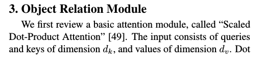
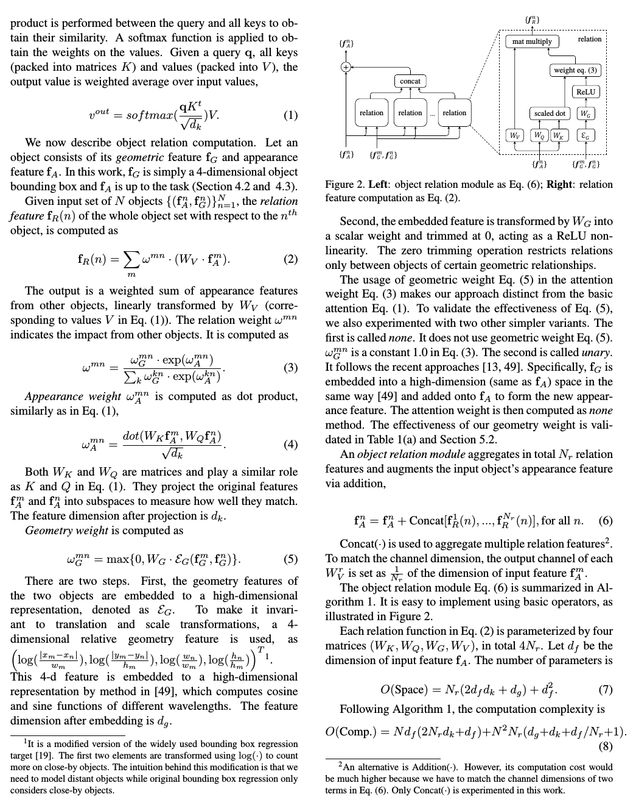
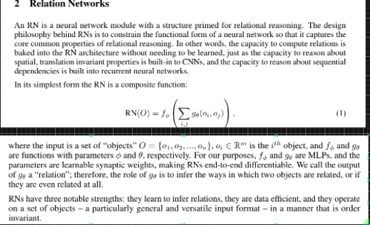
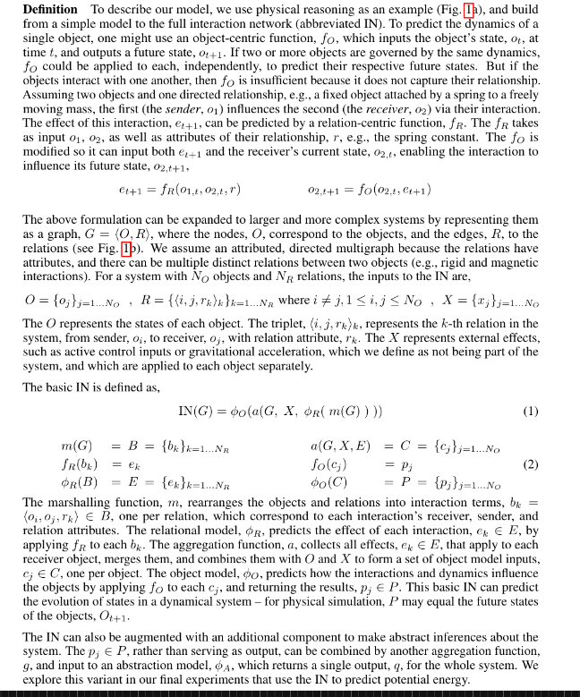

# Abstract Ideas

---

## Adversarial Learning

---

## Constrastive Learning

---

## Relational Neural Networks

---

---

---

## Interaction Network

---

## 

## Curiosity Driven Learning

---

## Learning by Model Disagreements

---

## Integration with Knowledge Bases

---

## Grounded Learning
