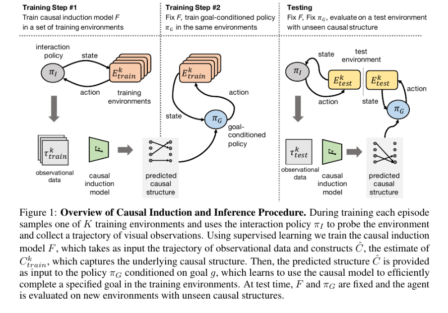
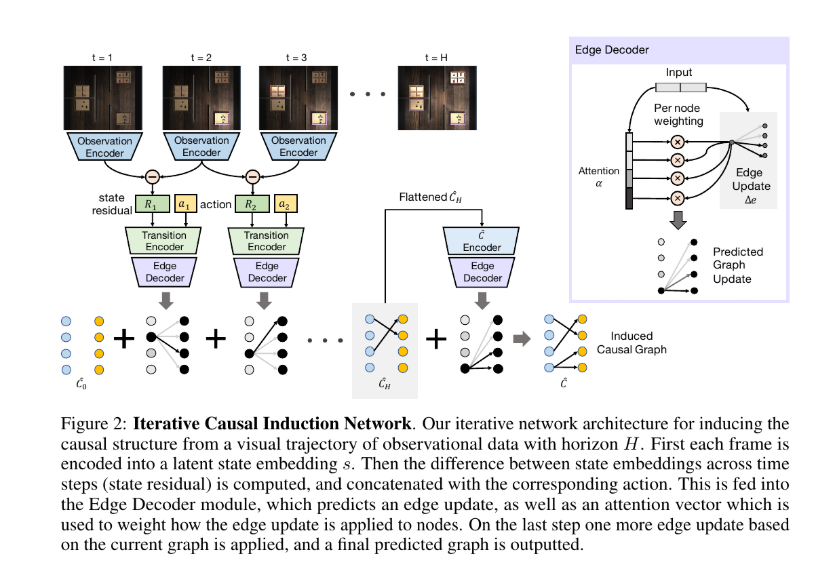
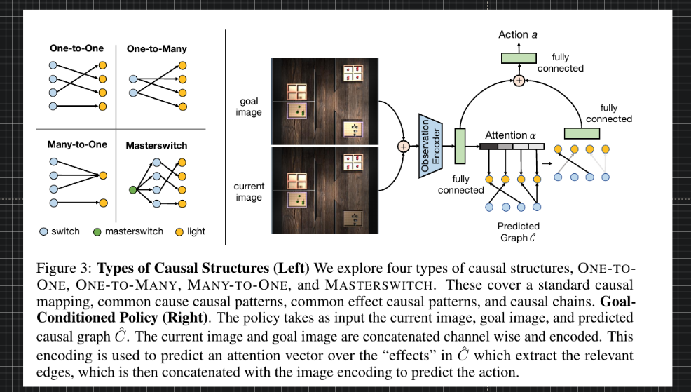
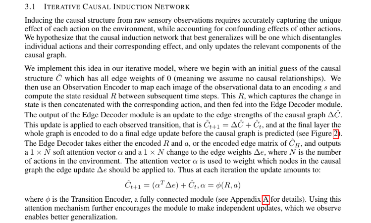

## Causal Machine Learning

- Using counterfactuals to solve problems, Recurrent Independent Mechanisms
- Model based Causality and Disentanglement : Causality and Anti-Causal by injecting interference

[**A Meta-Transfer Objective for Learning to Disentangle Causal Mechanisms**](https://arxiv.org/abs/1901.10912)

We propose to meta-learn causal structures based on how fast a learner adapts to new distributions arising from sparse distributional changes, e.g. due to interventions, actions of agents and other sources of non-stationarities. We show that under this assumption, the correct causal structural choices lead to faster adaptation to modified distributions because the changes are concentrated in one or just a few mechanisms when the learned knowledge is modularized appropriately. This leads to sparse expected gradients and a lower effective number of degrees of freedom needing to be relearned while adapting to the change. It motivates using the speed of adaptation to a modified distribution as a meta-learning objective. .

---

---

### Causality

- [**Papers with Code : Causal Inference**](https://paperswithcode.com/task/causal-inference)
- [**Neural Consciousness Flow**](https://arxiv.org/abs/1905.13049.pdf)
- [**Differentiable Learning of Logical Rules for Knowledge Base Reasoning**](http://papers.nips.cc/paper/6826-differentiable-learning-of-logical-rules-for-knowledge-base-reasoning.pdf)
- [**On Causal and Anticausal Learning**](https://icml.cc/2012/papers/625.pdf)
- [**Mirowski: Learning to navigate in cities without a map - Google Scholar**](https://scholar.google.com/scholar?cites=9758707731169438744&as_sdt=2005&sciodt=0,5&hl=en)
- [**Diversity and Depth in Per-Example Routing Models**](https://openreview.net/forum?id=BkxWJnC9tX)
- [**[1801.08214] Active Neural Localization**](https://arxiv.org/abs/1801.08214)
- [**Learning Spatial Common Sense With Geometry-Aware Recurrent Networks**](http://openaccess.thecvf.com/content_CVPR_2019/html/Tung_Learning_Spatial_Common_Sense_With_Geometry-Aware_Recurrent_Networks_CVPR_2019_paper.html)
- [**Two Causal Principles for Improving Visual Dialog**](https://arxiv.org/abs/1911.10496.pdf)
- [**Theoretical Impediments to Machine Learning With Seven Sparks from the Causal Revolution**](https://arxiv.org/abs/1801.04016.pdf)
- [**[1901.08162] Causal Reasoning from Meta-reinforcement Learning**](https://arxiv.org/abs/1901.08162)
- [**Learning Plannable Representations with Causal InfoGAN**](https://arxiv.org/abs/1807.09341.pdf)
- [**Causality for Machine Learning**](https://arxiv.org/abs/1911.10500.pdf)
- [**Learning Functional Causal Models with Generative Neural Networks**](https://arxiv.org/abs/1709.05321.pdf)
- [**Towards Causal VQA: Revealing and Reducing Spurious Correlations by Invariant and Covariant Semantic Editing**](https://arxiv.org/abs/1912.07538v1.pdf)
- [**Causal Discovery with Reinforcement Learning**](https://openreview.net/forum?id=S1g2skStPB)
- [**acmi-lab/counterfactually-augmented-data: Learning the Difference that Makes a Difference with Counterfactually-Augmented Data**](https://github.com/acmi-lab/counterfactually-augmented-data)
- [**Causality_Cognitive_Science_2013.pdf**](http://www.stat.ucla.edu/~sczhu/papers/Conf_2013/Causality_Cognitive_Science_2013.pdf)
- [**[2005.11736] Efficient Intervention Design for Causal Discovery with Latents**](https://arxiv.org/abs/2005.11736)
- [**Theory of Causal Induction.pdf**](https://cocosci.princeton.edu/tom/papers/tbci.pdf)
- [**Visual Causal Feature Learning**](http://www.its.caltech.edu/~fehardt/papers/CPE_UAI2015.pdf)
- https://arxiv.org/abs/2005.13407v2.pdf CausaLM: Causal Model Explanation Through Counterfactual Language Models
