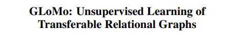
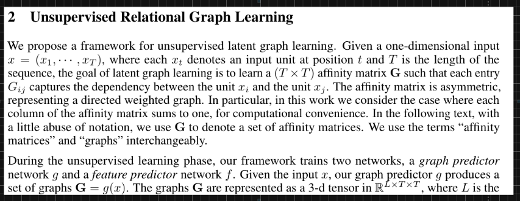
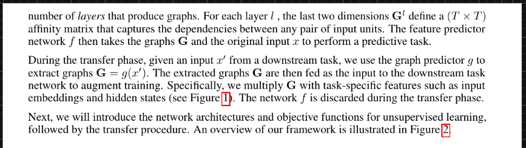
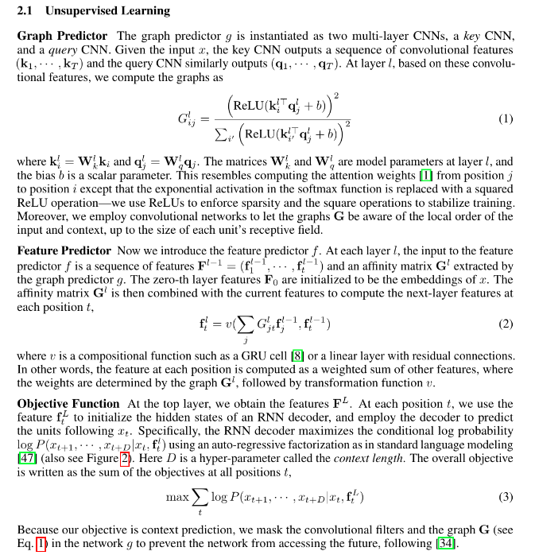
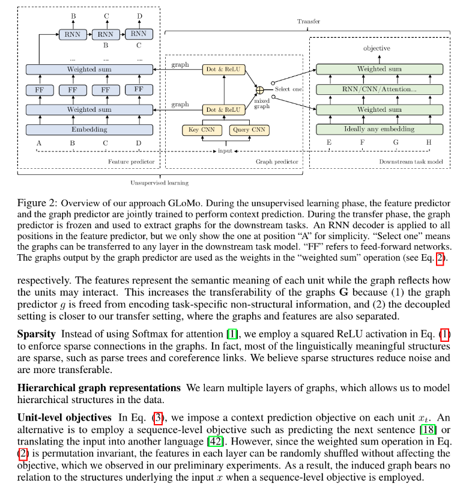
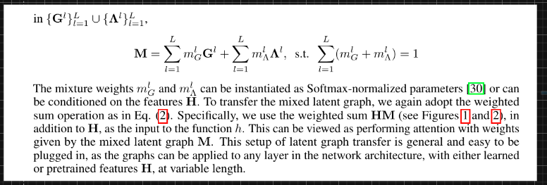
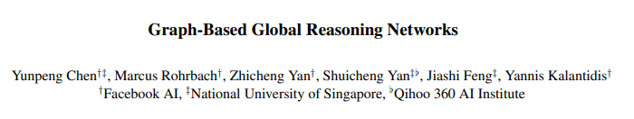

# Graph Neural Networks

[**Link**](https://arxiv.org/abs/1903.03894)

---

[**Link**](https://papers.nips.cc/paper/8110-glomo-unsupervised-learning-of-transferable-relational-graphs.pdf)

---

[**Link**](https://openaccess.thecvf.com/content_CVPR_2019/papers/Chen_Graph-Based_Global_Reasoning_Networks_CVPR_2019_paper.pdf)

### Graph and Interaction Networks
- [**Relational inductive biases, deep learning, and graph networks**](https://arxiv.org/abs/1806.01261.pdf)
- [**Graph Attention Networks**](https://arxiv.org/abs/1710.10903.pdf)
- [**SuperGlue: Learning Feature Matching with Graph Neural Networks**](https://arxiv.org/abs/1911.11763.pdf)
- [**RexYing/gnn-model-explainer: gnn explainer**](https://github.com/RexYing/gnn-model-explainer)
- [**thunlp/GNNPapers: Must-read papers on graph neural networks (GNN)**](https://github.com/thunlp/GNNPapers)
- [**- Deep Graph Library: Towards Efficient and Scalable Deep Learning on Graphs**](https://paperswithcode.com/paper/deep-graph-library-towards-efficient-and)
- [**weihua916 (Weihua Hu)**](https://github.com/weihua916)
- [**Graph Neural Tangent Kernel: Fusing Graph Neural Networks with Graph Kernels**](https://arxiv.org/abs/1905.13192.pdf)
- [GNNExplainer: Generating Explanations for Graph Neural Networks](https://arxiv.org/abs/1903.03894.pdf)
- Foundations and modelling of dynamic networks using Dynamic Graph Neural Networks: A survey https://arxiv.org/abs/2005.07496.pdf
- XAI for Graphs: Explaining Graph Neural Network Predictions by Identifying Relevant Walks https://arxiv.org/abs/2006.03589v1.pdf
  composition_based_multi_relational_graph_convolutional_networks.pdf
- [**RetGK: Graph Kernels based on Return Probabilities of Random Walks**](https://arxiv.org/abs/1809.02670.pdf)
