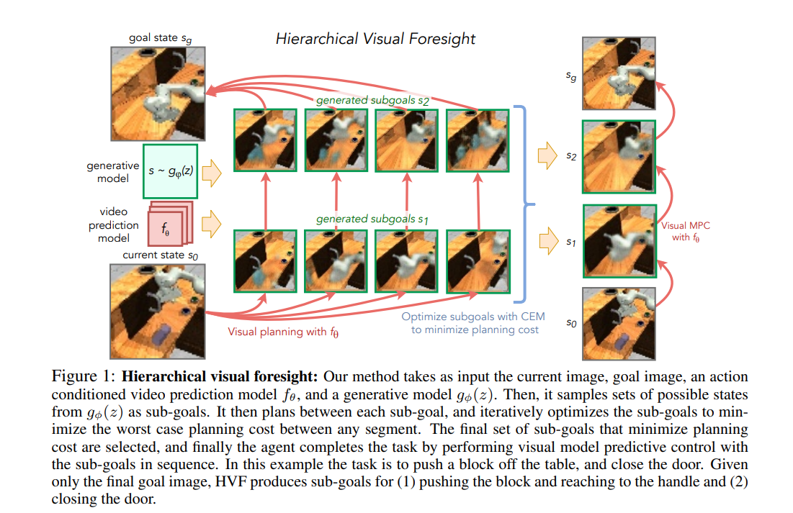
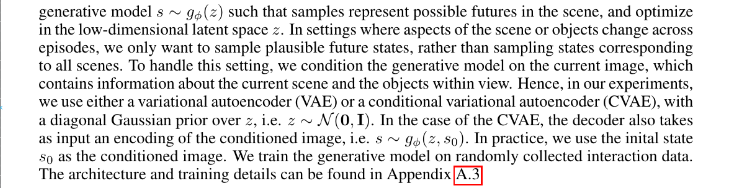
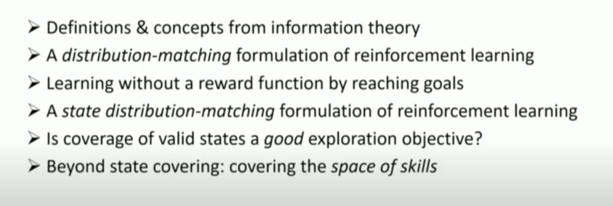

## Reinforcement Learning

## IROS, ICRA, RSS
- Model Predictive Control: Models a PID controller? where Integral is the memory of the previous errors (keep track of past mistakes), Differential predicts the trajectory of the current work.

---

- World Models
- Embodied AI
- Sim2Real

Modular control strategies, multi-task control : using control as a reward

what is the meaning of reinforcement learning → on Gecco creatures → does it transfer to the real world → what does it mean control such a creature in the fake world → if we build its real world counterpart, will it work as good?

How good actually is dexterous hand manipulation → how much is that transferable automatically to other tasks ?

How good is hierarchical goal-setting → generating new goals → to complete tasks → does it generalise?

What is the state of multi-task learning today → is it better than control theory ?

Policy Gradients is not data-efficient and Model-based Reinforcement Learning does not work that well ?

What is the point of training such a humongous network as the one of Dota-Five (only the collaboration part may be important) by wasting so much compute and using the same algorithm (PPO) if it does not transfer?

What purpose does playing these well-controlled environment games may be useful in the real world? A war or an entertainment source?

Can we integrate the intuition and understanding of the world from computer vision and NLP (knowledge base) to this reinforcement world to make it more efficient?

How do we add constraints to the actions the agent can take ?

---

## [**CURIOUS: Intrinsically Motivated Modular Multi-Goal Reinforcement Learning**](https://arxiv.org/abs/1810.06284)

## Self-Supervised Exploration via Disagreement

#### [\*\*[Project Website]](https://pathak22.github.io/exploration-by-disagreement/) [[Demo Video]\*\*](https://youtu.be/POlrWt32_ec)

---

## Zero-Shot Visual Imitation

#### In ICLR 2018 [\*\*[Project Website]](https://pathak22.github.io/zeroshot-imitation/) [[Videos]\*\*](http://pathak22.github.io/zeroshot-imitation/index.html#demoVideos)

We propose an alternative paradigm wherein an agent first explores the world without any expert supervision and then distills its experience into a goal-conditioned skill policy with a novel forward consistency loss. The key insight is the intuition that, for most tasks, reaching the goal is more important than how it is reached.

---

## World Models Experiments

Step by step instructions of reproducing [**World Models**](https://worldmodels.github.io/) ([pdf](https://arxiv.org/abs/1803.10122)).

Please see [**blog post**](http://blog.otoro.net//2018/06/09/world-models-experiments/) for step-by-step instructions.

---

## Soft Actor-Critic

Soft actor-critic is a deep reinforcement learning framework for training maximum entropy policies in continous domains. The algorithm is based on the paper [\*\*Soft Actor-Critic: Off-Policy Maximum Entropy Deep Reinforcement Learning with a Stochastic Actor](https://drive.google.com/file/d/0Bxz3x8U2LH_2QllDZVlUQ1BJVEJHeER2YU5mODNaeFZmc3dz/view) presented at the [Deep Reinforcement Learning Symposium\*\*](https://sites.google.com/view/deeprl-symposium-nips2017/), NIPS 2017.

---

## RoboNet: Large-Scale Multi-Robot Learning

Code for loading and manipulating the RoboNet dataset, as well as for training supervised inverse models and video prediction models on the dataset.

---

## ReQueST — (Re)ward (Que)ry (S)ynthesis via (T)rajectory Optimization

[ReQueST](https://arxiv.org/abs/1912.05652) is a [reward modeling](https://arxiv.org/abs/1811.07871)
algorithm that asks the user for feedback on hypothetical trajectories synthesized using a
pretrained model of the environment dynamics, instead of real trajectories generated by rolling out
a partially-trained agent in the environment. Compared to [**previous**](https://deepmind.com/blog/article/learning-through-human-feedback)
[**approaches**](https://arxiv.org/abs/1811.06521), this enables

1.  training more robust reward models that work off-policy,
2.  learning about unsafe states without visiting them, and
3.  better query-efficiency through the use of active learning.

---

## Third-Person Visual Imitation Learning via Decoupled Hierarchical Controller

#### [\*\*[Project Website]](https://pathak22.github.io/hierarchical-imitation/) [[Demo Video]\*\*](https://youtu.be/eWBkDuNFEKA)

---

## IC3Net

This repository contains reference implementation for IC3Net paper (accepted to ICLR 2019), **Learning when to communicate at scale in multiagent cooperative and competitive tasks**, available at [**https://arxiv.org/abs/1812.09755**](https://arxiv.org/abs/1812.09755)

---

## PlaNet

======

[****](LICENSE.md)

PlaNet: A Deep Planning Network for Reinforcement Learning [**[1]**](#references). Supports symbolic/visual observation spaces. Supports some Gym environments (including classic control/non-MuJoCo environments, so DeepMind Control Suite/MuJoCo are optional dependencies). Hyperparameters have been taken from the original work and are tuned for DeepMind Control Suite, so would need tuning for any other domains (such as the Gym environments).

---

## AlphaNPI

Adapting the AlphaZero algorithm to remove the need of execution traces to train NPI.

---

## Hierarchical Visual Foresight

[**Link**](https://arxiv.org/abs/1909.05829)

---

---

- [**Neural Replicator Dynamics**](https://arxiv.org/abs/1906.00190v1.pdf)
- [**CompILE: Compositional Imitation Learning and Execution**](http://proceedings.mlr.press/v97/kipf19a/kipf19a.pdf)
- [**Context-aware Dynamics Model for Generalization in Model-Based Reinforcement Learning**](https://paperswithcode.com/paper/context-aware-dynamics-model-for)
- [**Inductive Biases, Invariances and Generalization in RL (BIG)**](https://biases-invariances-generalization.github.io/)
- [**Search on the Replay Buffer: Bridging Planning and Reinforcement Learning - Colaboratory**](https://colab.research.google.com/drive/1GnyIypicdLf2g--tej3yZguLDkHUgEsk#scrollTo=MbGXO1TURVf-)
- [**Mutual Information-based State-Control for Intrinsically Motivated Reinforcement Learning**](https://arxiv.org/abs/2002.01963.pdf)

### RL
- [**[1806.01203] Relational inductive bias for physical construction in humans and machines**](https://arxiv.org/abs/1806.01203)
- [**The Ingredients of Real-World Robotic Reinforcement Learning**](https://arxiv.org/abs/2004.12570.pdf)
- [**: Represented Value Function Approach for Large Scale Multi Agent Reinforcement Learning**](https://paperswithcode.com/paper/represented-value-function-approach-for-large)
- [**: Restricting the Flow: Information Bottlenecks for Attribution**](https://paperswithcode.com/paper/restricting-the-flow-information-bottlenecks-1)
- [**Self-Consistent Trajectory Autoencoder: Hierarchical Reinforcement Learning with Trajectory Embeddings**](https://arxiv.org/abs/1806.02813.pdf)
- [**Inverse reinforcement learning for video games**](https://arxiv.org/abs/1810.10593.pdf)
- [**Reinforcement Learning, Fast and Slow**](file:///C:/Users/khush/AppData/Roaming/Microsoft/Windows/Network%20Shortcuts/RL,%20%20fast%20and%20slow.pdf)
- [**Visual Foresight: Model-Based Deep Reinforcement Learning for Vision-Based Robotic Control**](https://arxiv.org/abs/1812.00568.pdf)
- [**State Representation Learning in Robotics: Using Prior Knowledge about Physical Interaction.pdf**](http://roboticsproceedings.org/rss10/p19.pdf)
- [**Learning First-Order Symbolic Representations for Planning from the Structure of the State Space**](https://arxiv.org/abs/1909.05546.pdf)
- [**[1904.11455] Ray Interference: a Source of Plateaus in Deep Reinforcement Learning**](https://arxiv.org/abs/1904.11455)
- [**[1810.06544] Deep Imitative Models for Flexible Inference, Planning, and Control**](https://arxiv.org/abs/1810.06544)

### PPO and RL algorithms

- [**Proximal Policy Optimization**](https://openai.com/blog/openai-baselines-ppo/)
- [**RL — Proximal Policy Optimization (PPO) Explained - Jonathan Hui - Medium**](https://medium.com/@jonathan_hui/rl-proximal-policy-optimization-ppo-explained-77f014ec3f12)
- [**Proximal Policy Optimization Algorithms**](https://arxiv.org/abs/1707.06347.pdf)
- [**Self-Supervised Learning For Few-shot Image Classification**](https://github.com/phecy/SSL-FEW-SHOT)
- [**[1911.12247] Contrastive Learning of Structured World Models**](https://arxiv.org/abs/1911.12247)
- [**Learning Compositional Koopman Operators for Model-Based Control**](https://arxiv.org/abs/1910.08264.pdf)
- [**World Models**](https://arxiv.org/abs/1803.10122.pdf)
- [**google-research/dads: Code for 'Dynamics-Aware Unsupervised Discovery of Skills' (DADS). Enables skill discovery without supervision, which can be combined with model-based control.**](https://github.com/google-research/dads)
- [**Entity Abstraction in Visual Model-Based Reinforcement Learning**](https://arxiv.org/abs/1910.12827.pdf)
- [**Sparse Graphical Memory for Robust Planning**](https://arxiv.org/abs/2003.06417.pdf)
- [**Emergent Real-World Robotic Skills via Unsupervised Off-Policy Reinforcement Learning**](https://arxiv.org/abs/2004.12974v1.pdf)
- [**Adversarial Policies**](https://adversarialpolicies.github.io/)
- [**[1702.08360] Neural Map: Structured Memory for Deep Reinforcement Learning**](https://arxiv.org/abs/1702.08360)

---

- [**Kaixhin/PlaNet: Deep Planning Network: Control from pixels by latent planning with learned dynamics**](https://github.com/Kaixhin/PlaNet)
- [**rail-berkeley/softlearning: Softlearning is a reinforcement learning framework for training maximum entropy policies in continuous domains. Includes the official implementation of the Soft Actor-Critic algorithm**](https://github.com/rail-berkeley/softlearning)
- [**thu-ml/tianshou: An elegant, flexible, and superfast PyTorch deep Reinforcement Learning platform.**](https://github.com/thu-ml/tianshou)
- [**deepmind/bsuite: bsuite is a collection of carefully-designed experiments that investigate core capabilities of a reinforcement learning (RL) agent**](https://github.com/deepmind/bsuite)

---

- [**6391-generative-adversarial-imitation-learning.pdf**](http://papers.nips.cc/paper/6391-generative-adversarial-imitation-learning.pdf)
- [**Generalized Value Iteration Networks:Life Beyond Lattices**](https://arxiv.org/abs/1706.02416.pdf)
- [**A Unified Game-Theoretic Approach to Multiagent Reinforcement Learning**](https://arxiv.org/abs/1711.00832.pdf)

## RL & EmbodiedAI

- [**[1908.03568v2] Behaviour Suite for Reinforcement Learning**](https://arxiv.org/abs/1908.03568v2)
- [**Open-sourcing Polygames, a new framework for training AI bots through self-play**](https://ai.facebook.com/blog/open-sourcing-polygames-a-new-framework-for-training-ai-bots-through-self-play/?refid=17&ref=content_filter&_ft_=mf_story_key.10156557184037143%3Atop_level_post_id.10156557184037143%3Atl_objid.10156557184037143%3Acontent_owner_id_new.722677142%3Athrowback_story_fbid.10156557184037143%3Astory_location.4%3Astory_attachment_style.share%3Athid.722677142%3A306061129499414%3A2%3A0%3A1580543999%3A-6017571576998442429&__tn__=HH-R)
- [**[1909.08399] DeepGait: Planning and Control of Quadrupedal Gaits using Deep Reinforcement Learning**](https://arxiv.org/abs/1909.08399)
- [**Scene_Memory_Transformer_for_Embodied_Agents_in_Long-Horizon_Tasks_CVPR_2019_paper.pdf**](https://openaccess.thecvf.com/content_CVPR_2019/papers/Fang_Scene_Memory_Transformer_for_Embodied_Agents_in_Long-Horizon_Tasks_CVPR_2019_paper.pdf)
- [**Read to Fight Monsters: Using RL to teach agents to generalize to new settings**](https://ai.facebook.com/blog/read-to-fight-monsters-using-rl-to-teach-agents-to-generalize-to-new-settings/)
- [**BADGR: An Autonomous Self-Supervised Learning-Based Navigation System**](https://sites.google.com/view/badgr)
- [**neural-mmo**](https://jsuarez5341.github.io/neural-mmo/build/html/overview.html)
- [**[1906.08226] Unsupervised State Representation Learning in Atari**](https://arxiv.org/abs/1906.08226)
- [**Google AI Blog: Massively Scaling Reinforcement Learning with SEED RL**](https://ai.googleblog.com/2020/03/massively-scaling-reinforcement.html?m=1)
- [**Google AI Blog: Off-Policy Estimation for Infinite-Horizon Reinforcement Learning**](https://ai.googleblog.com/2020/04/off-policy-estimation-for-infinite.html?m=1)
- [**[1909.12823] A Generalized Training Approach for Multiagent Learning**](https://arxiv.org/abs/1909.12823)
- [**One Policy to Control Them All: Shared Modular Policies for Agent-Agnostic Control**](https://wenlong.page/modular-rl/)
- [**[2007.08794] Discovering Reinforcement Learning Algorithms**](https://arxiv.org/abs/2007.08794)
- [**[1806.07857] RUDDER: Return Decomposition for Delayed Rewards**](https://arxiv.org/abs/1806.07857)
- [**Long-Horizon Visual Planning with Goal-Conditioned Hierarchical Predictors**](https://orybkin.github.io/video-gcp/)
- [** dm_control: Software and Tasks for Continuous Control **](https://deepmind.com/research/publications/dm-control-Software-and-Tasks-for-Continuous-Control)
- [**Google AI Blog: Introducing Dreamer: Scalable Reinforcement Learning Using World Models**](https://ai.googleblog.com/2020/03/introducing-dreamer-scalable.html?m=1)
- [**Procgen and MineRL Competitions**](https://openai.com/blog/procgen-minerl-competitions/)
- [**Teaching a robot to see and navigate with simulation - Microsoft Research**](https://www.microsoft.com/en-us/research/blog/teaching-a-robot-to-see-and-navigate-with-simulation/?OCID=msr_blog_SLAM_CVPR_fb)
- [**CARL: Controllable Agent with Reinforcement Learning for Quadruped Locomotion**](https://inventec-ai-center.github.io/projects/CARL/index.html)
- [**Mirowski: Learning to navigate in cities without a map - Google Scholar**](https://scholar.google.com/scholar?cites=9758707731169438744&as_sdt=2005&sciodt=0,5&hl=en)
- [**Diversity and Depth in Per-Example Routing Models**](https://openreview.net/forum?id=BkxWJnC9tX)
- [**[1801.08214] Active Neural Localization**](https://arxiv.org/abs/1801.08214)
- [**[2002.02836] Causally Correct Partial Models for Reinforcement Learning**](https://arxiv.org/abs/2002.02836)

---

## Others

- [**[2001.08328] A Deep Learning Approach to Behavior-Based Learner Modeling**](https://arxiv.org/abs/2001.08328)
- [**[2001.08349v2] Investigating naturalistic hand movements by behavior mining in long-term video and neural recordings**](https://arxiv.org/abs/2001.08349v2)
- [**[2001.09063v2] Towards Graph Representation Learning in Emergent Communication**](https://arxiv.org/abs/2001.09063v2)
- [**[2001.09122] Reasoning About Generalization via Conditional Mutual Information**](https://arxiv.org/abs/2001.09122)
- [**HiPlot: High-dimensional interactive plots made easy**](https://ai.facebook.com/blog/hiplot-high-dimensional-interactive-plots-made-easy)
- [**[1904.12584] The Neuro-Symbolic Concept Learner: Interpreting Scenes, Words, and Sentences From Natural Supervision**](https://arxiv.org/abs/1904.12584)
- [**[1810.06721] Optimizing Agent Behavior over Long Time Scales by Transporting Value**](https://arxiv.org/abs/1810.06721)
- [**Networking Optimizations for Multi-Node DL on Kubernetes w/ Erez Cohen**](https://twimlai.com/twiml-talk-345-networking-optimizations-for-multi-node-deep-learning-on-kubernetes-with-erez-cohen/)
- [**Google AI Blog: Releasing the Drosophila Hemibrain Connectome — The Largest Synapse-Resolution Map of Brain Connectivity**](https://ai.googleblog.com/2020/01/releasing-drosophila-hemibrain.html)
- [**DeepMind : | A new model and dataset for long-range memory **](https://deepmind.com/blog/article/A_new_model_and_dataset_for_long-range_memory)
- [**Novelty speeds up learning with dopamine **](https://www.nerf.be/news/novelty-speeds-up-learning-with-dopamine)
- [**[2001.08055] Up to two billion times acceleration of scientific simulations with deep neural architecture search**](https://arxiv.org/abs/2001.08055)
- [**[2002.05715] Self-Distillation Amplifies Regularization in Hilbert Space**](https://arxiv.org/abs/2002.05715)
- [**The Big Data Landscape**](http://dfkoz.com/ai-data-landscape/)
- [**[2002.05242v1] Leveraging Affect Transfer Learning for Behavior Prediction in an Intelligent Tutoring System**](https://arxiv.org/abs/2002.05242v1)
- [**[1906.03352] Watch, Try, Learn: Meta-Learning from Demonstrations and Reward**](https://arxiv.org/abs/1906.03352)
- [**[2006.16668] GShard: Scaling Giant Models with Conditional Computation and Automatic Sharding**](https://arxiv.org/abs/2006.16668)
- [**[1905.06088] Neural-Symbolic Computing: An Effective Methodology for Principled Integration of Machine Learning and Reasoning**](https://arxiv.org/abs/1905.06088)
- [**[2002.10549] Progressive Learning and Disentanglement of Hierarchical Representations**](https://arxiv.org/abs/2002.10549)
- [**[1906.11951] Supervise Thyself: Examining Self-Supervised Representations in Interactive Environments**](https://arxiv.org/abs/1906.11951)
- [**[2003.02989] TensorFlow Quantum: A Software Framework for Quantum Machine Learning**](https://arxiv.org/abs/2003.02989)
- [**[2003.08165] Neuroevolution of Self-Interpretable Agents**](https://arxiv.org/abs/2003.08165)
- [**SAIL Blog : | When Humans Aren’t Optimal: Robots that Collaborate with Risk-Aware Humans **](http://ai.stanford.edu/blog/modeling-risky-humans/)
- [**SCALABLE AND COMPRESSIVE NEURAL NETWORK DATA STORAGE SYSTEM - DeepMind Technologies Limited**](http://www.freepatentsonline.com/y2020/0104677.html)
- [**[1912.04838] Scalability in Perception for Autonomous Driving: Waymo Open Dataset**](https://arxiv.org/abs/1912.04838)
- [**Meta Sim : Learning to Generate Synthetic Datasets**](https://nv-tlabs.github.io/meta-sim/)
- [**[1912.00177v2] Urban Driving with Conditional Imitation Learning**](https://arxiv.org/abs/1912.00177v2)
- [**JALI: An Animator-Centric Viseme Model for Expressive Lip Synchronization**](http://www.dgp.toronto.edu/~elf/JALISIG16.pdf)
- [**[1908.07563] Reactive Probabilistic Programming**](https://arxiv.org/abs/1908.07563)
- [**[2002.06177] The Next Decade in AI: Four Steps Towards Robust Artificial Intelligence**](https://arxiv.org/abs/2002.06177)
- [**Memory and Interconnect Optimizations for Peta-Scale Deep Learning Systems - IEEE Conference Publication**](https://ieeexplore.ieee.org/abstract/document/8990542)
- [**Zoom In: An Introduction to Circuits**](https://distill.pub/2020/circuits/zoom-in/)
- [**ALLSTEPS: Curriculum-driven Learning of Stepping Stone Skills**](https://www.cs.ubc.ca/~van/papers/2020-allsteps/index.html)
- [**deepmind/reverb: Reverb is an efficient and easy-to-use data storage and transport system designed for machine learning research**](https://github.com/deepmind/reverb)
- [**[2002.08871v1] Fast Differentiable Sorting and Ranking**](https://arxiv.org/abs/2002.08871v1)

### Github

- [**xavierpuigf/virtualhome: API to run VirtualHome, a simulator to generate videos of human activities**](https://github.com/xavierpuigf/virtualhome)
- [**cjy1992/interp-e2e-driving: Interpretable End-to-end Urban Autonomous Driving with Latent Deep Reinforcement Learning**](https://github.com/cjy1992/interp-e2e-driving)
- [**JindongJiang/SCALOR: Official PyTorch implementation of "SCALOR: Generative World Models with Scalable Object Representations"**](https://github.com/JindongJiang/SCALOR)
- [**TonghanWang/ROMA: Codes accompanying the paper "ROMA: Multi-Agent Reinforcement Learning with Emergent Roles" (ICML 2020 https://arxiv.org/abs/2003.08039)**](https://github.com/TonghanWang/ROMA)
- [**TensorSwarm/TensorSwarm: TensorSwarm: A framework for reinforcement learning of robot swarms.**](https://github.com/TensorSwarm/TensorSwarm)
- [**[2002.06306] Jelly Bean World: A Testbed for Never-Ending Learning**](https://arxiv.org/abs/2002.06306)
- [**facebookresearch/impact-driven-exploration: impact-driven-exploration**](https://github.com/facebookresearch/impact-driven-exploration)
