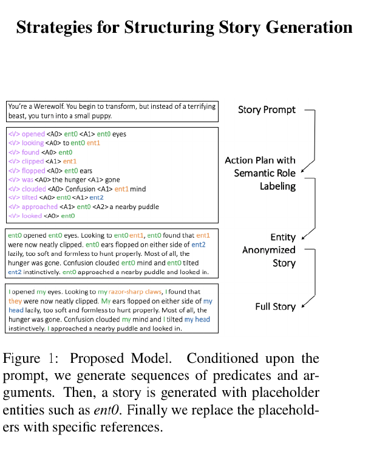
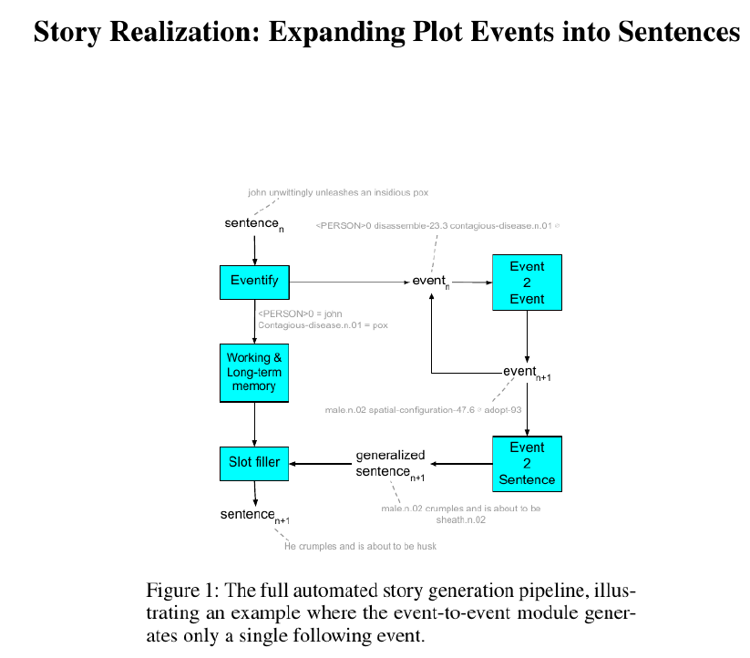
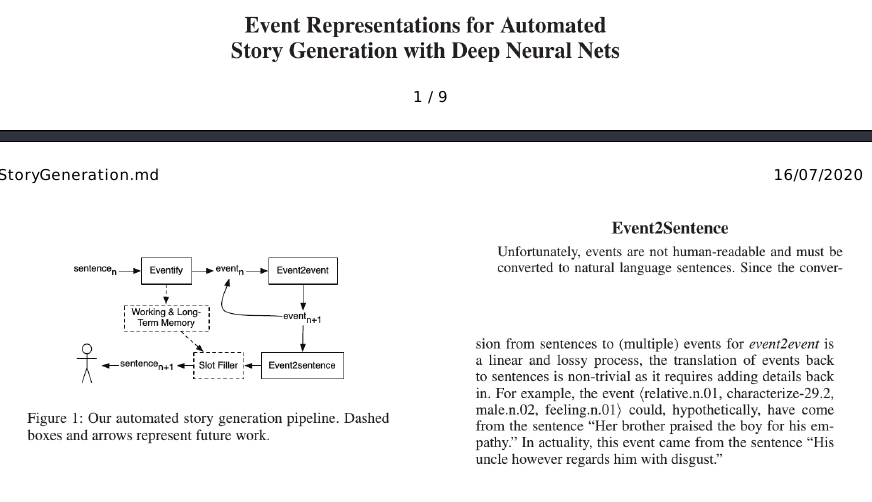
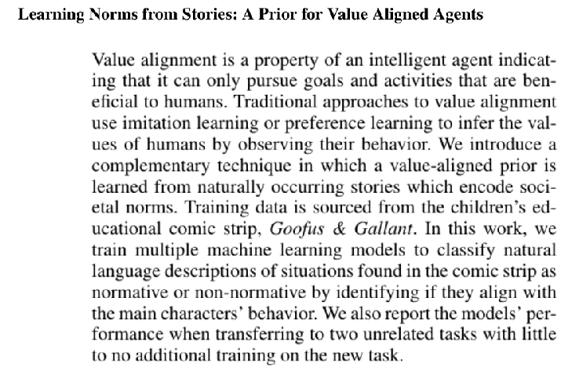
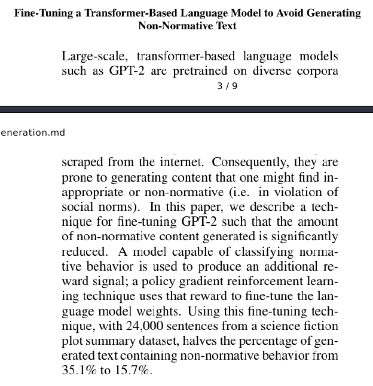
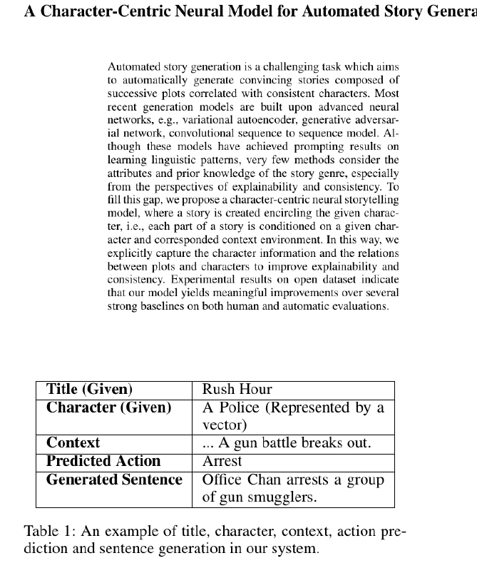
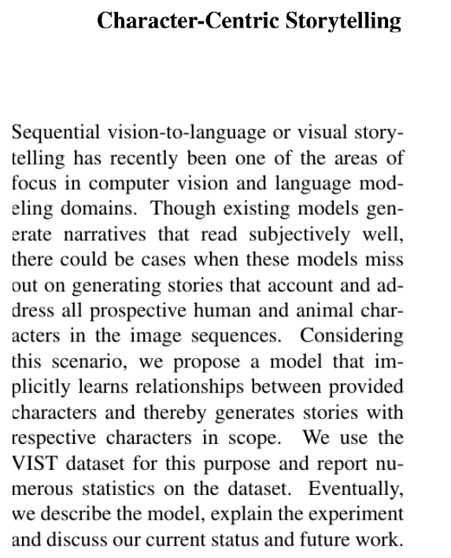
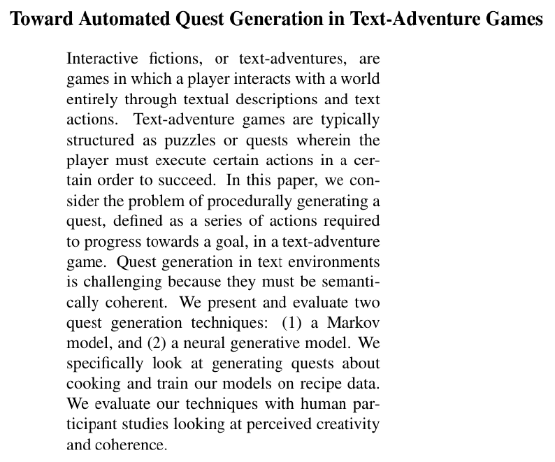
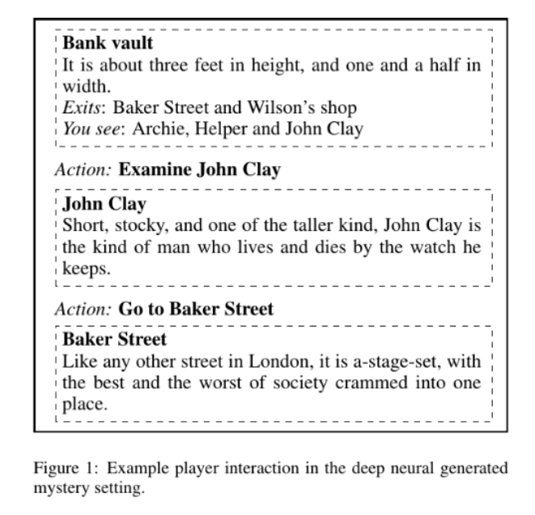

## Story Generation

**Where is State-of-the-are Story Generation today**

**What are the remaining big challenges in Story Generation**

**What are the various subdomains in Story Generation : for publication**

**What are the different kinds of approaches for these subdomains in Story Generation**

**Story Generation : Monetization, Use Cases in Industry**

---

---

## Full automated story telling pipeline

---

## Props Morphology

---

---

---

---

### Story Generation

- [**[2001.08764] Fine-Tuning a Transformer-Based Language Model to Avoid Generating Non-Normative Text**](https://arxiv.org/abs/2001.08764)
- [**Reinforcing an Image Caption Generator Using Off-Line Human Feedback**](https://arxiv.org/abs/1911.09753.pdf)
- [**Generating Interactive Worlds with Text**](https://arxiv.org/abs/1911.09194.pdf)
- [**A Character-Centric Neural Model for Automatic Story Generation - Google Search**](https://www.google.com/search?safe=active&sxsrf=ALeKk00oNWDCHjejL8PTZcvTIynln7a6tw:1582211968735&q=A+Character-Centric+Neural+Model+for+Automatic+Story+Generation&spell=1&sa=X&ved=2ahUKEwia_evytuDnAhVd7XMBHThdBoEQBSgAegQICxAn&biw=1745&bih=865)
- [**CoCoX: Generating Conceptual and Counterfactual Explanations via Fault-Lines**](https://pdfs.semanticscholar.org/d03e/66a84b92f520235079083d3c0947b2c910e0.pdf)
- [**Corpus-Level End-to-End Exploration for Interactive Systems**](https://arxiv.org/abs/1912.00753.pdf)
- [**On the interaction between supervision and self-play in emergent communication**](https://arxiv.org/abs/2002.01093v1.pdf)
- [**Working Memory Graphs**](https://arxiv.org/abs/1911.07141.pdf)
- [**Semantic Object Accuracy for Generative Text-to-Image Synthesis**](https://arxiv.org/abs/1910.13321.pdf)
- [**Controllable Neural Story Plot Generation via Reward Shaping**](https://www.ijcai.org/Proceedings/2019/0829.pdf)
- [**HobbitLong/CMC: pytorch implementation of "Contrastive Multiview Coding", "Momentum Contrast for Unsupervised Visual Representation Learning", and "Unsupervised Feature Learning via Non-Parametric Instance-level Discrimination"**](https://github.com/HobbitLong/CMC)
- [**timediv/metagenrl: MetaGenRL, a novel meta reinforcement learning algorithm. Unlike prior work, MetaGenRL can generalize to new environments that are entirely different from those used for meta-training.**](https://github.com/timediv/metagenrl)
- [**Language-Conditioned Graph Networks for Relational Reasoning**](http://openaccess.thecvf.com/content_ICCV_2019/papers/Hu_Language-Conditioned_Graph_Networks_for_Relational_Reasoning_ICCV_2019_paper.pdf)
- [**Towards Automatically Extracting Story Graphs from Natural Language Stories**](https://www.aaai.org/ocs/index.php/WS/AAAIW17/paper/viewFile/15067/14772)

---

- [**Bringing Stories Alive: Generating Interactive Fiction Worlds**](https://arxiv.org/abs/2001.10161.pdf)
- [**Yao: Plan-and-write: Towards better automatic storytelling - Google Scholar**](https://scholar.google.com/scholar?um=1&ie=UTF-8&lr&cites=7790864211221027670)
- [**[1912.03553] Learning Norms from Stories: A Prior for Value Aligned Agents**](https://arxiv.org/abs/1912.03553)
- [**Fan: Strategies for structuring story generation - Google Scholar**](https://scholar.google.com/scholar?cites=9520507552551087003&as_sdt=2005&sciodt=0,5&hl=en)
- [**Learning to Predict Explainable Plots for Neural Story Generation**](https://arxiv.org/abs/1912.02395.pdf)
- [**1912.02164.pdf**](https://arxiv.org/abs/1912.02164.pdf)
- [**Controllable Neural Story Plot Generation via Reward Shaping**](https://www.ijcai.org/Proceedings/2019/0829.pdf)
- [**Baheti: Generating more interesting responses in... - Google Scholar**](https://scholar.google.com/scholar?start=10&hl=en&as_sdt=0,5&sciodt=0,5&cites=7801491607724868320&scipsc=)
- [**The Second Conversational Intelligence Challenge**](https://arxiv.org/abs/1902.00098.pdf)
- [**Dinan: The second conversational intelligence challenge... - Google Scholar**](https://scholar.google.com/scholar?start=20&hl=en&as_sdt=0,5&sciodt=0,5&cites=11779702645780685250&scipsc=)
- [**Learning to Speak and Act in a Fantasy Text Adventure Game**](https://arxiv.org/abs/1903.03094.pdf)
- [**DialoGPT: Large-Scale Generative Pre-training for Conversational Response Generation**](https://arxiv.org/abs/1911.00536.pdf)
- [**Plug and Play Language Models: A Simple Approach to Controlled Text Generation**](https://arxiv.org/abs/1912.02164.pdf#page=13&zoom=100,110,178)

---

- [**[2001.10161] Bringing Stories Alive: Generating Interactive Fiction Worlds**](https://arxiv.org/abs/2001.10161)
- [**Graph Constrained Reinforcement Learning for Natural Language Action Spaces**](https://arxiv.org/abs/2001.08837.pdf)
- [**Generating Interactive Worlds with Text**](https://arxiv.org/abs/1911.09194.pdf)
- [**Creativity_in_Language_INLG-2.pdf**](http://www.ccnlg.org/wordpress/wp-content/uploads/2019/10/Creativity_in_Language_INLG-2.pdf)
- [**ALBERT: A Lite BERT for Self-supervised Learning of Language Representations**](https://arxiv.org/abs/1909.11942.pdf)
- [**Home > ChooseYourStory.com**](http://chooseyourstory.com/)
- [**CTRL: A Conditional Transformer Language Model for Controllable Generation**](https://arxiv.org/abs/1909.05858.pdf)
