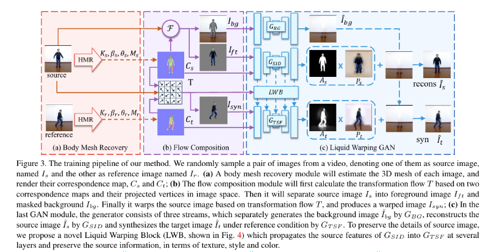

# Image/Video Synthesis

## Talking Head and GANs

.png>)

* [**What comprises a good talking-head video generation?: A Survey and Benchmark**](https://arxiv.org/abs/2005.03201.pdf)
* [**Hierarchical Cross-Modal Talking Face Generation With Dynamic Pixel-Wise Loss**](http://openaccess.thecvf.com/content\_CVPR\_2019/papers/Chen\_Hierarchical\_Cross-Modal\_Talking\_Face\_Generation\_With\_Dynamic\_Pixel-Wise\_Loss\_CVPR\_2019\_paper.pdf)
* [**3D Human Avatar Digitization from a Single Image**](https://dl.acm.org/doi/pdf/10.1145/3359997.3365707)
* [**TailorGAN: Making User-Defined Fashion Designs**](http://openaccess.thecvf.com/content\_WACV\_2020/papers/Chen\_TailorGAN\_Making\_User-Defined\_Fashion\_Designs\_WACV\_2020\_paper.pdf)
* [**lelechen63/talking-head-generation-survey: Official github repo for paper "What comprises a good talking-head video generation?: A Survey and Benchmark"**](https://github.com/lelechen63/talking-head-generation-survey)
* [**Expressive Body Capture: 3D Hands, Face, and Body from a Single Image**](https://arxiv.org/abs/1904.05866.pdf)
* [**Dynamic Multiscale Graph Neural Networks for 3D Skeleton-Based Human Motion Prediction**](https://github.com/limaosen0/DMGNN)
* [**\[1910.04302\] Prescribed Generative Adversarial Networks**](https://arxiv.org/abs/1910.04302)

## First order model and GANs

* [**AliaksandrSiarohin/first-order-model: This repository contains the source code for the paper First Order Motion Model for Image Animation**](https://github.com/AliaksandrSiarohin/first-order-model)
* [**First order model**](https://aliaksandrsiarohin.github.io/first-order-model-website/)
* [**First Order Motion Model for Image Animation**](http://papers.nips.cc/paper/8935-first-order-motion-model-for-image-animation.pdf)
* [**Coordinate-based Texture Inpainting for Pose-Guided Image Generation**](https://arxiv.org/abs/1811.11459.pdf)
* [**Deformable GANs for Pose-based Human Image Generation**](https://arxiv.org/abs/1801.00055.pdf)
* [**Unsupervised Disentanglement of Pose, Appearance and Background from Images and Videos**](https://arxiv.org/abs/2001.09518.pdf)
* [**Perceptual Image Super-Resolution with Progressive Adversarial Network**](https://arxiv.org/abs/2003.03756.pdf)
* [**Multi-Variate Temporal GAN for Large Scale Video Generation**](https://arxiv.org/abs/2004.01823.pdf)
* [**High-Fidelity Synthesis with Disentangled Representation**](https://arxiv.org/abs/2001.04296.pdf)
* [**Disentangled GANs for Controllable Generation of High-Resolution Images**](https://openreview.net/forum?id=SyezSCNYPB)
* [**Neural Network Dreams About Beautiful Natural Scenes - YouTube**](https://www.youtube.com/watch?v=MPdj8KGZHa0)
* [**Deep Image Spatial Transformation for Person Image Generation**](https://arxiv.org/abs/2003.00696.pdf)
* [**Predicting Scene Parsing and Motion Dynamics in the Future**](https://papers.nips.cc/paper/7267-predicting-scene-parsing-and-motion-dynamics-in-the-future.pdf)
* [**grey-eye/talking-heads: Our implementation of "Few-Shot Adversarial Learning of Realistic Neural Talking Head Models" (Egor Zakharov et al.)**](https://github.com/grey-eye/talking-heads)
* [**Recycle-GAN: Unsupervised Video Retargeting**](http://openaccess.thecvf.com/content\_ECCV\_2018/papers/Aayush\_Bansal\_Recycle-GAN\_Unsupervised\_Video\_ECCV\_2018\_paper.pdf)
* [**Synthesizing Obama: Learning Lip Sync from Audio**](https://grail.cs.washington.edu/projects/AudioToObama/siggraph17\_obama.pdf)
* [**Deep video portraits**](https://sci-hub.tw/https://dl.acm.org/citation.cfm?id=3201283)
* [**Cudeiro: Capture, Learning, and Synthesis of 3D Speaking... - Google Scholar**](https://scholar.google.com/scholar?rlz=1C1CHBF\_enUS858US858\&um=1\&ie=UTF-8\&lr\&cites=12568957979354957566)
* [**Animation Synthesis Triggered by Vocal Mimics**](https://dl.acm.org/citation.cfm?id=3360067)
* [**Animating Face using Disentangled Audio Representations**](https://arxiv.org/abs/1910.00726.pdf)
* [**Hangz-nju-cuhk/Talking-Face-Generation-DAVS: Code for Talking Face Generation by Adversarially Disentangled Audio-Visual Representation (AAAI 2019)**](https://github.com/Hangz-nju-cuhk/Talking-Face-Generation-DAVS)
* [**3D Morphable Face Models - Past, Present and Future**](https://arxiv.org/abs/1909.01815.pdf)
* [**A Robust Interactive Facial Animation Editing System. Motion, Interaction and Games on - MIG ’19**](https://sci-hub.tw/https://dl.acm.org/citation.cfm?id=3360076)
* [**cleardusk/3DDFA: The PyTorch improved version of TPAMI 2017 paper: Face Alignment in Full Pose Range: A 3D Total Solution.**](https://github.com/cleardusk/3DDFA)
* [**\[1804.01005\] Face Alignment in Full Pose Range: A 3D Total Solution**](https://arxiv.org/abs/1804.01005)
* [**TimoBolkart/voca: Voice Operated Character Animation**](https://github.com/TimoBolkart/voca)
* [**Voice Operated Character Animation**](https://voca.is.tue.mpg.de)
* [**Capture, Learning, and Synthesis of 3D Speaking Styles | Perceiving Systems - Max Planck Institute for Intelligent Systems**](https://ps.is.tuebingen.mpg.de/publications/voca2019)
* [**VOCA: Capture, Learning, and Synthesis of 3D Speaking Styles - YouTube**](https://www.youtube.com/watch?v=XceCxf\_GyW4)
* [**Neural Rendering and Reenactment of Human Actor Videos**](http://gvv.mpi-inf.mpg.de/projects/wxu/HumanReenactment/content/main.pdf)
* [**facebookresearch/QuaterNet: Proposes neural networks that can generate animation of virtual characters for different actions.**](https://github.com/facebookresearch/QuaterNet)
* [**Structured Prediction Helps 3D Human Motion Modelling**](http://openaccess.thecvf.com/content\_ICCV\_2019/papers/Aksan\_Structured\_Prediction\_Helps\_3D\_Human\_Motion\_Modelling\_ICCV\_2019\_paper.pdf)
* [**PMnet\_Learning.pdf**](https://research.birmingham.ac.uk/portal/files/71180007/PMnet\_Learning.pdf)
* [**Neural Rendering and Reenactment of Human Actor Videos**](https://amds123.github.io/2019/05/05/Neural-Rendering-and-Reenactment-of-Human-Actor-Videos/)
* [**\[1806.07179\] FrankenGAN: Guided Detail Synthesis for Building Mass-Models Using Style-Synchonized GANs**](https://arxiv.org/abs/1806.07179)
* [**lei65537/Visual\_Driven\_Mesh\_Repair: Repairing Man-Made Meshes via Visual Driven Global Optimization with Minimum Intrusion**](https://github.com/lei65537/Visual\_Driven\_Mesh\_Repair)
* [**Extreme 3D Face Reconstruction: Seeing Through Occlusions**](https://arxiv.org/abs/1712.05083v2.pdf)
* [**Learning to Regress 3D Face Shape and Expression from an Image without 3D Supervision**](https://paperswithcode.com/paper/learning-to-regress-3d-face-shape-and)

## Talking Heads/Artificial Humans

* [**facebookresearch/TalkingWithHands32M: Talking with Hands**](https://github.com/facebookresearch/TalkingWithHands32M)
* [**Talking With Hands 16.2M: A Large-Scale Dataset of Synchronized Body-Finger Motion and Audio for Conversational Motion Analysis and Synthesis**](http://openaccess.thecvf.com/content\_ICCV\_2019/papers/Lee\_Talking\_With\_Hands\_16.2M\_A\_Large-Scale\_Dataset\_of\_Synchronized\_Body-Finger\_ICCV\_2019\_paper.pdf)
* [**Intelligent Home 3D: Automatic 3D-House Design from Linguistic Descriptions Only**](https://arxiv.org/abs/2003.00397.pdf)
* [**Object-Centric Image Generation from Layouts**](https://arxiv.org/abs/2003.07449.pdf)
* [**ARCH: Animatable Reconstruction of Clothed Humans**](https://arxiv.org/abs/2004.04572v2.pdf)
* [**shunsukesaito/PIFu: This repository contains the code for the paper "PIFu: Pixel-Aligned Implicit Function for High-Resolution Clothed Human Digitization"**](https://github.com/shunsukesaito/PIFu)
* [**MedDialog: A Large-scale Medical Dialogue Dataset**](https://paperswithcode.com/paper/meddialog-a-large-scale-medical-dialogue)
* [**- Video Generation**](https://paperswithcode.com/task/video-generation)
* [**Background Matting: The World is Your Green Screen**](https://arxiv.org/abs/2004.00626.pdf)
* [**Predicting 3D Human Dynamics from Video**](https://arxiv.org/abs/1908.04781.pdf)
* [**Sim2real transfer learning for 3D human pose estimation: motion to the rescue**](https://arxiv.org/abs/1907.02499.pdf)
* [**hubert0527/COCO-GAN: COCO-GAN: Generation by Parts via Conditional Coordinating (ICCV 2019 oral)**](https://github.com/hubert0527/COCO-GAN)
* [**COCO-GAN: Generation by Parts via Conditional Coordinating**](https://arxiv.org/abs/1904.00284.pdf)
* [**Efficient Neural Networks for Real-time Motion Style Transfer**](https://sci-hub.tw/https://dl.acm.org/citation.cfm?id=3340254)
* [**Realistic virtual hands: Exploring how appearance affects the sense of embodiment**](http://www.diva-portal.org/smash/get/diva2:1098480/FULLTEXT01.pdf)
* [**Text2Action: Generative Adversarial Synthesis from Language to Action**](https://sci-hub.tw/https://ieeexplore.ieee.org/abstract/document/8460608)
* [**Human Motion Modeling using DVGANs**](https://arxiv.org/abs/1804.10652.pdf)
* [**Language2Pose: Natural Language Grounded Pose Forecasting**](https://arxiv.org/abs/1907.01108.pdf)
* [**Generative Autoregressive Networks for 3D Dancing Move Synthesis from Music**](https://arxiv.org/abs/1911.04069.pdf)
* [**Dextrous manipulation from a grasping pose.**](https://sci-hub.tw/https://dl.acm.org/citation.cfm?id=1531365)
* [**Real-Time Grasp Pose Generation for Virtual Hand - Paolo Caputo.pdf**](https://www.politesi.polimi.it/bitstream/10589/108749/1/Real-Time%20Grasp%20Pose%20Generation%20for%20Virtual%20Hand%20-%20Paolo%20Caputo.pdf)
* [**Dancing to Music**](https://arxiv.org/abs/1911.02001.pdf)
* [**Dynamic Multiscale Graph Neural Networks for 3D Skeleton-Based Human Motion Prediction**](https://github.com/limaosen0/DMGNN)

## Scene Graph Generation

* [**Scene Representation Networks: Continuous 3D-Structure-Aware Neural Scene Representations**](https://openreview.net/forum?id=Bylp4EHx8r)
* [**3D Scene Graph**](https://3dscenegraph.stanford.edu/Albertville.html)
* [**Exploring Context and Visual Pattern of Relationship for Scene Graph Generation**](http://vipl.ict.ac.cn/resources/codes/code/Exploring%20Context%20and%20Visual%20Pattern%20of%20Relationship%20for%20Scene%20Graph%20Generation\_CVPR2019.pdf)
* [**Knowledge-Embedded Routing Network for Scene Graph Generation**](https://arxiv.org/abs/1903.03326.pdf)
* [**Specifying Object Attributes and Relations in Interactive Scene Generation**](https://arxiv.org/abs/1909.05379.pdf)
* [**Factorizable Net: An Efficient Subgraph-based Framework for Scene Graph Generation**](https://arxiv.org/abs/1806.11538.pdf)
* [**yuweihao/KERN: Code for Knowledge-Embedded Routing Network for Scene Graph Generation (CVPR 2019)**](https://github.com/yuweihao/KERN)
* [**applied-ai-lab/genesis: Official PyTorch implementation of "GENESIS: Generative Scene Inference and Sampling with Object-Centric Latent Representations"**](https://github.com/applied-ai-lab/genesis)
* [**ashual/scene\_generation: A PyTorch implementation of the paper: Specifying Object Attributes and Relations in Interactive Scene Generation**](https://github.com/ashual/scene\_generation)
* [**Realistic Scene Synthesis for Deep Learning in Robotics**](https://paperswithcode.com/paper/stillleben-realistic-scene-synthesis-for-deep)
* [**: Scene Generation**](https://paperswithcode.com/task/scene-generation/latest#code)
* [**: Specifying Object Attributes and Relations in Interactive Scene Generation**](https://paperswithcode.com/paper/specifying-object-attributes-and-relations-in#code)
* [**: SceneGraphNet: Neural Message Passing for 3D Indoor Scene Augmentation**](https://paperswithcode.com/paper/scenegraphnet-neural-message-passing-for-3d#code)
* [**: GENESIS: Generative Scene Inference and Sampling with Object-Centric Latent Representations**](https://paperswithcode.com/paper/genesis-generative-scene-inference-and#code)
* [**: Specifying Object Attributes and Relations in Interactive Scene Generation**](https://paperswithcode.com/paper/specifying-object-attributes-and-relations-in#code)
* [**Learning Visual Dynamics Models of Rigid Objects using Relational Inductive Biases**](https://arxiv.org/abs/1909.03749.pdf)
* [**Attentive Relational Networks for Mapping Images to Scene Graphs**](http://openaccess.thecvf.com/content\_CVPR\_2019/papers/Qi\_Attentive\_Relational\_Networks\_for\_Mapping\_Images\_to\_Scene\_Graphs\_CVPR\_2019\_paper.pdf)
* [**: Exploring Context and Visual Pattern of Relationship for Scene Graph Generation**](https://paperswithcode.com/paper/exploring-context-and-visual-pattern-of)
* [**Image Generation From Layout**](http://openaccess.thecvf.com/content\_CVPR\_2019/papers/Zhao\_Image\_Generation\_From\_Layout\_CVPR\_2019\_paper.pdf)
* [**Trends in Integration of Vision and Language Research: A Survey of Tasks, Datasets, and Methods**](https://arxiv.org/abs/1907.09358.pdf)
* [**Text2Scene: Generating Compositional Scenes From Textual Descriptions**](http://openaccess.thecvf.com/content\_CVPR\_2019/papers/Tan\_Text2Scene\_Generating\_Compositional\_Scenes\_From\_Textual\_Descriptions\_CVPR\_2019\_paper.pdf)
* [**Scene Graph Generation With External Knowledge and Image Reconstruction**](http://openaccess.thecvf.com/content\_CVPR\_2019/papers/Gu\_Scene\_Graph\_Generation\_With\_External\_Knowledge\_and\_Image\_Reconstruction\_CVPR\_2019\_paper.pdf)
* [**Deep Structured Generative Models**](https://arxiv.org/abs/1807.03877.pdf)
* [**A Layer-Based Sequential Framework for Scene Generation with GANs**](https://arxiv.org/abs/1902.00671.pdf)
* [**Trends in Integration of Vision and Language Research: A Survey of Tasks, Datasets, and Methods**](https://arxiv.org/abs/1907.09358.pdf)
* [**Image Generation From Layout**](http://openaccess.thecvf.com/content\_CVPR\_2019/papers/Zhao\_Image\_Generation\_From\_Layout\_CVPR\_2019\_paper.pdf)
* [**Mapping Images to Scene Graphs with Permutation-Invariant Structured Prediction**](http://papers.nips.cc/paper/7951-mapping-images-to-scene-graphs-with-permutation-invariant-structured-prediction.pdf)
* [**Graphical Contrastive Losses for Scene Graph Parsing**](http://openaccess.thecvf.com/content\_CVPR\_2019/papers/Zhang\_Graphical\_Contrastive\_Losses\_for\_Scene\_Graph\_Parsing\_CVPR\_2019\_paper.pdf)
* [**3D Scene Graph: A Structure for Unified Semantics, 3D Space, and Camera**](https://arxiv.org/abs/1910.02527.pdf)
* [**Differentiable Scene Graphs**](http://openaccess.thecvf.com/content\_WACV\_2020/papers/Raboh\_Differentiable\_Scene\_Graphs\_WACV\_2020\_paper.pdf)
* [**shikorab/DSG**](https://github.com/shikorab/DSG)

## 3D Morphable Models

* [**3D Morphable Face Models - Past, Present and Future**](https://arxiv.org/abs/1909.01815.pdf)
* [**3D Face Reconstruction**](https://paperswithcode.com/task/3d-face-reconstruction)
* [**Total Moving Face Reconstruction**](https://www.supasorn.com/eccv14\_totalmoving.pdf)
* [**kwotsin/mimicry: A PyTorch library for the reproducibility of GAN research.**](https://github.com/kwotsin/mimicry)
* [**microsoft/Deep3DFaceReconstruction: Deep3DFaceReconstruction**](https://github.com/microsoft/Deep3DFaceReconstruction)
