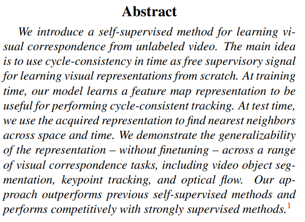

# Video Synthesis

## Moments in Time Dataset: one million videos for event understanding

[**Link**](https://arxiv.org/pdf/1903.07593.pdf)

.png>)

[**Link**](https://arxiv.org/pdf/1706.01433.pdf)

.png>)

.png>)

.png>)

[**Link**](https://arxiv.org/pdf/1806.01810.pdf)

.png>)

[**Learning to Decompose and Disentangle Representations for Video Prediction**](https://arxiv.org/pdf/1806.04166.pdf)

We propose the Decompositional Disentangled Predictive Auto-Encoder (DDPAE), a framework that combines structured probabilistic models and deep networks to automatically (i) decompose the high-dimensional video that we aim to predict into components, and (ii) disentangle each component to have low-dimensional temporal dynamics that are easier to predict.

[**Unsupervised-learning-of-object-structure-and-dynamics-from-videos**](https://papers.nips.cc/paper/8304-unsupervised-learning-of-object-structure-and-dynamics-from-videos.pdf)

We adopt a keypoint-based image representation and learn a stochastic dynamics model of the keypoints.

## Video Understanding

[**MoCoGAN: Decomposing Motion and Content for Video Generation**](https://arxiv.org/pdf/)

* [**Point-to-Point Video Generation**](https://arxiv.org/abs/1904.02912v2.pdf)
* [**G3AN : This video does not exist. Disentangling motion and appearance for video generation**](https://arxiv.org/abs/1912.05523v1.pdf)
* [**Learning to Decompose and Disentangle Representations for Video Prediction**](http://papers.nips.cc/paper/7333-learning-to-decompose-and-disentangle-representations-for-video-prediction.pdf)
* [**- Non-Adversarial Video Synthesis with Learned Priors**](https://paperswithcode.com/paper/non-adversarial-video-synthesis-with-learned)
* [**Navsynth**](https://abhishekaich27.github.io/navsynth.html)
* [**VideoBERT: A Joint Model for Video and Language Representation Learning**](https://arxiv.org/abs/1904.01766.pdf)
* [**ViLBERT: Pretraining Task-Agnostic Visiolinguistic Representations for Vision-and-Language Tasks**](https://arxiv.org/abs/1908.02265.pdf)
* [**Unified Vision-Language Pre-Training for Image Captioning and VQA**](https://arxiv.org/abs/1909.11059.pdf)
* [**VideoFlow: A Flow-Based Generative Model for Video**](https://arxiv.org/abs/1903.01434.pdf)
* [**Generating Videos with Scene Dynamics**](https://papers.nips.cc/paper/6194-generating-videos-with-scene-dynamics.pdf)
* [**What Makes a Video a Video: Analyzing Temporal Information in Video Understanding Models and Datasets**](http://openaccess.thecvf.com/content\_cvpr\_2018/papers/Huang\_What\_Makes\_a\_CVPR\_2018\_paper.pdf)
* [**Disentangling Propagation and Generation for Video Prediction**](http://openaccess.thecvf.com/content\_ICCV\_2019/papers/Gao\_Disentangling\_Propagation\_and\_Generation\_for\_Video\_Prediction\_ICCV\_2019\_paper.pdf)
* [**End-To-End Time-Lapse Video Synthesis From a Single Outdoor Image**](http://openaccess.thecvf.com/content\_CVPR\_2019/html/Nam\_End-To-End\_Time-Lapse\_Video\_Synthesis\_From\_a\_Single\_Outdoor\_Image\_CVPR\_2019\_paper.html)
* [**\[1907.06571\] Efficient Video Generation on Complex Datasets**](https://arxiv.org/abs/1907.06571)
* [**GANimation: One-Shot Anatomically Consistent Facial Animation**](https://link.springer.com/article/10.1007/s11263-019-01210-3)
* [**\[1908.06607\] Video synthesis of human upper body with realistic face**](https://arxiv.org/abs/1908.06607)
* [**Liu: Video synthesis of human upper body with realistic face - Google Scholar**](https://scholar.google.com/scholar?cites=13583776322979873311\&as\_sdt=2005\&sciodt=0,5\&hl=en)
* [**Cartoonish sketch-based face editing in videos using identity deformation transfer - ScienceDirect**](https://www.sciencedirect.com/science/article/abs/pii/S0097849319300147)
