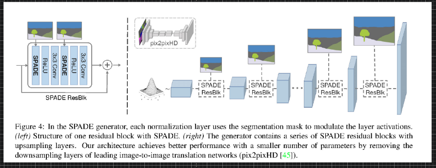
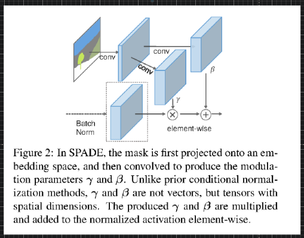
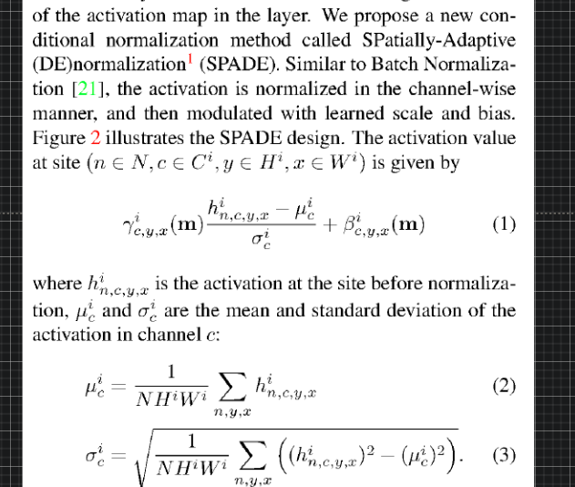
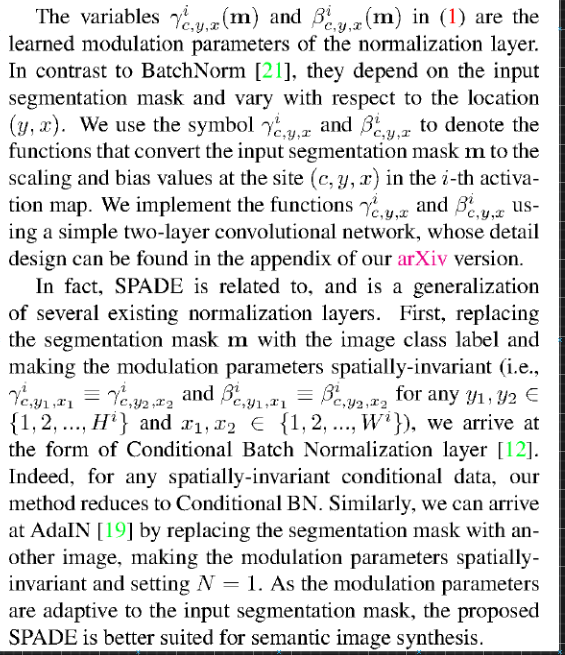
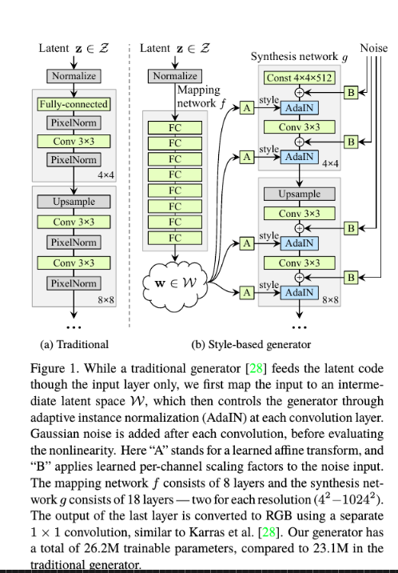
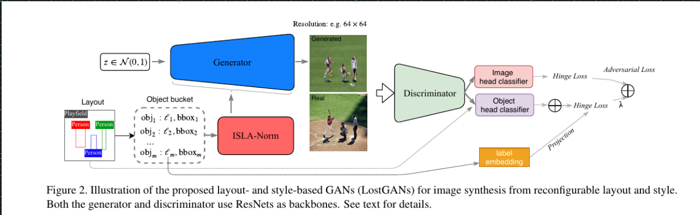

# Computer Vision

---

## AI as a Movie Maker

---

### SPADE

- [**junyanz/pytorch-CycleGAN-and-pix2pix: Image-to-Image Translation in PyTorch**](https://github.com/junyanz/pytorch-CycleGAN-and-pix2pix)
- [**NVlabs/SPADE: Semantic Image Synthesis with SPADE**](https://github.com/NVlabs/SPADE)

---

---

[**Link**](https://arxiv.org/pdf/1711.07971.pdf)

---

### End-to-End Object Detection with Transformers

https://github.com/facebookresearch/detr

---

- [**guoyongcs/DRN: Closed-loop Matters: Dual Regression Networks for Single Image Super-Resolution**](https://github.com/guoyongcs/DRN)
- [**Closed-loop Matters: Dual Regression Networks for Single Image Super-Resolution**](https://arxiv.org/abs/2003.07018.pdf)
- [**Ariel Shamir's Homepage**](http://www.faculty.idc.ac.il/arik/site/writeVideo.asp)
- [**Non-Photorealistic Computer Graphics: Modeling, Rendering, and Animation - Thomas Strothotte, Stefan Schlechtweg - Google Books**](https://books.google.co.in/books?hl=en&lr=&id=Kq_dU65kngUC&oi=fnd&pg=PP2&ots=vEmD9Rjr3i&sig=LXVandqs4l0nLWDwDaNgSwa3XjY&redir_esc=y#v=onepage&q&f=false)
- [**Lin: Video stylization: painterly rendering and optimizat... - Google Scholar**](https://scholar.google.com/scholar?um=1&ie=UTF-8&lr&cites=1538375253694513701)

- [**Generalizing Convolutional Neural Networks for Equivariance to Lie Groups on Arbitrary Continuous Data**](https://github.com/mfinzi/LieConv)

---

- [**What Synthesis is Missing: Depth Adaptation Integrated with Weak Supervision for Indoor Scene Parsing**](https://arxiv.org/abs/1903.09781.pdf)
- [**Mocycle-GAN: Unpaired Video-to-Video Translation**](https://arxiv.org/abs/1908.09514.pdf)
- [**End-To-End Time-Lapse Video Synthesis From a Single Outdoor Image**](http://openaccess.thecvf.com/content_CVPR_2019/papers/Nam_End-To-End_Time-Lapse_Video_Synthesis_From_a_Single_Outdoor_Image_CVPR_2019_paper.pdf)
- [**Deep Video Frame Interpolation using Cyclic Frame Generation**](https://www.citi.sinica.edu.tw/papers/yylin/6497-F.pdf)
- [**FVD: A new Metric for Video Generation**](https://openreview.net/forum?id=rylgEULtdN)
- [**Semantic Image Synthesis with Spatially-Adaptive Normalization**](https://arxiv.org/abs/1903.07291.pdf)
- [**Modular Generative Adversarial Networks**](http://openaccess.thecvf.com/content_ECCV_2018/papers/Bo_Zhao_Modular_Generative_Adversarial_ECCV_2018_paper.pdf)

- [**Unsupervised Doodling and Painting with Improved SPIRAL**](https://learning-to-paint.github.io/)
- [**Deep Learning Monitor - Find new Arxiv papers, tweets and Reddit posts for you**](https://deeplearn.org/)
- [**Image Synthesis From Reconfigurable Layout and Style**](https://arxiv.org/abs/1908.07500.pdf)
- [**Adversarial Learning of Semantic Relevance in Text to Image Synthesis**](http://www.eecs.harvard.edu/~htk/publication/2019-aaai-cha-gwon-kung.pdf)
- [**Convolutional Sequence Generation for Skeleton-Based Action Synthesis - Google Search**](https://www.google.com/search?q=Convolutional+Sequence+Generation+for+Skeleton-Based+Action+Synthesis&rlz=1C1CHBF_enUS858US858&oq=Convolutional+Sequence+Generation+for+Skeleton-Based+Action+Synthesis&aqs=chrome..69i57&sourceid=chrome&ie=UTF-8)

---

- [**Art and Technology at Pixar**](http://graphics.pixar.com/library/sigAsia2018Course/paper.pdf)
- [**Film Prodcution Pipeline**](https://www.youtube.com/watch?v=7hUH92xwODg)
- [**A Survey on Human Performance Capture and Animation**](https://users.cs.cf.ac.uk/Yukun.Lai/papers/PerformanceSurveyJCST.pdf)
- [**Painterly Rendering for Animation**](http://www.eecs.umich.edu/courses/eecs498-2/papers/meier96.pdf)

- [**Text-based Editing of Talking-head Video**](https://arxiv.org/abs/1906.01524.pdf)
- [**Incremental Scene Synthesis**](https://arxiv.org/abs/1811.12297.pdf)
- [**Unsupervised Person Image Generation With Semantic Parsing Transformation**](http://openaccess.thecvf.com/content_CVPR_2019/papers/Song_Unsupervised_Person_Image_Generation_With_Semantic_Parsing_Transformation_CVPR_2019_paper.pdf)
- [**DeepView: View Synthesis With Learned Gradient Descent**](http://openaccess.thecvf.com/content_CVPR_2019/papers/Flynn_DeepView_View_Synthesis_With_Learned_Gradient_Descent_CVPR_2019_paper.pdf)
- [**Textured Neural Avatars**](http://openaccess.thecvf.com/content_CVPR_2019/papers/Shysheya_Textured_Neural_Avatars_CVPR_2019_paper.pdf)
- [**Multi-Channel Attention Selection GAN With Cascaded Semantic Guidance for Cross-View Image Translation**](http://openaccess.thecvf.com/content_CVPR_2019/papers/Tang_Multi-Channel_Attention_Selection_GAN_With_Cascaded_Semantic_Guidance_for_Cross-View_CVPR_2019_paper.pdf)
- [**STGAN: A Unified Selective Transfer Network for Arbitrary Image Attribute Editing**](http://openaccess.thecvf.com/content_CVPR_2019/papers/Liu_STGAN_A_Unified_Selective_Transfer_Network_for_Arbitrary_Image_Attribute_CVPR_2019_paper.pdf)
- [**Towards Instance-Level Image-To-Image Translation**](http://openaccess.thecvf.com/content_CVPR_2019/papers/Shen_Towards_Instance-Level_Image-To-Image_Translation_CVPR_2019_paper.pdf)
- [**Deep Flow-Guided Video Inpainting**](http://openaccess.thecvf.com/content_CVPR_2019/papers/Xu_Deep_Flow-Guided_Video_Inpainting_CVPR_2019_paper.pdf)

## Vision

- [**[2001.07966] ImageBERT: Cross-modal Pre-training with Large-scale Weak-supervised Image-Text Data**](https://arxiv.org/abs/2001.07966)
- [**[2001.09518] Unsupervised Disentanglement of Pose, Appearance and Background from Images and Videos**](https://arxiv.org/abs/2001.09518)
- [**Everybody’s Talkin’: Let Me Talk as You Want**](https://wywu.github.io/projects/EBT/EBT.html)
- [**[2001.09908] Rotation, Translation, and Cropping for Zero-Shot Generalization**](https://arxiv.org/abs/2001.09908)
- [**https://next.cs.cmu.edu/multiverse/**](https://next.cs.cmu.edu/multiverse/)
- [**[1804.03160] The Sound of Pixels**](https://arxiv.org/abs/1804.03160)
- [**Google AI Blog: AutoFlip: An Open Source Framework for Intelligent Video Reframing**](https://ai.googleblog.com/2020/02/autoflip-open-source-framework-for.html?m=1)
- [**[2002.05709] A Simple Framework for Contrastive Learning of Visual Representations**](https://arxiv.org/abs/2002.05709)
- [**[2002.05235v1] Image-to-Image Translation with Text Guidance**](https://arxiv.org/abs/2002.05235v1)
- [**[2001.06232] Sideways: Depth-Parallel Training of Video Models**](https://arxiv.org/abs/2001.06232)
- [**Deep Single Image Portrait Relighting**](https://zhhoper.github.io/dpr.html)
- [**[1910.05852v2] Implicit competitive regularization in GANs**](https://arxiv.org/abs/1910.05852v2)
- [**[2004.04572v1] ARCH: Animatable Reconstruction of Clothed Humans**](https://arxiv.org/abs/2004.04572v1)
- [**[2004.05155] Learning to Explore using Active Neural SLAM**](https://arxiv.org/abs/2004.05155)
- [**[2004.13060v1] GIMP-ML: Python Plugins for using Computer Vision Models in GIMP**](https://arxiv.org/abs/2004.13060v1)
- [**[2004.12992v1] MakeItTalk: Speaker-Aware Talking Head Animation**](https://arxiv.org/abs/2004.12992v1)
- [**[1912.08795] Dreaming to Distill: Data-free Knowledge Transfer via DeepInversion**](https://arxiv.org/abs/1912.08795)
- [**[1912.11370] Big Transfer (BiT): General Visual Representation Learning**](https://arxiv.org/abs/1912.11370)
- [**[2005.07781] Scones: Towards Conversational Authoring of Sketches**](https://arxiv.org/abs/2005.07781)
- [**[2006.03677] Visual Transformers: Token-based Image Representation and Processing for Computer Vision**](https://arxiv.org/abs/2006.03677)
- [**[2006.09965v1] High-Fidelity Generative Image Compression**](https://arxiv.org/abs/2006.09965v1)
- [**[2006.10738v1] Differentiable Augmentation for Data-Efficient GAN Training**](https://arxiv.org/abs/2006.10738v1)
- [**Image GPT**](https://openai.com/blog/image-gpt/)
- [**CVPR'20 Online Tutorial on Interpretable Machine Learning in Computer Vision**](https://interpretablevision.github.io/)
- [**Consistent Video Depth Estimation**](https://roxanneluo.github.io/Consistent-Video-Depth-Estimation/)
- [**How to Get a Better GAN (Almost) for Free: Introducing the Metropolis-Hastings GAN **](https://eng.uber.com/mh-gan/)
- [**Satoshi Iizuka — DeepRemaster**](http://iizuka.cs.tsukuba.ac.jp/projects/remastering/en/index.html)
- [**Use the Force, Luke!**](https://ehsanik.github.io/forcecvpr2020/)
- [**Generating Digital Painting Lighting Effects via RGB-space Geometry**](https://lllyasviel.github.io/PaintingLight/)
- [** A deep learning approach for generalized speech animation**](https://dl.acm.org/doi/pdf/10.1145/3072959.3073699)
- [**Synthesizing Environment-Aware Activities via Activity Sketches**](https://andrewliao11.github.io/project/env-program/)
- [**Feedback_Adversarial_Learning_Spatial_Feedback_for_Improving_Generative_Adversarial_Networks**](https://openaccess.thecvf.com/content_CVPR_2019/papers/Huh_Feedback_Adversarial_Learning_Spatial_Feedback_for_Improving_Generative_Adversarial_Networks_CVPR_2019_paper.pdf)
- [**Penrose: from mathematical notation to beautiful diagrams**](https://penrose.ink/siggraph20.html)
- [**High Fidelity Generative Image Compression**](https://hific.github.io/)
- [**Immersive Light Field Video with a Layered Mesh Representation**](https://augmentedperception.github.io/deepviewvideo/)
- [**Introducing neural supersampling for real-time rendering - Facebook Research**](https://research.fb.com/blog/2020/07/introducing-neural-supersampling-for-real-time-rendering/)
- [**Swapping Autoencoder for Deep Image Manipulation**](https://taesung.me/SwappingAutoencoder/)
- [**The Eyes Have It: An Integrated Eye and Face Model for Photorealistic Facial Animation - Facebook Research**](https://research.fb.com/publications/the-eyes-have-it-an-integrated-eye-and-face-model-for-photorealistic-facial-animation/)
- [**Neural Supersampling for Real-time Rendering - Facebook Research**](https://research.fb.com/publications/neural-supersampling-for-real-time-rendering/)
- [**VR Facial Animation via Multiview Image Translation - Facebook Research**](https://research.fb.com/publications/vr-facial-animation-via-multiview-image-translation/)
- [**VirtualHome**](http://virtual-home.org/)

---
