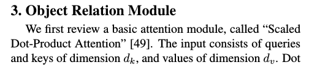
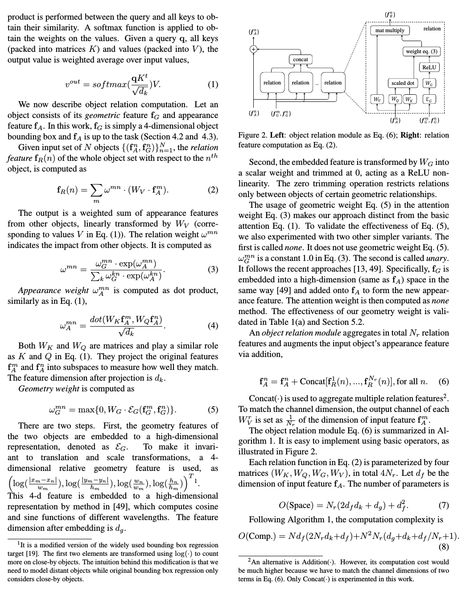

# Abstract Ideas

## Adversarial Learning

## Constrastive Learning
---
## Relational Neural Networks

---

---
## Curiosity Driven Learning

## Learning by Model Disagreements

## Integration with Knowledge Bases
