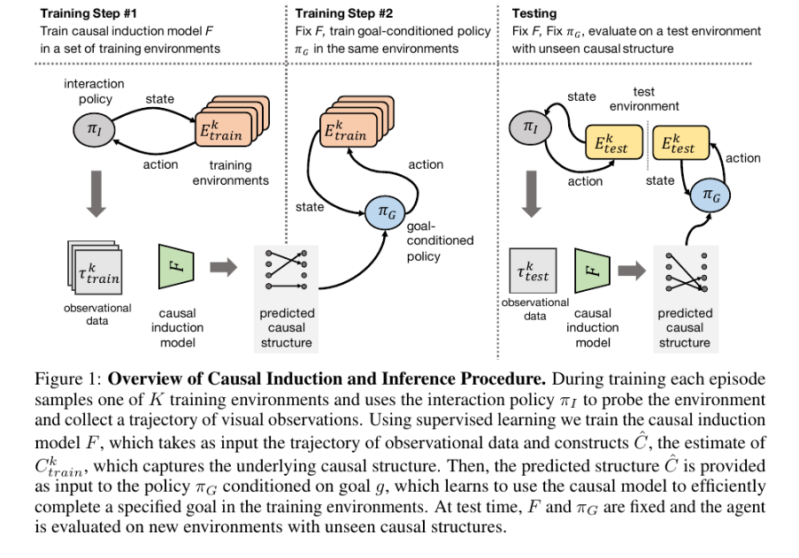
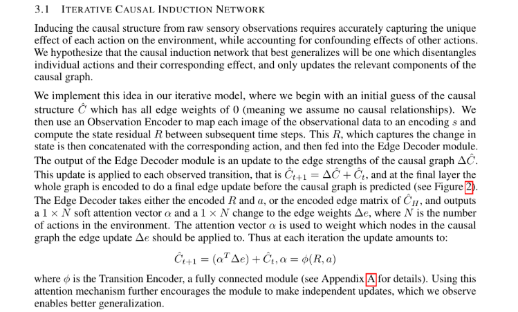
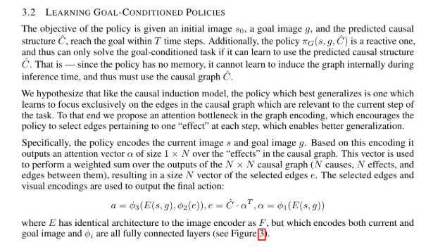

## Causal Machine Learning

- Using counterfactuals to solve problems, Recurrent Independent Mechanisms
- Model based Causality and Disentanglement : Causality and Anti-Causal by injecting interference

[https://arxiv.org/abs/1901.10912](https://arxiv.org/abs/1901.10912)

We propose to meta-learn causal structures based on how fast a learner adapts to new distributions arising from sparse distributional changes, e.g. due to interventions, actions of agents and other sources of non-stationarities. We show that under this assumption, the correct causal structural choices lead to faster adaptation to modified distributions because the changes are concentrated in one or just a few mechanisms when the learned knowledge is modularized appropriately. This leads to sparse expected gradients and a lower effective number of degrees of freedom needing to be relearned while adapting to the change. It motivates using the speed of adaptation to a modified distribution as a meta-learning objective. .

---

---

