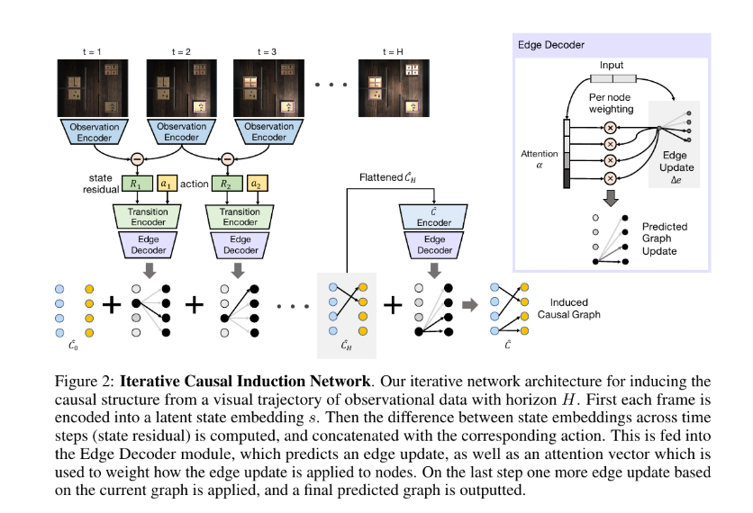
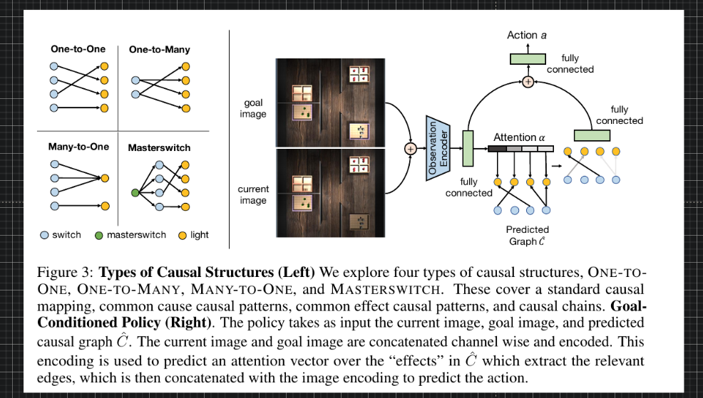

## Causal Machine Learning

- Using counterfactuals to solve problems, Recurrent Independent Mechanisms
- Model based Causality and Disentanglement : Causality and Anti-Causal by injecting interference

[https://arxiv.org/abs/1901.10912](https://arxiv.org/abs/1901.10912)

We propose to meta-learn causal structures based on how fast a learner adapts to new distributions arising from sparse distributional changes, e.g. due to interventions, actions of agents and other sources of non-stationarities. We show that under this assumption, the correct causal structural choices lead to faster adaptation to modified distributions because the changes are concentrated in one or just a few mechanisms when the learned knowledge is modularized appropriately. This leads to sparse expected gradients and a lower effective number of degrees of freedom needing to be relearned while adapting to the change. It motivates using the speed of adaptation to a modified distribution as a meta-learning objective. .

---

---

### Causality and Neural Logic

https://arxiv.org/abs/1905.13049.pdf | Neural Consciousness Flow
https://arxiv.org/abs/1811.00497.pdf | Modeling Attention Flow on Graphs
http://papers.nips.cc/paper/6826-differentiable-learning-of-logical-rules-for-knowledge-base-reasoning.pdf | Differentiable Learning of Logical Rules for Knowledge Base Reasoning
https://arxiv.org/abs/1809.02193.pdf | Logical Rule Induction and Theory Learning Using Neural Theorem Proving
https://arxiv.org/abs/1907.05008.pdf | Understanding the Representation Power of Graph Neural Networks in Learning Graph Topology
https://icml.cc/2012/papers/625.pdf | On Causal and Anticausal Learning

https://scholar.google.com/scholar?cites=9758707731169438744&as_sdt=2005&sciodt=0,5&hl=en | Mirowski: Learning to navigate in cities without a map - Google Scholar
https://openreview.net/forum?id=BkxWJnC9tX | Diversity and Depth in Per-Example Routing Models
https://arxiv.org/abs/1804.00645.pdf | Universal Planning Networks
https://scholar.google.com/scholar?start=0&hl=en&as_sdt=2005&sciodt=0,5&cites=14158098098420736883&scipsc= | Parisotto: Neural map: Structured memory for deep... - Google Scholar
https://arxiv.org/abs/1702.08360 | [1702.08360] Neural Map: Structured Memory for Deep Reinforcement Learning
https://arxiv.org/abs/1709.05706 | [1709.05706] Memory Augmented Control Networks
https://arxiv.org/abs/1801.08214 | [1801.08214] Active Neural Localization
http://openaccess.thecvf.com/content_CVPR_2019/html/Tung_Learning_Spatial_Common_Sense_With_Geometry-Aware_Recurrent_Networks_CVPR_2019_paper.html | CVPR 2019 Open Access Repository
https://openreview.net/forum?id=H1gN6kSFwS | Learning Neural Causal Models from Unknown Interventions
https://arxiv.org/abs/1911.10496.pdf | Two Causal Principles for Improving Visual Dialog