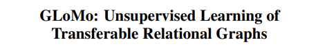
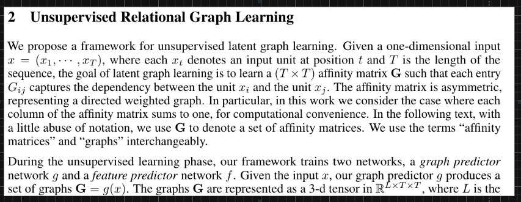
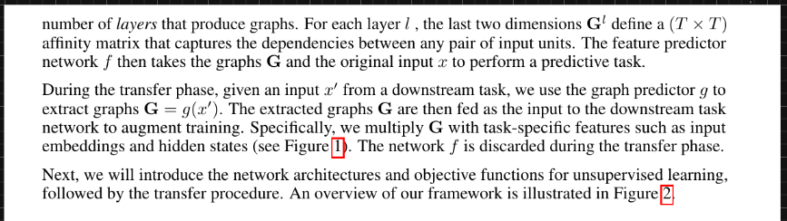
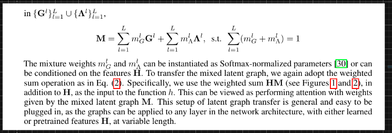

# Graph Neural Networks

[Link](https://arxiv.org/abs/1903.03894)

---

[Link](https://papers.nips.cc/paper/8110-glomo-unsupervised-learning-of-transferable-relational-graphs.pdf)

---

[Link](https://openaccess.thecvf.com/content_CVPR_2019/papers/Chen_Graph-Based_Global_Reasoning_Networks_CVPR_2019_paper.pdf)

### Graph and Interaction Networks

- https://arxiv.org/abs/1612.00341.pdf | A Compositional Object-Based Approach to Learning Physical Dynamics
- http://papers.nips.cc/paper/6418-interaction-networks-for-learning-about-objects-relations-and-physics.pdf | Interaction Networks for Learning about Objects, Relations and Physics
- http://papers.nips.cc/paper/6620-learning-to-see-physics-via-visual-de-animation.pdf | Learning to See Physics via Visual De-animation
- https://arxiv.org/abs/1806.01242.pdf | Graph Networks as Learnable Physics Engines for Inference and Control
- http://papers.nips.cc/paper/8096-flexible-neural-representation-for-physics-prediction.pdf | Flexible neural representation for physics prediction
- http://papers.nips.cc/paper/7333-learning-to-decompose-and-disentangle-representations-for-video-prediction.pdf | Learning to Decompose and Disentangle Representations for Video Prediction
- https://arxiv.org/abs/1806.01203.pdf | Relational inductive bias for physical construction in humans and machines
- http://papers.nips.cc/paper/6951-a-disentangled-recognition-and-nonlinear-dynamics-model-for-unsupervised-learning.pdf | A Disentangled Recognition and Nonlinear Dynamics Model for Unsupervised Learning
- http://papers.nips.cc/paper/7040-visual-interaction-networks-learning-a-physics-simulator-from-video.pdf | papers.nips.cc/paper/7040-visual-interaction-networks-learning-a-physics-simulator-from-video.pdf
- https://arxiv.org/abs/1802.04687.pdf | Neural Relational Inference for Interacting Systems
- https://scholar.google.co.in/scholar?start=0&hl=en&as_sdt=2005&sciodt=0,5&cites=9706972547667418204&scipsc= | Chang: A compositional object-based approach to learning... - Google Scholar
- https://paperswithcode.com/paper/deepgs-deep-representation-learning-of-graphs | - DeepGS: Deep Representation Learning of Graphs and Sequences for Drug-Target Binding Affinity Prediction
- https://arxiv.org/abs/1710.10903.pdf | Graph Attention Networks
- https://arxiv.org/abs/1911.11763.pdf | SuperGlue: Learning Feature Matching with Graph Neural Networks
- https://github.com/RexYing/gnn-model-explainer | RexYing/gnn-model-explainer: gnn explainer
- https://github.com/thunlp/GNNPapers | thunlp/GNNPapers: Must-read papers on graph neural networks (GNN)
- https://paperswithcode.com/paper/deep-graph-library-towards-efficient-and | - Deep Graph Library: Towards Efficient and Scalable Deep Learning on Graphs
- https://github.com/weihua916 | weihua916 (Weihua Hu)
