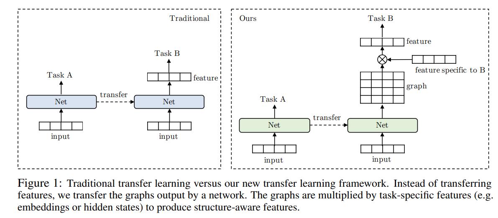

# Graph Neural Networks

[**Link**](https://arxiv.org/abs/1903.03894)

---

[**Link**](https://papers.nips.cc/paper/8110-glomo-unsupervised-learning-of-transferable-relational-graphs.pdf)

---

[**Link**](https://openaccess.thecvf.com/content_CVPR_2019/papers/Chen_Graph-Based_Global_Reasoning_Networks_CVPR_2019_paper.pdf)

### Graph and Interaction Networks

- [**A Compositional Object-Based Approach to Learning Physical Dynamics**](https://arxiv.org/abs/1612.00341.pdf)
- [**Interaction Networks for Learning about Objects, Relations and Physics**](http://papers.nips.cc/paper/6418-interaction-networks-for-learning-about-objects-relations-and-physics.pdf)
- [**Learning to See Physics via Visual De-animation**](http://papers.nips.cc/paper/6620-learning-to-see-physics-via-visual-de-animation.pdf)
- [**Graph Networks as Learnable Physics Engines for Inference and Control**](https://arxiv.org/abs/1806.01242.pdf)
- [**Flexible neural representation for physics prediction**](http://papers.nips.cc/paper/8096-flexible-neural-representation-for-physics-prediction.pdf)
- [**Learning to Decompose and Disentangle Representations for Video Prediction**](http://papers.nips.cc/paper/7333-learning-to-decompose-and-disentangle-representations-for-video-prediction.pdf)
- [**Relational inductive bias for physical construction in humans and machines**](https://arxiv.org/abs/1806.01203.pdf)
- [**A Disentangled Recognition and Nonlinear Dynamics Model for Unsupervised Learning**](http://papers.nips.cc/paper/6951-a-disentangled-recognition-and-nonlinear-dynamics-model-for-unsupervised-learning.pdf)
- [**visual-interaction-networks-learning-a-physics-simulator-from-video.pdf**](http://papers.nips.cc/paper/7040-visual-interaction-networks-learning-a-physics-simulator-from-video.pdf)
- [**Neural Relational Inference for Interacting Systems**](https://arxiv.org/abs/1802.04687.pdf)
- [**Chang: A compositional object-based approach to learning... - Google Scholar**](https://scholar.google.co.in/scholar?start=0&hl=en&as_sdt=2005&sciodt=0,5&cites=9706972547667418204&scipsc=)
- [**- DeepGS: Deep Representation Learning of Graphs and Sequences for Drug-Target Binding Affinity Prediction**](https://paperswithcode.com/paper/deepgs-deep-representation-learning-of-graphs)
- [**Graph Attention Networks**](https://arxiv.org/abs/1710.10903.pdf)
- [**SuperGlue: Learning Feature Matching with Graph Neural Networks**](https://arxiv.org/abs/1911.11763.pdf)
- [**RexYing/gnn-model-explainer: gnn explainer**](https://github.com/RexYing/gnn-model-explainer)
- [**thunlp/GNNPapers: Must-read papers on graph neural networks (GNN)**](https://github.com/thunlp/GNNPapers)
- [**- Deep Graph Library: Towards Efficient and Scalable Deep Learning on Graphs**](https://paperswithcode.com/paper/deep-graph-library-towards-efficient-and)
- [**weihua916 (Weihua Hu)**](https://github.com/weihua916)
