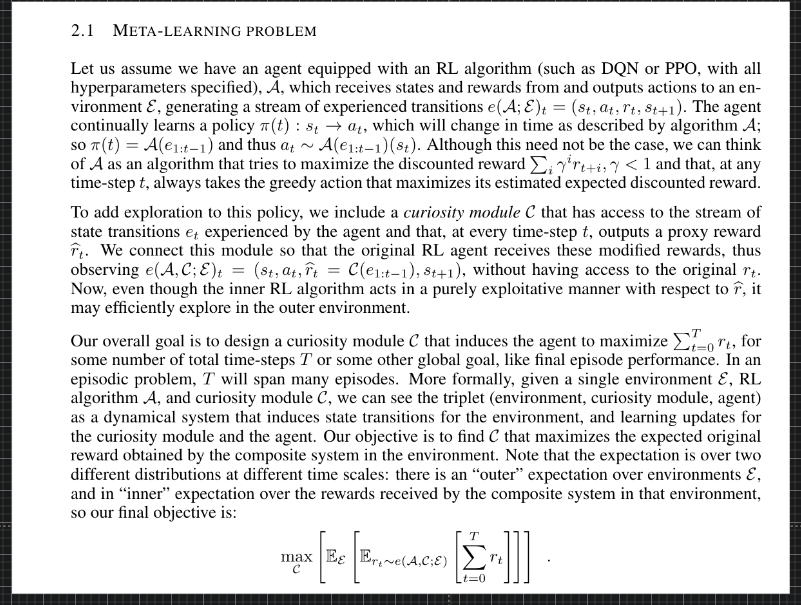
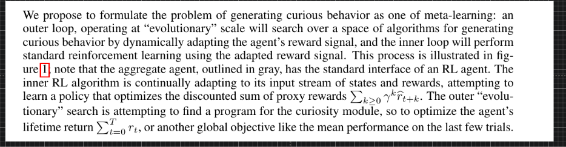

# Meta Learning

---

### Meta-Learning

http://cs330.stanford.edu/ | CS 330 Deep Multi-Task and Meta Learning
http://web.stanford.edu/class/cs330/material/homework_1_final.pdf | homework_1_final.pdf
https://web.mit.edu/cocosci/Papers/Science-2015-Lake-1332-8.pdf | 1332 1332..1338
http://proceedings.mlr.press/v48/santoro16.pdf | santoro16.pdf
https://arxiv.org/abs/1802.05098 | [1802.05098] DiCE: The Infinitely Differentiable Monte-Carlo Estimator
https://arxiv.org/abs/1611.04201 | [1611.04201] CAD2RL: Real Single-Image Flight without a Single Real Image
https://arxiv.org/abs/1810.06544 | [1810.06544] Deep Imitative Models for Flexible Inference, Planning, and Control
https://arxiv.org/abs/1810.04805 | [1810.04805] BERT: Pre-training of Deep Bidirectional Transformers for Language Understanding
https://arxiv.org/abs/1710.02298 | [1710.02298] Rainbow: Combining Improvements in Deep Reinforcement Learning
https://arxiv.org/abs/1907.00953 | [1907.00953] Stochastic Latent Actor-Critic: Deep Reinforcement Learning with a Latent Variable Model
http://roboticsproceedings.org/rss10/p19.pdf | p19.pdf
https://arxiv.org/abs/1904.11455 | [1904.11455] Ray Interference: a Source of Plateaus in Deep Reinforcement Learning
https://www.sciencedirect.com/science/article/pii/S0004370299000521 | Between MDPs and semi-MDPs: A framework for temporal abstraction in reinforcement learning - ScienceDirect
https://arxiv.org/abs/1610.05182 | [1610.05182] Learning and Transfer of Modulated Locomotor Controllers
https://arxiv.org/abs/1805.08296 | [1805.08296] Data-Efficient Hierarchical Reinforcement Learning
https://arxiv.org/abs/1906.07343 | [1906.07343] Language as an Abstraction for Hierarchical Deep Reinforcement Learning
https://www.biorxiv.org/content/10.1101/295964v2 | Prefrontal Cortex as a Meta-Reinforcement Learning System | bioRxiv
https://arxiv.org/abs/1710.03748 | [1710.03748] Emergent Complexity via Multi-Agent Competition
https://arxiv.org/abs/1711.00482 | [1711.00482] Learning with Latent Language
http://cs330.stanford.edu/#topics | CS 330 Deep Multi-Task and Meta Learning
http://cs330.stanford.edu/slides/cs330_lecture1.pdf | cs330_lecture1
http://cs330.stanford.edu/slides/cs330_lec2.pdf | cs330_lec2
https://arxiv.org/abs/1808.08437 | [1808.08437] Meta-Learning for Low-Resource Neural Machine Translation
https://arxiv.org/abs/1710.10304 | [1710.10304] Few-shot Autoregressive Density Estimation: Towards Learning to Learn Distributions
https://arxiv.org/abs/1703.07326 | [1703.07326] One-Shot Imitation Learning
https://arxiv.org/abs/1502.02072.pdf | Massively Multitask Networks for Drug Discovery
https://arxiv.org/abs/1807.05960 | [1807.05960] Meta-Learning with Latent Embedding Optimization
https://arxiv.org/abs/1810.03642 | [1810.03642] Fast Context Adaptation via Meta-Learning
https://arxiv.org/abs/1903.03096 | [1903.03096] Meta-Dataset: A Dataset of Datasets for Learning to Learn from Few Examples
https://arxiv.org/abs/1711.04043 | [1711.04043] Few-Shot Learning with Graph Neural Networks
https://ai.googleblog.com/2019/02/introducing-planet-deep-planning.html? | Google AI Blog: Introducing PlaNet: A Deep Planning Network for Reinforcement Learning

### Meta-induction and AI-Cognitive Sciences

https://papers.nips.cc/paper/6803-neural-program-meta-induction.pdf | Neural Program Meta-Induction
https://openreview.net/forum?id=H1gfOiAqYm |Execution-Guided Neural Program Synthesis
https://arxiv.org/abs/1905.12941.pdf | Learning Compositional Neural Programs with Recursive Tree Search and Planning
https://arxiv.org/abs/1910.06764.pdf | Stabilizing Transformers for Reinforcement Learning
http://delivery.acm.org/10.1145/3360000/3351094/p1543-duan.pdf?ip=196.207.120.77&id=3351094&acc=OPEN&key=4D4702B0C3E38B35%2E4D4702B0C3E38B35%2E4D4702B0C3E38B35%2E6D218144511F3437&__acm__=1572177329_8e0602267436eaebaa93882eaf22b0f5 | Watch, Reason and Code: Learning to Represent Videos Using Program
https://arxiv.org/abs/1901.02875.pdf | Learning to Infer and Execute 3D Shape Programs

https://openreview.net/forum?id=S1sqHMZCb
http://openaccess.thecvf.com/content_CVPR_2019/papers/Huang_Neural_Task_Graphs_Generalizing_to_Unseen_Tasks_From_a_Single_CVPR_2019_paper.pdf | Neural Task Graphs: Generalizing to Unseen Tasks From a Single Video Demonstration
https://arxiv.org/abs/1806.01203 | [1806.01203] Relational inductive bias for physical construction in humans and machines
https://arxiv.org/abs/1906.05370 | [1906.05370] Neural Graph Evolution: Towards Efficient Automatic Robot Design
https://arxiv.org/abs/1906.11315 | [1906.11315] Generalization to Novel Objects using Prior Relational Knowledge
https://arxiv.org/abs/1910.00105 | [1910.00105] Cross Domain Imitation Learning
https://papers.nips.cc/paper/6803-neural-program-meta-induction.pdf | Neural Program Meta-Induction
http://proceedings.mlr.press/v80/sun18a/sun18a.pdf | Neural Program Synthesis from Diverse Demonstration Videos
https://openreview.net/forum?id=H1gfOiAqYm | Execution-Guided Neural Program Synthesis
https://openreview.net/forum?id=ryeOSnAqYm | Synthetic Datasets for Neural Program Synthesis
https://arxiv.org/abs/1905.12941.pdf | Learning Compositional Neural Programs with Recursive Tree Search and Planning

https://www.biorxiv.org/content/biorxiv/early/2019/10/21/808584.full.pdf | Prefrontal cortex exhibits multi-dimensional dynamic encoding during decision-making
https://arxiv.org/abs/1907.04553.pdf | Neural Reasoning, Fast and Slow, for Video Question Answering
https://arxiv.org/abs/1909.05546.pdf | Learning First-Order Symbolic Representations for Planning from the Structure of the State Space
https://arxiv.org/abs/1801.04016.pdf | Theoretical Impediments to Machine Learning With Seven Sparks from the Causal Revolution
file:///C:/Users/khush/AppData/Roaming/Microsoft/Windows/Network%20Shortcuts/RL,%20%20fast%20and%20slow.pdf | Reinforcement Learning, Fast and Slow
file:///C:/Users/khush/Desktop/DL_symbolic_processing.pdf | Reconciling deep learning with symbolic artificial intelligence: representing objects and relations
https://arxiv.org/abs/1906.11315.pdf | Generalization to Novel Objects using Prior Relational Knowledge
https://arxiv.org/abs/1910.01075v1.pdf | Learning Neural Causal Models from Unknown Interventions
https://arxiv.org/abs/1909.10893v2.pdf | Recurrent Independent Mechanisms
http://keg.cs.tsinghua.edu.cn/jietang/publications/ACL19-Yu-et-al-MOOC_Concept_Expansion.pdf | ACL19-Yu-et-al-MOOC_Concept_Expansion.pdf
https://arxiv.org/abs/1906.03717.pdf | Argument Generation with Retrieval, Planning, and Realization
https://arxiv.org/abs/1912.07544v1.pdf | Planning with Abstract Learned Models While Learning Transferable Subtasks
https://github.com/learnables/learn2learn/tree/master | learnables/learn2learn: PyTorch Meta-learning Framework for Researchers
http://learn2learn.net/docs/learn2learn.algorithms/ | learn2learn.algorithms - learn2learn
http://learn2learn.net/docs/learn2learn/ | learn2learn - learn2learn
