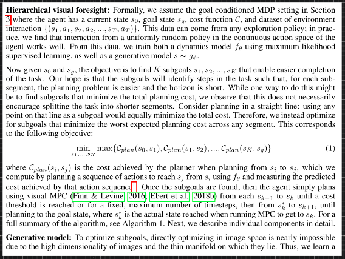
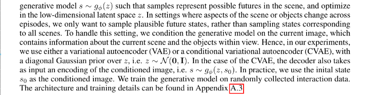
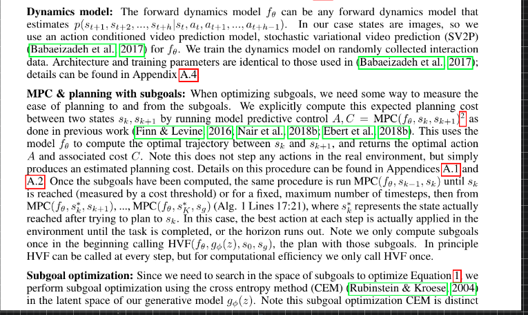

## Reinforcement Learning

- Model Predictive Control: Models a PID controller? where Integral is the memory of the previous errors (keep track of past mistakes), Differential predicts the trajectory of the current work.

---
- World Models
- Embodied AI 
- Sim2Real
  
Modular control strategies, multi-task control : using control as a reward

what is the meaning of reinforcement learning → on Gecco creatures → does it transfer to the real world → what does it mean control such a creature in the fake world → if we build its real world counterpart, will it work as good?

How good actually is dexterous hand manipulation → how much is that transferable automatically to other tasks ?

How good is hierarchical goal-setting → generating new goals → to complete tasks → does it generalise?

What is the state of multi-task learning today → is it better than control theory ?

Policy Gradients is not data-efficient and Model-based Reinforcement Learning does not work that well ?

What is the point of training such a humongous network as the one of Dota-Five (only the collaboration part may be important) by wasting so much compute and using the same algorithm (PPO) if it does not transfer?

What purpose does playing these well-controlled environment games may be useful in the real world? A war or an entertainment source?

Can we integrate the intuition and understanding of the world from computer vision and NLP (knowledge base) to this reinforcement world to make it more efficient?

How do we add constraints to the actions the agent can take ?

---

## Self-Supervised Exploration via Disagreement ##

#### [[Project Website]](https://pathak22.github.io/exploration-by-disagreement/) [[Demo Video]](https://youtu.be/POlrWt32_ec)

---

## Zero-Shot Visual Imitation ##

#### In ICLR 2018 [[Project Website]](https://pathak22.github.io/zeroshot-imitation/) [[Videos]](http://pathak22.github.io/zeroshot-imitation/index.html#demoVideos)

We propose an alternative paradigm wherein an agent first explores the world without any expert supervision and then distills its experience into a goal-conditioned skill policy with a novel forward consistency loss. The key insight is the intuition that, for most tasks, reaching the goal is more important than how it is reached.

---

## World Models Experiments

Step by step instructions of reproducing [World Models](https://worldmodels.github.io/) ([pdf](https://arxiv.org/abs/1803.10122)).

Please see [blog post](http://blog.otoro.net//2018/06/09/world-models-experiments/) for step-by-step instructions.

---

## Soft Actor-Critic

Soft actor-critic is a deep reinforcement learning framework for training maximum entropy policies in continous domains. The algorithm is based on the paper [Soft Actor-Critic: Off-Policy Maximum Entropy Deep Reinforcement Learning with a Stochastic Actor](https://drive.google.com/file/d/0Bxz3x8U2LH_2QllDZVlUQ1BJVEJHeER2YU5mODNaeFZmc3dz/view) presented at the [Deep Reinforcement Learning Symposium](https://sites.google.com/view/deeprl-symposium-nips2017/), NIPS 2017.

--- 

## RoboNet: Large-Scale Multi-Robot Learning

Code for loading and manipulating the RoboNet dataset, as well as for training supervised inverse models and video prediction models on the dataset.

---

## ReQueST — (Re)ward (Que)ry (S)ynthesis via (T)rajectory Optimization

[ReQueST](https://arxiv.org/abs/1912.05652) is a [reward modeling](https://arxiv.org/abs/1811.07871)
algorithm that asks the user for feedback on hypothetical trajectories synthesized using a
pretrained model of the environment dynamics, instead of real trajectories generated by rolling out
a partially-trained agent in the environment. Compared to
[previous](https://deepmind.com/blog/article/learning-through-human-feedback)
[approaches](https://arxiv.org/abs/1811.06521), this enables

1.  training more robust reward models that work off-policy,
2.  learning about unsafe states without visiting them, and
3.  better query-efficiency through the use of active learning.

--- 

## Third-Person Visual Imitation Learning via Decoupled Hierarchical Controller ##

#### [[Project Website]](https://pathak22.github.io/hierarchical-imitation/) [[Demo Video]](https://youtu.be/eWBkDuNFEKA)

---

## IC3Net

This repository contains reference implementation for IC3Net paper (accepted to ICLR 2019), **Learning when to communicate at scale in multiagent cooperative and competitive tasks**, available at [https://arxiv.org/abs/1812.09755](https://arxiv.org/abs/1812.09755)

---

## PlaNet
======

PlaNet: A Deep Planning Network for Reinforcement Learning [[1]](#references). Supports symbolic/visual observation spaces. Supports some Gym environments (including classic control/non-MuJoCo environments, so DeepMind Control Suite/MuJoCo are optional dependencies). Hyperparameters have been taken from the original work and are tuned for DeepMind Control Suite, so would need tuning for any other domains (such as the Gym environments).

---

## AlphaNPI

Adapting the AlphaZero algorithm  to remove the need of execution traces to train NPI.

---

## Hierarchical Visual Foresight

[Link](https://arxiv.org/abs/1909.05829)

### RL

https://paperswithcode.com/paper/represented-value-function-approach-for-large | : Represented Value Function Approach for Large Scale Multi Agent Reinforcement Learning
https://paperswithcode.com/paper/biologically-motivated-deep-learning-method | : Biologically-Motivated Deep Learning Method using Hierarchical Competitive Learning
https://paperswithcode.com/paper/restricting-the-flow-information-bottlenecks-1 | : Restricting the Flow: Information Bottlenecks for Attribution
https://paperswithcode.com/paper/understanding-and-mitigating-gradient | : Understanding and mitigating gradient pathologies in physics-informed neural networks
https://arxiv.org/abs/2001.04536v1.pdf | Understanding and mitigating gradient pathologies in physics-informed neural networks
https://arxiv.org/abs/2001.04451v1.pdf | Reformer: The Efficient Transformer
https://deepmind.com/blog/article/Dopamine-and-temporal-difference-learning-A-fruitful-relationship-between-neuroscience-and-AI | Dopamine and temporal difference learning: A fruitful relationship between neuroscience and AI | DeepMind
https://arxiv.org/abs/1906.00190v1.pdf | Neural Replicator Dynamics
https://arxiv.org/abs/1903.05614v3.pdf | Computing Approximate Equilibria in Sequential Adversarial Games by Exploitability Descent
https://arxiv.org/abs/2001.04959v1.pdf | High–Dimensional Brain in a High-Dimensional World: Blessing of Dimensionality
https://arxiv.org/abs/2001.04947v1.pdf | Neural Human Video Rendering: Joint Learning of Dynamic Textures and Rendering-to-Video Translation
https://arxiv.org/abs/2001.05140v1.pdf | Graph-Bert: Only Attention is Needed for Learning Graph Representations
https://arxiv.org/abs/2001.05016v1.pdf | Neural Arithmetic Units
https://arxiv.org/abs/1912.12740v1.pdf | Practice of Streaming and Dynamic Graphs: Concepts, Models, Systems, and Parallelism
https://arxiv.org/abs/1806.02813.pdf | Self-Consistent Trajectory Autoencoder: Hierarchical Reinforcement Learning with Trajectory Embeddings

### PPO and RL algorithms

https://arxiv.org/abs/1707.06347.pdf | Proximal Policy Optimization Algorithms
https://github.com/phecy/SSL-FEW-SHOT | phecy/SSL-FEW-SHOT: SSL-FEW-SHOT
https://www.ncbi.nlm.nih.gov/pubmed/20345247 | Neural mechanisms for interacting with a world full of action choices. - PubMed - NCBI
https://royalsocietypublishing.org/doi/abs/10.1098/rstb.1985.0010 | Actions and habits: the development of behavioural autonomy | Philosophical Transactions of the Royal Society of London. B, Biological Sciences
https://www.google.com/search?q=A+framework+for+the+cooperation+of+learning+algorithms.&rlz=1C1CHBF_enUS858US858&oq=A+framework+for+the+cooperation+of+learning+algorithms.&aqs=chrome..69i57j69i64l3&sourceid=chrome&ie=UTF-8 | A framework for the cooperation of learning algorithms. - Google Search
https://www.google.com/search?q=Motivation+and+cognitive+control%3A+from+behavior+to+neural+mechanism&rlz=1C1CHBF_enUS858US858&oq=Motivation+and+cognitive+control%3A+from+behavior+to+neural++mechanism&aqs=chrome..69i57&sourceid=chrome&ie=UTF-8 | Motivation and cognitive control: from behavior to neural mechanism - Google Search
https://www.google.com/search?q=Neural+module+networks&rlz=1C1CHBF_enUS858US858&oq=Neural+module+networks&aqs=chrome..69i57&sourceid=chrome&ie=UTF-8 | Neural module networks - Google Search
https://arxiv.org/abs/1709.08568 | [1709.08568] The Consciousness Prior
https://www.nature.com/nathumbehav/ | Nature Human Behaviour
https://www.google.com/search?q=Learning+to+decompose+neural+computation.&rlz=1C1CHBF_enUS858US858&oq=Learning+to+decompose+neural++computation.&aqs=chrome..69i57&sourceid=chrome&ie=UTF-8 | Learning to decompose neural computation. - Google Search
https://www.google.com/search?q=Routing+networks+and+the+challenges+of+modular+and+compositional+computation&rlz=1C1CHBF_enUS858US858&oq=Routing+networks+and+the++challenges+of+modular+and+compositional+computation&aqs=chrome..69i57&sourceid=chrome&ie=UTF-8 | Routing networks and the challenges of modular and compositional computation - Google Search
https://www.google.com/search?q=challenging+common+assumptions+in+the+unsupervised+learning+of+disentangled+representations&rlz=1C1CHBF_enUS858US858&oq=challen&aqs=chrome.1.69i57j35i39j0l2j69i60l2.4878j0j7&sourceid=chrome&ie=UTF-8 | challenging common assumptions in the unsupervised learning of disentangled representations - Google Search
https://github.com/rail-berkeley/softlearning | rail-berkeley/softlearning: Softlearning is a reinforcement learning framework for training maximum entropy policies in continuous domains. Includes the official implementation of the Soft Actor-Critic algorithm
https://github.com/thu-ml/tianshou | thu-ml/tianshou: An elegant, flexible, and superfast PyTorch deep Reinforcement Learning platform.
https://github.com/deepmind/bsuite | deepmind/bsuite: bsuite is a collection of carefully-designed experiments that investigate core capabilities of a reinforcement learning (RL) agent
https://arxiv.org/abs/1911.12247 | [1911.12247] Contrastive Learning of Structured World Models
https://arxiv.org/abs/1909.12271.pdf | RLBench: The Robot Learning Benchmark & Learning Environment
http://proceedings.mlr.press/v97/kipf19a/kipf19a.pdf | CompILE: Compositional Imitation Learning and Execution
https://arxiv.org/abs/1910.08264.pdf | Learning Compositional Koopman Operators for Model-Based Control
https://arxiv.org/abs/1803.10122.pdf | World Models
https://arxiv.org/abs/1810.06284 | CURIOUS: Intrinsically Motivated Modular Multi-Goal Reinforcement Learning
https://pathak22.github.io/zeroshot-imitation/ | Zero-Shot Visual Imitation
http://proceedings.mlr.press/v78/finn17a/finn17a.pdf?source=post_page--------------------------- | finn17a.pdf