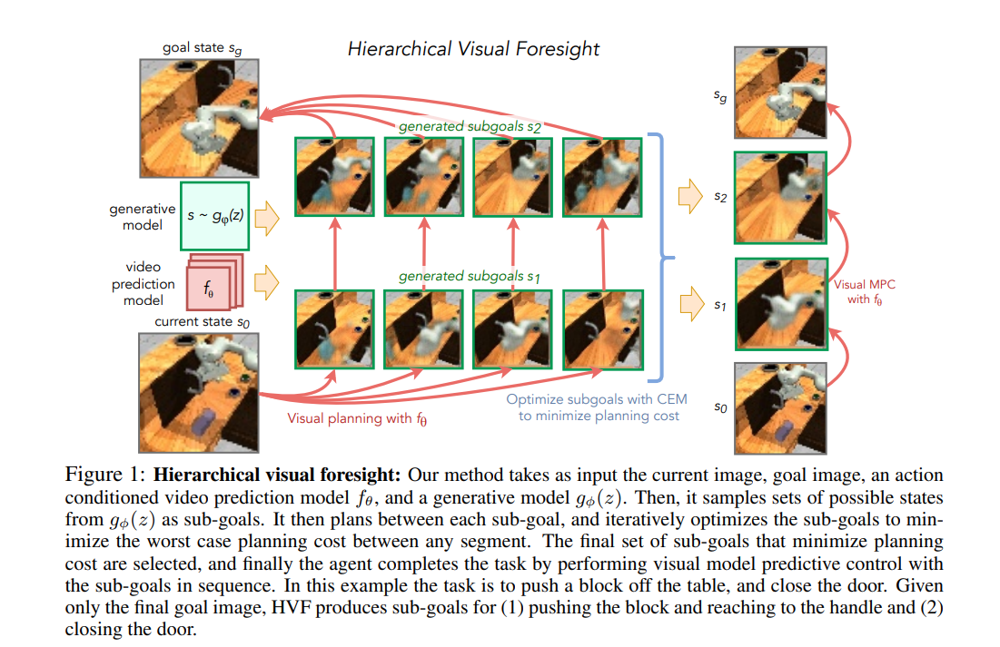
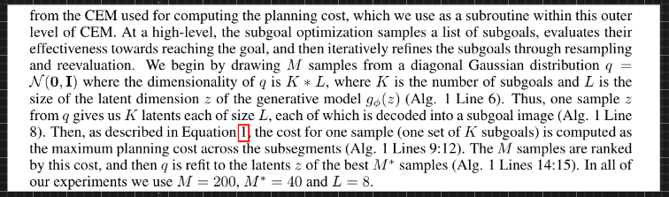
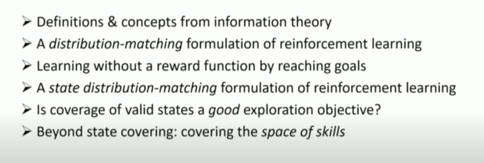
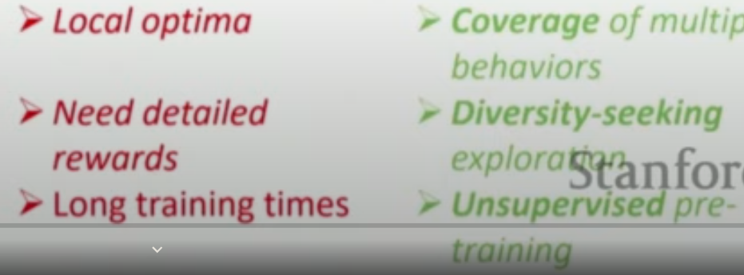

## Reinforcement Learning

- Model Predictive Control: Models a PID controller? where Integral is the memory of the previous errors (keep track of past mistakes), Differential predicts the trajectory of the current work.

---

- World Models
- Embodied AI
- Sim2Real

Modular control strategies, multi-task control : using control as a reward

what is the meaning of reinforcement learning → on Gecco creatures → does it transfer to the real world → what does it mean control such a creature in the fake world → if we build its real world counterpart, will it work as good?

How good actually is dexterous hand manipulation → how much is that transferable automatically to other tasks ?

How good is hierarchical goal-setting → generating new goals → to complete tasks → does it generalise?

What is the state of multi-task learning today → is it better than control theory ?

Policy Gradients is not data-efficient and Model-based Reinforcement Learning does not work that well ?

What is the point of training such a humongous network as the one of Dota-Five (only the collaboration part may be important) by wasting so much compute and using the same algorithm (PPO) if it does not transfer?

What purpose does playing these well-controlled environment games may be useful in the real world? A war or an entertainment source?

Can we integrate the intuition and understanding of the world from computer vision and NLP (knowledge base) to this reinforcement world to make it more efficient?

How do we add constraints to the actions the agent can take ?

---

## Self-Supervised Exploration via Disagreement

#### [\*\*[Project Website]](https://pathak22.github.io/exploration-by-disagreement/) [[Demo Video]\*\*](https://youtu.be/POlrWt32_ec)

---

## Zero-Shot Visual Imitation

#### In ICLR 2018 [\*\*[Project Website]](https://pathak22.github.io/zeroshot-imitation/) [[Videos]\*\*](http://pathak22.github.io/zeroshot-imitation/index.html#demoVideos)

We propose an alternative paradigm wherein an agent first explores the world without any expert supervision and then distills its experience into a goal-conditioned skill policy with a novel forward consistency loss. The key insight is the intuition that, for most tasks, reaching the goal is more important than how it is reached.

---

## World Models Experiments

Step by step instructions of reproducing [\*\*World Models](https://worldmodels.github.io/) ([pdf\*\*](https://arxiv.org/abs/1803.10122)).

Please see [**blog post**](http://blog.otoro.net//2018/06/09/world-models-experiments/) for step-by-step instructions.

---

## Soft Actor-Critic

Soft actor-critic is a deep reinforcement learning framework for training maximum entropy policies in continous domains. The algorithm is based on the paper [\*\*Soft Actor-Critic: Off-Policy Maximum Entropy Deep Reinforcement Learning with a Stochastic Actor](https://drive.google.com/file/d/0Bxz3x8U2LH_2QllDZVlUQ1BJVEJHeER2YU5mODNaeFZmc3dz/view) presented at the [Deep Reinforcement Learning Symposium\*\*](https://sites.google.com/view/deeprl-symposium-nips2017/), NIPS 2017.

---

## RoboNet: Large-Scale Multi-Robot Learning

Code for loading and manipulating the RoboNet dataset, as well as for training supervised inverse models and video prediction models on the dataset.

---

## ReQueST — (Re)ward (Que)ry (S)ynthesis via (T)rajectory Optimization

[\*\*ReQueST](https://arxiv.org/abs/1912.05652) is a [reward modeling\*\*](https://arxiv.org/abs/1811.07871)
algorithm that asks the user for feedback on hypothetical trajectories synthesized using a
pretrained model of the environment dynamics, instead of real trajectories generated by rolling out
a partially-trained agent in the environment. Compared to
[**previous**](https://deepmind.com/blog/article/learning-through-human-feedback)
[**approaches**](https://arxiv.org/abs/1811.06521), this enables

1.  training more robust reward models that work off-policy,
2.  learning about unsafe states without visiting them, and
3.  better query-efficiency through the use of active learning.

---

## Third-Person Visual Imitation Learning via Decoupled Hierarchical Controller

#### [\*\*[Project Website]](https://pathak22.github.io/hierarchical-imitation/) [[Demo Video]\*\*](https://youtu.be/eWBkDuNFEKA)

---

## IC3Net

This repository contains reference implementation for IC3Net paper (accepted to ICLR 2019), **Learning when to communicate at scale in multiagent cooperative and competitive tasks**, available at [**https://arxiv.org/abs/1812.09755**](https://arxiv.org/abs/1812.09755)

---

## PlaNet

======

[****](LICENSE.md)

PlaNet: A Deep Planning Network for Reinforcement Learning [**[1]**](#references). Supports symbolic/visual observation spaces. Supports some Gym environments (including classic control/non-MuJoCo environments, so DeepMind Control Suite/MuJoCo are optional dependencies). Hyperparameters have been taken from the original work and are tuned for DeepMind Control Suite, so would need tuning for any other domains (such as the Gym environments).

---

## AlphaNPI

Adapting the AlphaZero algorithm to remove the need of execution traces to train NPI.

---

## Hierarchical Visual Foresight

[**Link**](https://arxiv.org/abs/1909.05829)

### RL

- [**: Represented Value Function Approach for Large Scale Multi Agent Reinforcement Learning**](https://paperswithcode.com/paper/represented-value-function-approach-for-large)
- [**: Biologically-Motivated Deep Learning Method using Hierarchical Competitive Learning**](https://paperswithcode.com/paper/biologically-motivated-deep-learning-method)
- [**: Restricting the Flow: Information Bottlenecks for Attribution**](https://paperswithcode.com/paper/restricting-the-flow-information-bottlenecks-1)
- [**Reformer: The Efficient Transformer**](https://arxiv.org/abs/2001.04451v1.pdf)
- [**DeepMind**](https://deepmind.com/blog/article/Dopamine-and-temporal-difference-learning-A-fruitful-relationship-between-neuroscience-and-AI | Dopamine and temporal difference learning: A fruitful relationship between neuroscience and AI )
- [**Neural Replicator Dynamics**](https://arxiv.org/abs/1906.00190v1.pdf)
- [**Computing Approximate Equilibria in Sequential Adversarial Games by Exploitability Descent**](https://arxiv.org/abs/1903.05614v3.pdf)
- [**High–Dimensional Brain in a High-Dimensional World: Blessing of Dimensionality**](https://arxiv.org/abs/2001.04959v1.pdf)
- [**Neural Human Video Rendering: Joint Learning of Dynamic Textures and Rendering-to-Video Translation**](https://arxiv.org/abs/2001.04947v1.pdf)
- [**Graph-Bert: Only Attention is Needed for Learning Graph Representations**](https://arxiv.org/abs/2001.05140v1.pdf)
- [**Practice of Streaming and Dynamic Graphs: Concepts, Models, Systems, and Parallelism**](https://arxiv.org/abs/1912.12740v1.pdf)
- [**Self-Consistent Trajectory Autoencoder: Hierarchical Reinforcement Learning with Trajectory Embeddings**](https://arxiv.org/abs/1806.02813.pdf)
- [**Inverse reinforcement learning for video games**](https://arxiv.org/abs/1810.10593.pdf)

### PPO and RL algorithms

- [**Proximal Policy Optimization**](https://openai.com/blog/openai-baselines-ppo/)
- [**RL — Proximal Policy Optimization (PPO) Explained - Jonathan Hui - Medium**](https://medium.com/@jonathan_hui/rl-proximal-policy-optimization-ppo-explained-77f014ec3f12)
- [**Proximal Policy Optimization Algorithms**](https://arxiv.org/abs/1707.06347.pdf)
- [**Self-Supervised Learning For Few-shot Image Classification**](https://github.com/phecy/SSL-FEW-SHOT)

- [**[1911.12247] Contrastive Learning of Structured World Models**](https://arxiv.org/abs/1911.12247)
- [**RLBench: The Robot Learning Benchmark & Learning Environment**](https://arxiv.org/abs/1909.12271.pdf)
- [**CompILE: Compositional Imitation Learning and Execution**](http://proceedings.mlr.press/v97/kipf19a/kipf19a.pdf)
- [**Learning Compositional Koopman Operators for Model-Based Control**](https://arxiv.org/abs/1910.08264.pdf)
- [**World Models**](https://arxiv.org/abs/1803.10122.pdf)
- [**CURIOUS: Intrinsically Motivated Modular Multi-Goal Reinforcement Learning**](https://arxiv.org/abs/1810.06284)
- [**Zero-Shot Visual Imitation**](https://pathak22.github.io/zeroshot-imitation/)
- [**Reinforcement Learning with Competitive Ensembles of Information-Constrained Primitives**](https://arxiv.org/abs/1906.10667.pdf)
- [**google-research/dads: Code for 'Dynamics-Aware Unsupervised Discovery of Skills' (DADS). Enables skill discovery without supervision, which can be combined with model-based control.**](https://github.com/google-research/dads)
- [**Entity Abstraction in Visual Model-Based Reinforcement Learning**](https://arxiv.org/abs/1910.12827.pdf)
- [**Sparse Graphical Memory for Robust Planning**](https://arxiv.org/abs/2003.06417.pdf)
- [**First return then explore**](https://arxiv.org/abs/2004.12919v1.pdf)
- [**Emergent Real-World Robotic Skills via Unsupervised Off-Policy Reinforcement Learning**](https://arxiv.org/abs/2004.12974v1.pdf)
- [**Learning the Difference that Makes a Difference with Counterfactually-Augmented Data**](https://arxiv.org/abs/1909.12434.pdf)

- [**[2001.07685] FixMatch: Simplifying Semi-Supervised Learning with Consistency and Confidence**](https://arxiv.org/abs/2001.07685)
- [**YORB 2020**](https://yorb.itp.io/)
  [****](https://paperswithcode.com/paper/context-aware-dynamics-model-for | Context-aware Dynamics Model for Generalization in Model-Based Reinforcement Learning )
  [****](https://paperswithcode.com/paper/novelty-search-makes-evolvability-inevitable | Novelty Search makes Evolvability Inevitable )
  [****](https://paperswithcode.com/paper/dense-caption-matching-and-frame-selection | Dense-Caption Matching and Frame-Selection Gating for Temporal Localization in VideoQA )

- [**Ask to Learn: A Study on Curiosity-driven Question Generation**](https://arxiv.org/abs/1911.03350v1.pdf)
- [**Graph Neural Tangent Kernel: Fusing Graph Neural Networks with Graph Kernels**](https://arxiv.org/abs/1905.13192.pdf)
- [**RetGK: Graph Kernels based on Return Probabilities of Random Walks**](https://arxiv.org/abs/1809.02670.pdf)
- [**OpenReview**](https://openreview.net/forum?id=HJgySxSKvB | Deep Relational Factorization Machines )
- [**Coresets for Data-efficient Training of Machine Learning Models**](https://arxiv.org/abs/1906.01827.pdf)
- [**Comparing Unsupervised Word Translation Methods Step by Step**](http://papers.nips.cc/paper/8836-comparing-unsupervised-word-translation-methods-step-by-step.pdf)
- [**Adversarial Policies**](https://adversarialpolicies.github.io/)
- [**Plan2Vec: Unsupervised Representation Learning by Latent Plans**](https://paperswithcode.com/paper/plan2vec-unsupervised-representation-learning-1)
- [**[1702.08360] Neural Map: Structured Memory for Deep Reinforcement Learning**](https://arxiv.org/abs/1702.08360)

---

- [**Kaixhin/PlaNet: Deep Planning Network: Control from pixels by latent planning with learned dynamics**](https://github.com/Kaixhin/PlaNet)
- [**rail-berkeley/softlearning: Softlearning is a reinforcement learning framework for training maximum entropy policies in continuous domains. Includes the official implementation of the Soft Actor-Critic algorithm**](https://github.com/rail-berkeley/softlearning)
- [**thu-ml/tianshou: An elegant, flexible, and superfast PyTorch deep Reinforcement Learning platform.**](https://github.com/thu-ml/tianshou)
- [**deepmind/bsuite: bsuite is a collection of carefully-designed experiments that investigate core capabilities of a reinforcement learning (RL) agent**](https://github.com/deepmind/bsuite)

---

- [**Designing and Interpreting Probes with Control Tasks**](https://arxiv.org/abs/1909.03368.pdf)
- [**6391-generative-adversarial-imitation-learning.pdf**](http://papers.nips.cc/paper/6391-generative-adversarial-imitation-learning.pdf)
- [**Generalized Value Iteration Networks:Life Beyond Lattices**](https://arxiv.org/abs/1706.02416.pdf)
- [**A Unified Game-Theoretic Approach to Multiagent Reinforcement Learning**](https://arxiv.org/abs/1711.00832.pdf)
- [**Modular meta-learning**](https://arxiv.org/abs/1806.10166.pdf)
- [**Self-Supervised Exploration via Disagreement**](https://arxiv.org/abs/1906.04161.pdf)
- [**Hierarchical Reinforcement Learning for Multi-agent MOBA Game**](https://arxiv.org/abs/1901.08004.pdf)
- [**Learning Dexterous In-Hand Manipulation**](https://arxiv.org/abs/1808.00177.pdf)
- [**Reinforcement Learning with Competitive Ensembles of Information-Constrained Primitives**](https://arxiv.org/abs/1906.10667.pdf)
- [**Meta Learning Shared Hierarchies**](https://arxiv.org/abs/1710.09767.pdf)
- [**Revisiting Fundamentals of Experience Replay**](http://acsweb.ucsd.edu/~wfedus/pdf/replay.pdf)
- [**The Ingredients of Real-World Robotic Reinforcement Learning**](https://arxiv.org/abs/2004.12570.pdf)

