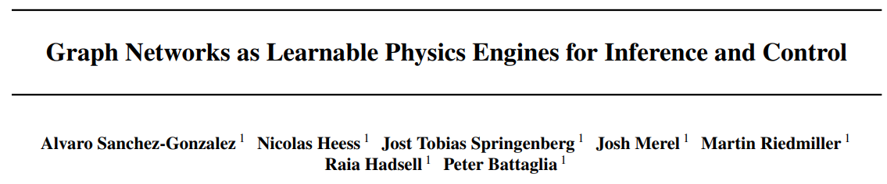
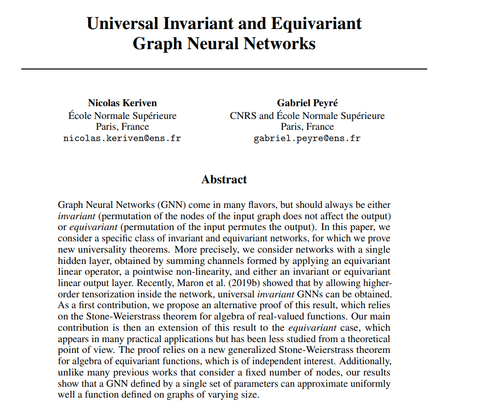
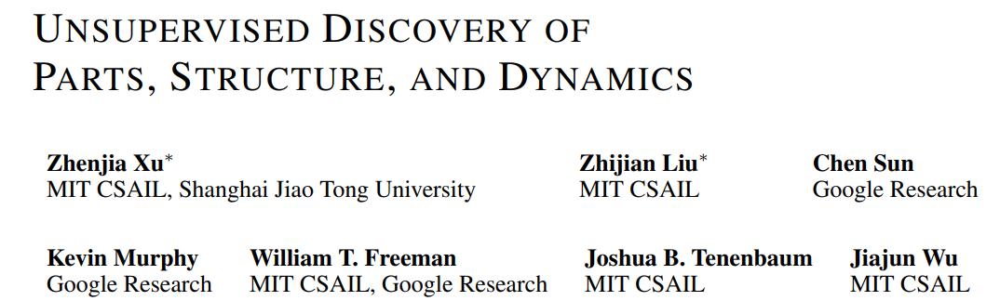
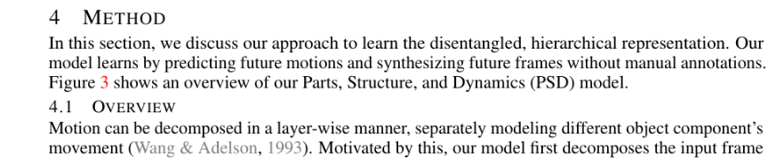
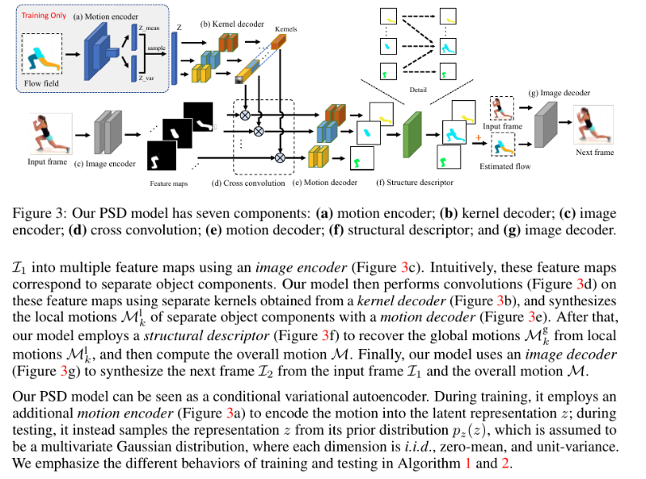
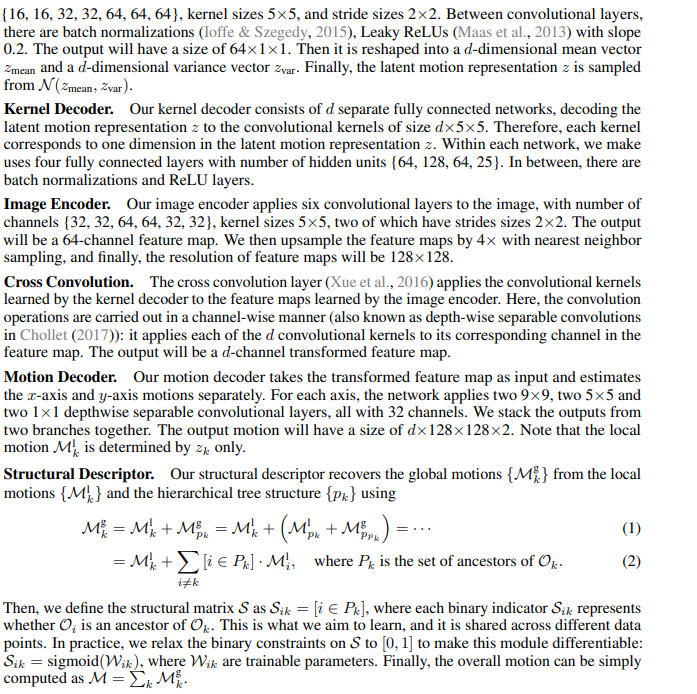
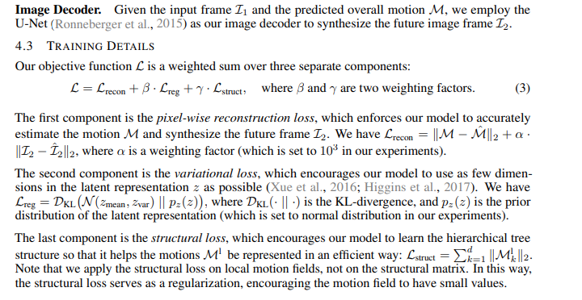

# Reasoning, Neural Logic and Neural Physics 

---
[Link](https://arxiv.org/pdf/1612.00341.pdf)

---

[Link](https://arxiv.org/pdf/1806.01242.pdf)

---

[Link](https://arxiv.org/pdf/1810.01566.pdf)

---

[Link](http://papers.nips.cc/paper/8931-universal-invariant-and-equivariant-graph-neural-networks.pdf)

---

[Link](https://arxiv.org/pdf/1903.05136.pdf)

