# Neural Reasoning

---

[**Link**](https://arxiv.org/pdf/1612.00341.pdf)

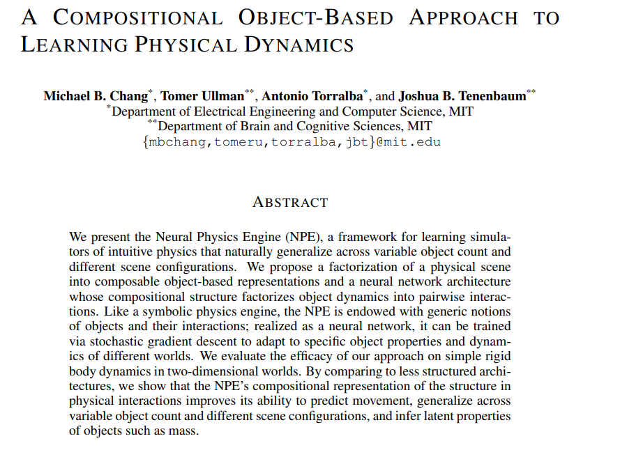

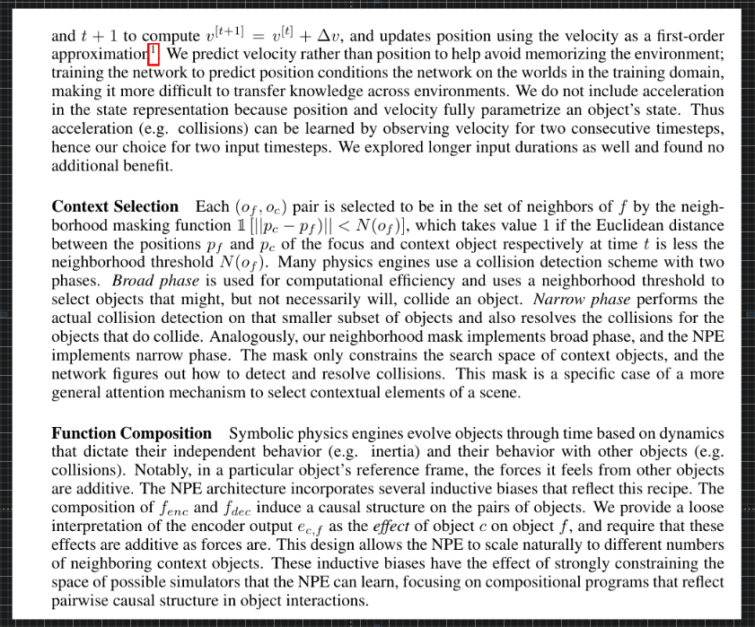

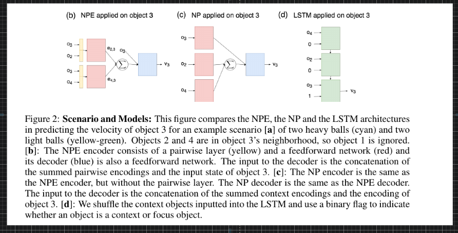

---

[**Link**](https://arxiv.org/pdf/1806.01242.pdf)

---

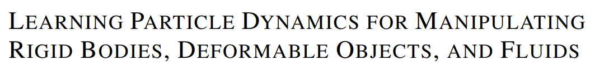

[**Link**](https://arxiv.org/pdf/1810.01566.pdf)

---

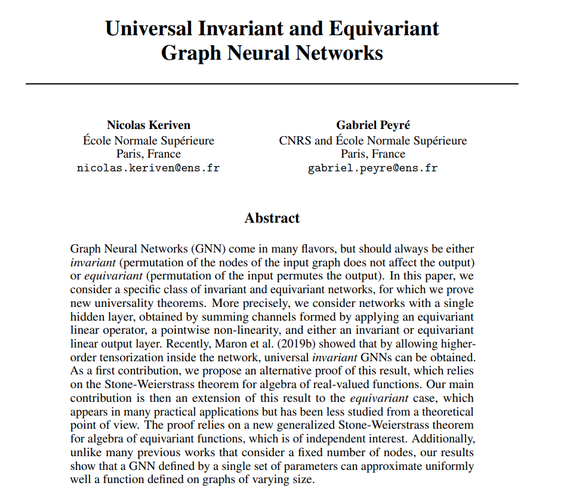

[**Link**](http://papers.nips.cc/paper/8931-universal-invariant-and-equivariant-graph-neural-networks.pdf)

---

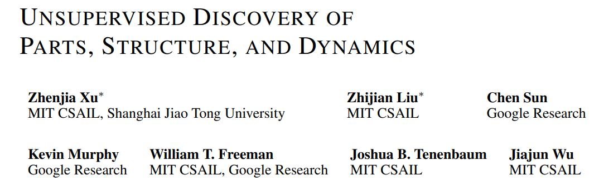

[**Link**](https://arxiv.org/pdf/1903.05136.pdf)

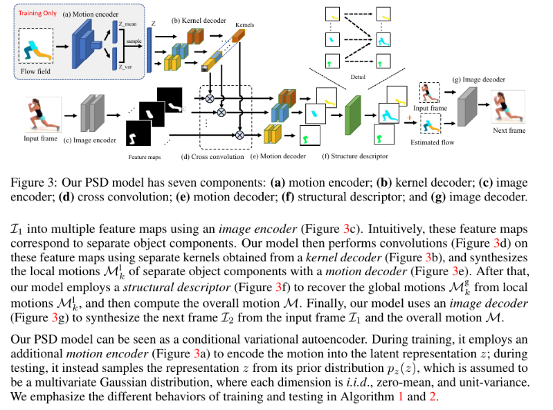

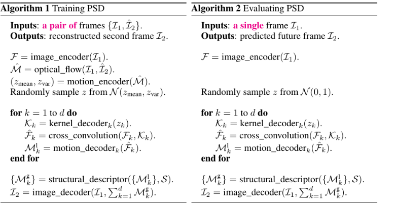

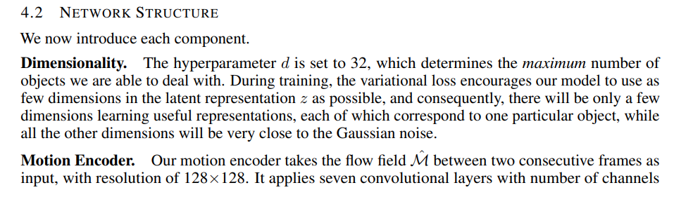

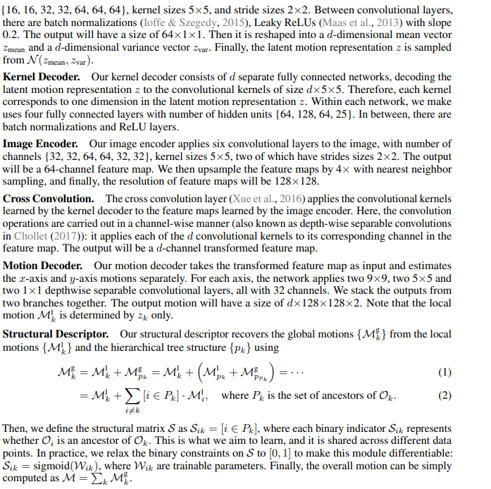

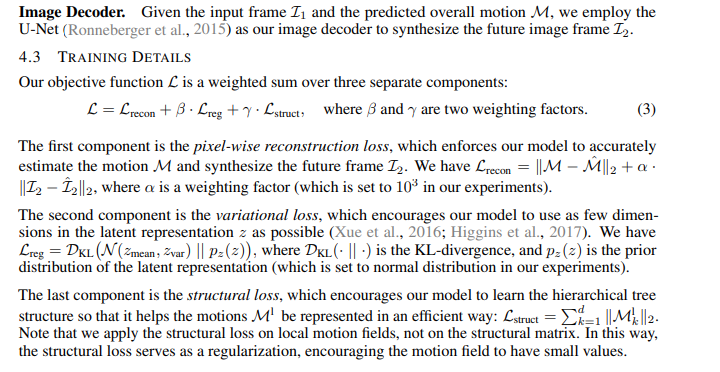

---

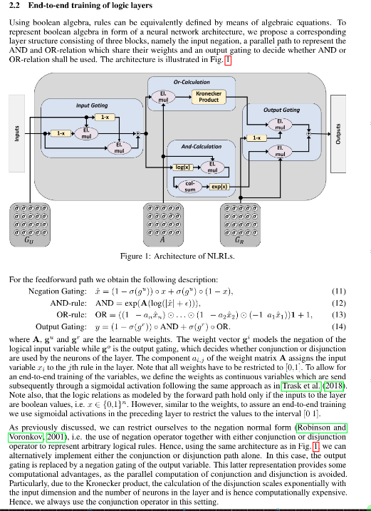

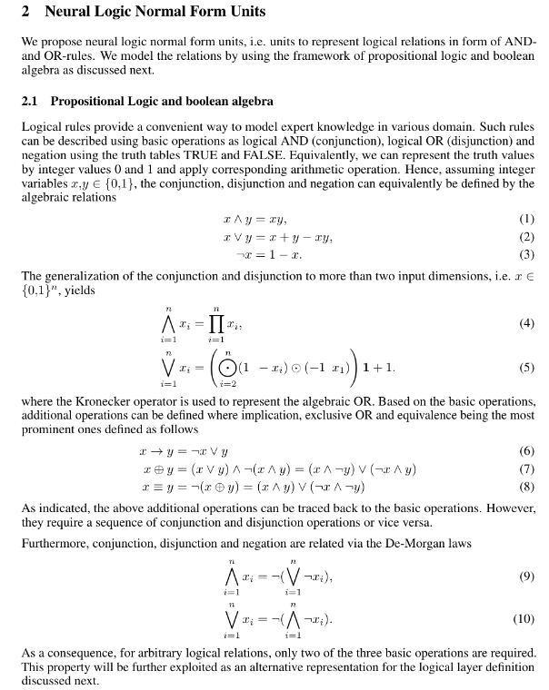

---

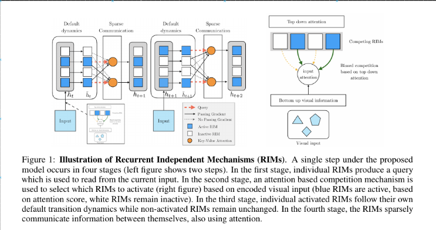

---

[**Link**](https://arxiv.org/pdf/1905.10307.pdf)

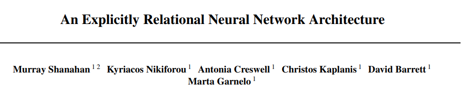

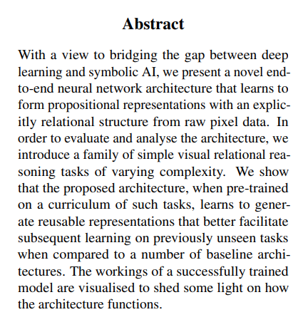

### NeuroSymbolic AI

- [**The Neuro-Symbolic Concept Learner**](http://nscl.csail.mit.edu/)
- [**VCR: Visual Commonsense Reasoning**](https://visualcommonsense.com/)
- [**Specifying Object Attributes and Relations in Interactive Scene Generation**](https://arxiv.org/abs/1909.05379.pdf)
- [**Trends in Integration of Vision and Language Research: A Survey of Tasks, Datasets, and Methods**](https://arxiv.org/abs/1907.09358.pdf)
- [**RAVEN: A Dataset for Relational and Analogical Visual rEasoNing**](https://arxiv.org/abs/1903.02741.pdf)
- [**Explainable and Explicit Visual Reasoning over Scene Graphs**](https://arxiv.org/abs/1812.01855.pdf)
- [**From Recognition to Cognition: Visual Commonsense Reasoning**](https://arxiv.org/abs/1811.10830.pdf)
- [**Cross-Modal Relationship Inference for Grounding Referring Expressions**](https://zpascal.net/cvpr2019/Yang_Cross-Modal_Relationship_Inference_for_Grounding_Referring_Expressions_CVPR_2019_paper.pdf)
- [**Matrix capsules with EM routing**](https://openreview.net/forum?id=HJWLfGWRb)
- [**Spatio-Temporal Action Graph Networks**](https://arxiv.org/abs/1812.01233.pdf)
- [**Unsupervised Discovery of Parts, Structure, and Dynamics**](https://arxiv.org/abs/1903.05136.pdf)
- [**Language as an Abstraction for Hierarchical Deep Reinforcement Learning**](https://arxiv.org/abs/1906.07343.pdf)
- [**Visual Foresight: Model-Based Deep Reinforcement Learning for Vision-Based Robotic Control**](https://arxiv.org/abs/1812.00568.pdf)
- [**Learning Dynamics Model in Reinforcement Learning by Incorporating the Long Term Future**](https://arxiv.org/abs/1903.01599.pdf)
- [**Discovering objects and their relations from entangled scene representations**](https://arxiv.org/abs/1702.05068.pdf)
- [**CLEVRER: CoLlision Events for Video REpresentation and Reasoning**](https://arxiv.org/abs/1910.01442.pdf)
- [**OpenReview**](https://openreview.net/forum?id=rJxbJeHFPS | What Can Neural Networks Reason About? )
- [**Neural-Symbolic VQA: Disentangling Reasoning from Vision and Language Understanding**](http://papers.nips.cc/paper/7381-neural-symbolic-vqa-disentangling-reasoning-from-vision-and-language-understanding.pdf)
