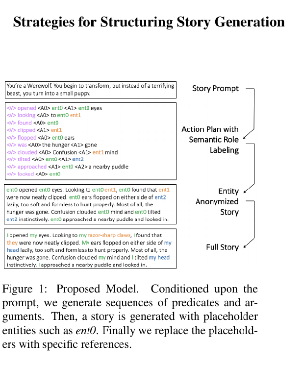
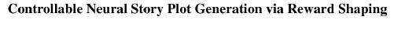

## Story Generation

---

---

## Full automated story telling pipeline

---

## Props Morphology

---

---

---

---

### Story Generation

- https://arxiv.org/abs/2001.08764 | [2001.08764] Fine-Tuning a Transformer-Based Language Model to Avoid Generating Non-Normative Text
- https://aaai.org/Conferences/AAAI-20/wp-content/uploads/2020/01/AAAI-20-Accepted-Paper-List.pdf | AAAI-20 Accepted Paper List
- https://arxiv.org/abs/1911.09753.pdf | Reinforcing an Image Caption Generator Using Off-Line Human Feedback
- https://arxiv.org/abs/1911.09194.pdf | 1911.09194.pdf
- https://www.google.com/search?safe=active&sxsrf=ALeKk00oNWDCHjejL8PTZcvTIynln7a6tw:1582211968735&q=A+Character-Centric+Neural+Model+for+Automatic+Story+Generation&spell=1&sa=X&ved=2ahUKEwia_evytuDnAhVd7XMBHThdBoEQBSgAegQICxAn&biw=1745&bih=865 | A Character-Centric Neural Model for Automatic Story Generation - Google Search
- https://pdfs.semanticscholar.org/d03e/66a84b92f520235079083d3c0947b2c910e0.pdf | CoCoX: Generating Conceptual and Counterfactual Explanations via Fault-Lines
- http://www.stat.ucla.edu/~sczhu/papers/Conf_2013/Causality_Cognitive_Science_2013.pdf | Causality_Cognitive_Science_2013.pdf
- https://arxiv.org/abs/1912.00753.pdf | Corpus-Level End-to-End Exploration for Interactive Systems
- https://arxiv.org/abs/1905.10819.pdf | Learning to Optimize Computational Resources: Frugal Training with Generalization Guarantees
- https://arxiv.org/abs/2002.01093v1.pdf | On the interaction between supervision and self-play in emergent communication
- https://arxiv.org/abs/2002.00655v1.pdf | Dynamic Parameter Allocation in Parameter Servers
- https://arxiv.org/abs/2002.00876v1.pdf | Torch-Struct: Deep Structured Prediction Library
- https://arxiv.org/abs/2002.03754v2.pdf | Unsupervised Discovery of Interpretable Directions in the GAN Latent Space
- https://arxiv.org/abs/1911.07141.pdf | Working Memory Graphs
- https://cocosci.princeton.edu/tom/papers/tbci.pdf | tbci.pdf
- http://www.its.caltech.edu/~fehardt/papers/CPE_UAI2015.pdf | CPE_UAI2015.pdf
- https://arxiv.org/abs/1910.13321.pdf | 1910.13321.pdf
- https://www.ijcai.org/Proceedings/2019/0829.pdf | Controllable Neural Story Plot Generation via Reward Shaping
- https://github.com/HobbitLong/CMC | HobbitLong/CMC: pytorch implementation of "Contrastive Multiview Coding", "Momentum Contrast for Unsupervised Visual Representation Learning", and "Unsupervised Feature Learning via Non-Parametric Instance-level Discrimination"
- https://github.com/timediv/metagenrl | timediv/metagenrl: MetaGenRL, a novel meta reinforcement learning algorithm. Unlike prior work, MetaGenRL can generalize to new environments that are entirely different from those used for meta-training.
- https://scholar.google.com/scholar?cluster=8837128214653317831&hl=en&as_sdt=0,5&sciodt=0,5 | Mao: The neuro-symbolic concept learner: Interpreting... - Google Scholar
- https://arxiv.org/abs/1905.06088.pdf | Neural-Symbolic Computing: An Effective Methodology for Principled Integration of Machine Learning and Reasoning
- http://openaccess.thecvf.com/content_ICCV_2019/papers/Hu_Language-Conditioned_Graph_Networks_for_Relational_Reasoning_ICCV_2019_paper.pdf | Language-Conditioned Graph Networks for Relational Reasoning
- https://www.aaai.org/ocs/index.php/WS/AAAIW17/paper/viewFile/15067/14772 | Towards Automatically Extracting Story Graphs from Natural Language Stories

---

### Story Generation

- https://arxiv.org/abs/2001.10161.pdf | Bringing Stories Alive: Generating Interactive Fiction Worlds
- https://scholar.google.com/scholar?um=1&ie=UTF-8&lr&cites=7790864211221027670 | Yao: Plan-and-write: Towards better automatic storytelling - Google Scholar
- https://arxiv.org/abs/1912.03553 | [1912.03553] Learning Norms from Stories: A Prior for Value Aligned Agents
- https://scholar.google.com/scholar?cites=9520507552551087003&as_sdt=2005&sciodt=0,5&hl=en | Fan: Strategies for structuring story generation - Google Scholar
- https://arxiv.org/abs/1912.02395.pdf | Learning to Predict Explainable Plots for Neural Story Generation
- https://arxiv.org/abs/1912.02164.pdf | 1912.02164.pdf
- https://www.ijcai.org/Proceedings/2019/0829.pdf | Controllable Neural Story Plot Generation via Reward Shaping
- https://scholar.google.com/scholar?start=10&hl=en&as_sdt=0,5&sciodt=0,5&cites=7801491607724868320&scipsc= | Baheti: Generating more interesting responses in... - Google Scholar
- https://arxiv.org/abs/1902.00098.pdf | 1902.00098.pdf
- https://scholar.google.com/scholar?start=20&hl=en&as_sdt=0,5&sciodt=0,5&cites=11779702645780685250&scipsc= | Dinan: The second conversational intelligence challenge... - Google Scholar
- https://arxiv.org/abs/1903.03094.pdf | 1903.03094.pdf
- https://arxiv.org/abs/1911.00536.pdf | 1911.00536.pdf
- https://arxiv.org/abs/1912.02164.pdf#page=13&zoom=100,110,178 | 1912.02164.pdf

---

- https://arxiv.org/abs/2001.10161 | [2001.10161] Bringing Stories Alive: Generating Interactive Fiction Worlds
- https://arxiv.org/abs/2001.08837.pdf | Graph Constrained Reinforcement Learning for Natural Language Action Spaces
- https://arxiv.org/abs/1911.09194.pdf | Generating Interactive Worlds with Text
- http://www.ccnlg.org/wordpress/wp-content/uploads/2019/10/Creativity_in_Language_INLG-2.pdf | Creativity_in_Language_INLG-2.pdf
- https://scholar.google.com/citations?hl=en&user=8R35rCwAAAAJ&view_op=list_works&sortby=pubdate | Sergey Levine - Google Scholar Citations
- https://tarl2019.github.io/assets/papers/sharma2019dynamicsaware.pdf | sharma2019dynamicsaware.pdf
- https://arxiv.org/abs/1909.11942.pdf | ALBERT: A Lite BERT for Self-supervised Learning of Language Representations
- http://chooseyourstory.com/ | Home > ChooseYourStory.com
- https://arxiv.org/abs/1909.05858.pdf | CTRL: A Conditional Transformer Language Model for Controllable Generation
