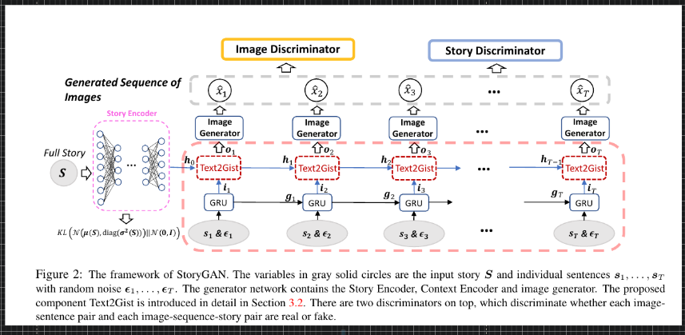
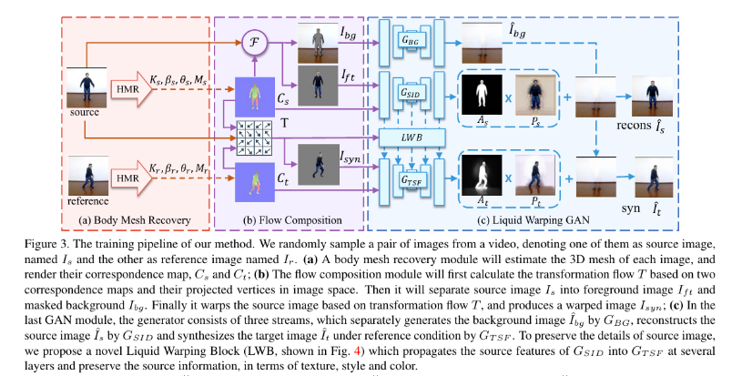
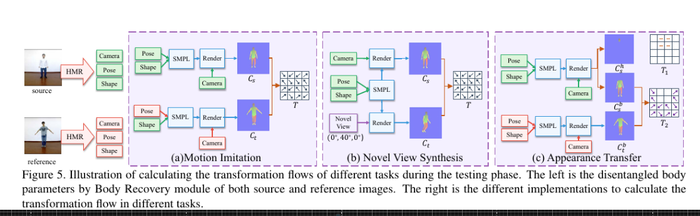

## Synthesia

---

### StoryGAN

https://arxiv.org/abs/1812.02784.pdf | StoryGAN: A Sequential Conditional GAN for Story Visualization

---

---

## Spatial Transformers

---

## Video synthesis

---

### Talking Head and GANs

https://arxiv.org/abs/2005.03201.pdf | What comprises a good talking-head video generation?: A Survey and Benchmark
http://openaccess.thecvf.com/content_CVPR_2019/papers/Chen_Hierarchical_Cross-Modal_Talking_Face_Generation_With_Dynamic_Pixel-Wise_Loss_CVPR_2019_paper.pdf | Hierarchical Cross-Modal Talking Face Generation With Dynamic Pixel-Wise Loss
https://dl.acm.org/doi/pdf/10.1145/3359997.3365707 | 3D Human Avatar Digitization from a Single Image
http://openaccess.thecvf.com/content_WACV_2020/papers/Chen_TailorGAN_Making_User-Defined_Fashion_Designs_WACV_2020_paper.pdf | TailorGAN: Making User-Defined Fashion Designs
https://github.com/lelechen63/talking-head-generation-survey | lelechen63/talking-head-generation-survey: Official github repo for paper "What comprises a good talking-head video generation?: A Survey and Benchmark"

---

### First order model and GANs

https://github.com/AliaksandrSiarohin/first-order-model | AliaksandrSiarohin/first-order-model: This repository contains the source code for the paper First Order Motion Model for Image Animation
https://aliaksandrsiarohin.github.io/first-order-model-website/ | First order model
http://papers.nips.cc/paper/8935-first-order-motion-model-for-image-animation.pdf | First Order Motion Model for Image Animation
https://arxiv.org/abs/1811.11459.pdf | Coordinate-based Texture Inpainting for Pose-Guided Image Generation
https://arxiv.org/abs/1801.00055.pdf | Deformable GANs for Pose-based Human Image Generation
https://arxiv.org/abs/2001.09518.pdf | Unsupervised Disentanglement of Pose, Appearance and Background from Images and Videos
https://arxiv.org/abs/2003.03756.pdf | Perceptual Image Super-Resolution with Progressive Adversarial Network
https://arxiv.org/abs/2004.01823.pdf | Multi-Variate Temporal GAN for Large Scale Video Generation
https://arxiv.org/abs/2001.04296.pdf | High-Fidelity Synthesis with Disentangled Representation
https://openreview.net/forum?id=SyezSCNYPB | Disentangled GANs for Controllable Generation of High-Resolution Images | OpenReview
https://www.youtube.com/watch?v=MPdj8KGZHa0 | Neural Network Dreams About Beautiful Natural Scenes - YouTube
https://arxiv.org/abs/2003.00696.pdf | Deep Image Spatial Transformation for Person Image Generation
https://papers.nips.cc/paper/7267-predicting-scene-parsing-and-motion-dynamics-in-the-future.pdf | Predicting Scene Parsing and Motion Dynamics in the Future

https://github.com/grey-eye/talking-heads | grey-eye/talking-heads: Our implementation of "Few-Shot Adversarial Learning of Realistic Neural Talking Head Models" (Egor Zakharov et al.)
http://openaccess.thecvf.com/content_ECCV_2018/papers/Aayush_Bansal_Recycle-GAN_Unsupervised_Video_ECCV_2018_paper.pdf | Recycle-GAN: Unsupervised Video Retargeting
https://grail.cs.washington.edu/projects/AudioToObama/siggraph17_obama.pdf | Synthesizing Obama: Learning Lip Sync from Audio
https://sci-hub.tw/https://dl.acm.org/citation.cfm?id=3201283 | Sci-Hub | Deep video portraits. ACM Transactions on Graphics, 37(4), 1–14 | 10.1145/3197517.3201283
https://scholar.google.com/scholar?rlz=1C1CHBF_enUS858US858&um=1&ie=UTF-8&lr&cites=12568957979354957566 | Cudeiro: Capture, Learning, and Synthesis of 3D Speaking... - Google Scholar
https://dl.acm.org/citation.cfm?id=3360067 | Animation Synthesis Triggered by Vocal Mimics
https://arxiv.org/abs/1910.00726.pdf | Animating Face using Disentangled Audio Representations
https://github.com/Hangz-nju-cuhk/Talking-Face-Generation-DAVS | Hangz-nju-cuhk/Talking-Face-Generation-DAVS: Code for Talking Face Generation by Adversarially Disentangled Audio-Visual Representation (AAAI 2019)
https://arxiv.org/abs/1909.01815.pdf | 3D Morphable Face Models - Past, Present and Future
https://sci-hub.tw/https://dl.acm.org/citation.cfm?id=3360076 | Sci-Hub | A Robust Interactive Facial Animation Editing System. Motion, Interaction and Games on - MIG ’19 | 10.1145/3359566.3360076
https://github.com/cleardusk/3DDFA | cleardusk/3DDFA: The PyTorch improved version of TPAMI 2017 paper: Face Alignment in Full Pose Range: A 3D Total Solution.
https://arxiv.org/abs/1804.01005 | [1804.01005] Face Alignment in Full Pose Range: A 3D Total Solution

https://github.com/TimoBolkart/voca | TimoBolkart/voca: Voice Operated Character Animation
https://voca.is.tue.mpg.de/ | Voice Operated Character Animation
https://ps.is.tuebingen.mpg.de/publications/voca2019 | Capture, Learning, and Synthesis of 3D Speaking Styles | Perceiving Systems - Max Planck Institute for Intelligent Systems
https://www.youtube.com/watch?v=XceCxf_GyW4 | VOCA: Capture, Learning, and Synthesis of 3D Speaking Styles - YouTube

https://github.com/google/neural-tangents | google/neural-tangents: Fast and Easy Infinite Neural Networks in Python
http://gvv.mpi-inf.mpg.de/projects/wxu/HumanReenactment/content/main.pdf | gvv.mpi-inf.mpg.de/projects/wxu/HumanReenactment/content/main.pdf
https://github.com/facebookresearch/QuaterNet | facebookresearch/QuaterNet: Proposes neural networks that can generate animation of virtual characters for different actions.
http://openaccess.thecvf.com/content_ICCV_2019/papers/Aksan_Structured_Prediction_Helps_3D_Human_Motion_Modelling_ICCV_2019_paper.pdf | Structured Prediction Helps 3D Human Motion Modelling
https://research.birmingham.ac.uk/portal/files/71180007/PMnet_Learning.pdf | PMnet_Learning.pdf
https://amds123.github.io/2019/05/05/Neural-Rendering-and-Reenactment-of-Human-Actor-Videos/ | Neural Rendering and Reenactment of Human Actor Videos
https://arxiv.org/abs/1806.07179 | [1806.07179] FrankenGAN: Guided Detail Synthesis for Building Mass-Models Using Style-Synchonized GANs
https://github.com/lei65537/Visual_Driven_Mesh_Repair | lei65537/Visual_Driven_Mesh_Repair: Repairing Man-Made Meshes via Visual Driven Global Optimization with Minimum Intrusion
https://arxiv.org/abs/1712.05083v2.pdf | Extreme 3D Face Reconstruction: Seeing Through Occlusions
https://paperswithcode.com/paper/learning-to-regress-3d-face-shape-and | : Learning to Regress 3D Face Shape and Expression from an Image without 3D Supervision

---

### Talking Heads/Artificial Humans

https://github.com/facebookresearch/TalkingWithHands32M | facebookresearch/TalkingWithHands32M: Talking with Hands
http://openaccess.thecvf.com/content_ICCV_2019/papers/Lee_Talking_With_Hands_16.2M_A_Large-Scale_Dataset_of_Synchronized_Body-Finger_ICCV_2019_paper.pdf | Talking With Hands 16.2M: A Large-Scale Dataset of Synchronized Body-Finger Motion and Audio for Conversational Motion Analysis and Synthesis
https://arxiv.org/abs/2003.00397.pdf | Intelligent Home 3D: Automatic 3D-House Design from Linguistic Descriptions Only
https://arxiv.org/abs/2003.07449.pdf | Object-Centric Image Generation from Layouts
https://arxiv.org/abs/2004.04572v2.pdf | ARCH: Animatable Reconstruction of Clothed Humans
https://github.com/shunsukesaito/PIFu | shunsukesaito/PIFu: This repository contains the code for the paper "PIFu: Pixel-Aligned Implicit Function for High-Resolution Clothed Human Digitization"
https://paperswithcode.com/paper/meddialog-a-large-scale-medical-dialogue | - MedDialog: A Large-scale Medical Dialogue Dataset
https://paperswithcode.com/task/video-generation | - Video Generation
https://arxiv.org/abs/2004.00626.pdf | Background Matting: The World is Your Green Screen
https://arxiv.org/abs/1908.04781.pdf | Predicting 3D Human Dynamics from Video
https://arxiv.org/abs/1907.02499.pdf | Sim2real transfer learning for 3D human pose estimation: motion to the rescue

https://github.com/hubert0527/COCO-GAN | hubert0527/COCO-GAN: COCO-GAN: Generation by Parts via Conditional Coordinating (ICCV 2019 oral)
https://arxiv.org/abs/1904.00284.pdf | COCO-GAN: Generation by Parts via Conditional Coordinating
https://sci-hub.tw/https://dl.acm.org/citation.cfm?id=3340254 | Sci-Hub | Efficient Neural Networks for Real-time Motion Style Transfer. Proceedings of the ACM on Computer Graphics and Interactive Techniques, 2(2), 1–17 | 10.1145/3340254
http://www.diva-portal.org/smash/get/diva2:1098480/FULLTEXT01.pdf | CMSY10
https://sci-hub.tw/https://ieeexplore.ieee.org/abstract/document/8460608 | Sci-Hub | Text2Action: Generative Adversarial Synthesis from Language to Action. 2018 IEEE International Conference on Robotics and Automation (ICRA) | 10.1109/ICRA.2018.8460608
https://arxiv.org/abs/1804.10652.pdf | Human Motion Modeling using DVGANs
https://arxiv.org/abs/1907.01108.pdf | Language2Pose: Natural Language Grounded Pose Forecasting
https://arxiv.org/abs/1911.04069.pdf | Generative Autoregressive Networks for 3D Dancing Move Synthesis from Music
https://sci-hub.tw/https://dl.acm.org/citation.cfm?id=1531365 | Sci-Hub | Dextrous manipulation from a grasping pose. ACM Transactions on Graphics, 28(3), 1 | 10.1145/1531326.1531365
https://www.politesi.polimi.it/bitstream/10589/108749/1/Real-Time%20Grasp%20Pose%20Generation%20for%20Virtual%20Hand%20-%20Paolo%20Caputo.pdf | Real-Time Grasp Pose Generation for Virtual Hand - Paolo Caputo.pdf
https://arxiv.org/abs/1911.02001.pdf | Dancing to Music
https://github.com/limaosen0/DMGNN | limaosen0/DMGNN: The implementation of DMGNN

---

### Scene Graph Generation

https://openreview.net/forum?id=Bylp4EHx8r | Scene Representation Networks: Continuous 3D-Structure-Aware Neural Scene Representations
https://3dscenegraph.stanford.edu/Albertville.html | 3D Scene Graph
http://vipl.ict.ac.cn/resources/codes/code/Exploring%20Context%20and%20Visual%20Pattern%20of%20Relationship%20for%20Scene%20Graph%20Generation_CVPR2019.pdf | Exploring Context and Visual Pattern of Relationship for Scene Graph Generation
https://arxiv.org/abs/1903.03326.pdf | Knowledge-Embedded Routing Network for Scene Graph Generation
https://arxiv.org/abs/1909.05379.pdf | Specifying Object Attributes and Relations in Interactive Scene Generation
https://arxiv.org/abs/1806.11538.pdf | Factorizable Net: An Efficient Subgraph-based Framework for Scene Graph Generation
https://github.com/yuweihao/KERN | yuweihao/KERN: Code for Knowledge-Embedded Routing Network for Scene Graph Generation (CVPR 2019)

https://github.com/applied-ai-lab/genesis | applied-ai-lab/genesis: Official PyTorch implementation of "GENESIS: Generative Scene Inference and Sampling with Object-Centric Latent Representations"
https://github.com/ashual/scene_generation | ashual/scene_generation: A PyTorch implementation of the paper: Specifying Object Attributes and Relations in Interactive Scene Generation
https://github.com/yzhou359/3DIndoor-SceneGraphNet | yzhou359/3DIndoor-SceneGraphNet: PyTorch implementation of 'SceneGraphNet: Neural Message Passing for 3D Indoor Scene Augmentation' ICCV 2019
https://paperswithcode.com/paper/stillleben-realistic-scene-synthesis-for-deep | Stillleben: Realistic Scene Synthesis for Deep Learning in Robotics |
https://paperswithcode.com/task/scene-generation/latest#code | : Scene Generation
https://paperswithcode.com/paper/specifying-object-attributes-and-relations-in#code | : Specifying Object Attributes and Relations in Interactive Scene Generation
https://paperswithcode.com/paper/scenegraphnet-neural-message-passing-for-3d#code | : SceneGraphNet: Neural Message Passing for 3D Indoor Scene Augmentation
https://paperswithcode.com/paper/genesis-generative-scene-inference-and#code | : GENESIS: Generative Scene Inference and Sampling with Object-Centric Latent Representations
https://paperswithcode.com/paper/specifying-object-attributes-and-relations-in#code | : Specifying Object Attributes and Relations in Interactive Scene Generation
https://arxiv.org/abs/1909.03749.pdf | Learning Visual Dynamics Models of Rigid Objects using Relational Inductive Biases
http://openaccess.thecvf.com/content_CVPR_2019/papers/Tan_Text2Scene_Generating_Compositional_Scenes_From_Textual_Descriptions_CVPR_2019_paper.pdf | Text2Scene: Generating Compositional Scenes From Textual Descriptions
http://openaccess.thecvf.com/content_CVPR_2019/papers/Qi_Attentive_Relational_Networks_for_Mapping_Images_to_Scene_Graphs_CVPR_2019_paper.pdf | Attentive Relational Networks for Mapping Images to Scene Graphs
https://paperswithcode.com/paper/exploring-context-and-visual-pattern-of | : Exploring Context and Visual Pattern of Relationship for Scene Graph Generation
http://openaccess.thecvf.com/content_CVPR_2019/papers/Zhao_Image_Generation_From_Layout_CVPR_2019_paper.pdf | Image Generation From Layout
https://arxiv.org/abs/1907.09358.pdf | 1907.09358.pdf
http://openaccess.thecvf.com/content_CVPR_2019/papers/Tan_Text2Scene_Generating_Compositional_Scenes_From_Textual_Descriptions_CVPR_2019_paper.pdf | Text2Scene: Generating Compositional Scenes From Textual Descriptions
http://openaccess.thecvf.com/content_CVPR_2019/papers/Gu_Scene_Graph_Generation_With_External_Knowledge_and_Image_Reconstruction_CVPR_2019_paper.pdf | Scene Graph Generation With External Knowledge and Image Reconstruction
https://arxiv.org/abs/1807.03877.pdf | Deep Structured Generative Models
https://arxiv.org/abs/1902.00671.pdf | A Layer-Based Sequential Framework for Scene Generation with GANs
https://arxiv.org/abs/1907.09358.pdf | Trends in Integration of Vision and Language Research: A Survey of Tasks, Datasets, and Methods
http://openaccess.thecvf.com/content_CVPR_2019/papers/Zhao_Image_Generation_From_Layout_CVPR_2019_paper.pdf | Image Generation From Layout
http://papers.nips.cc/paper/7951-mapping-images-to-scene-graphs-with-permutation-invariant-structured-prediction.pdf | Mapping Images to Scene Graphs with Permutation-Invariant Structured Prediction
http://openaccess.thecvf.com/content_CVPR_2019/papers/Zhang_Graphical_Contrastive_Losses_for_Scene_Graph_Parsing_CVPR_2019_paper.pdf | Graphical Contrastive Losses for Scene Graph Parsing
https://arxiv.org/abs/1910.02527.pdf | 3D Scene Graph: A Structure for Unified Semantics, 3D Space, and Camera
http://openaccess.thecvf.com/content_WACV_2020/papers/Raboh_Differentiable_Scene_Graphs_WACV_2020_paper.pdf | Differentiable Scene Graphs
https://github.com/shikorab/DSG | shikorab/DSG

---

### 3D Morphable Models

https://arxiv.org/abs/1909.01815.pdf | 3D Morphable Face Models - Past, Present and Future
https://paperswithcode.com/task/3d-face-reconstruction | : 3D Face Reconstruction
https://www.supasorn.com/eccv14_totalmoving.pdf | eccv14_totalmoving.pdf
https://github.com/kwotsin/mimicry | kwotsin/mimicry: A PyTorch library for the reproducibility of GAN research.
https://github.com/microsoft/Deep3DFaceReconstruction | microsoft/Deep3DFaceReconstruction: Deep3DFaceReconstruction
