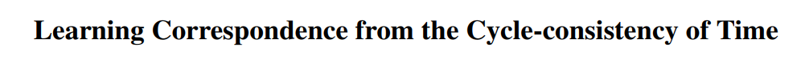
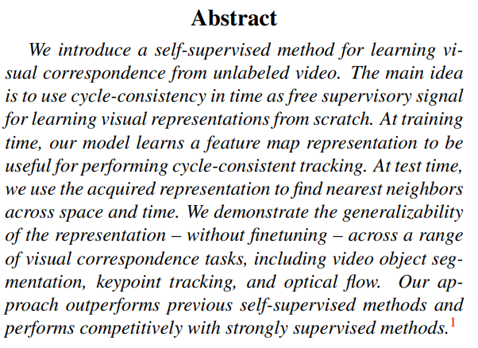
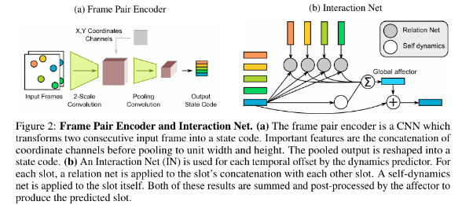
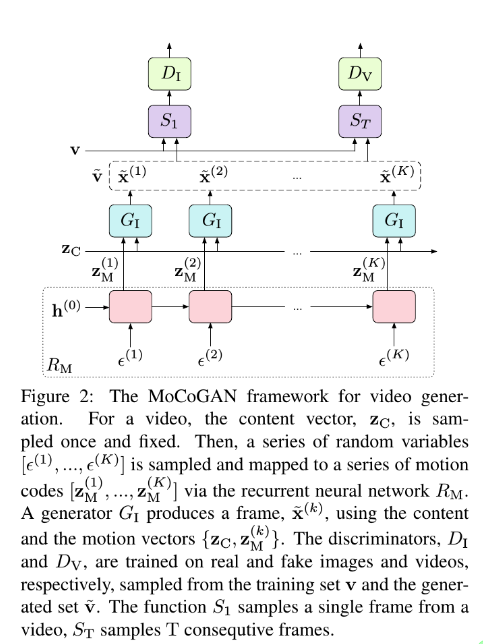
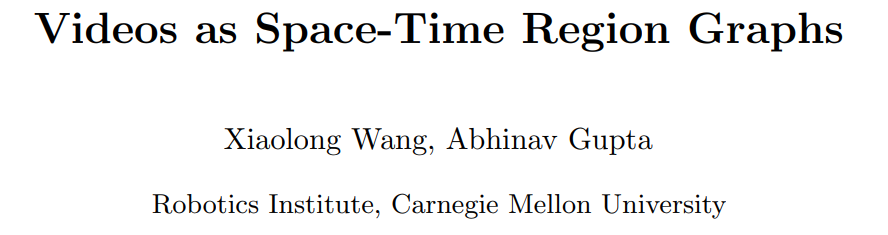

## Video Dynamics

---

### Moments in Time Dataset: one million videos for event understanding

---

[**Link**](https://arxiv.org/pdf/1903.07593.pdf)

---

[**Link**](https://arxiv.org/pdf/1706.01433.pdf)

---

---

[**Link**](https://arxiv.org/pdf/1806.01810.pdf)

---

[**Link**](https://arxiv.org/pdf/1806.04166.pdf)

---

[**Link**](https://papers.nips.cc/paper/8304-unsupervised-learning-of-object-structure-and-dynamics-from-videos.pdf)

### Video Understanding

- [**Point-to-Point Video Generation**](https://arxiv.org/abs/1904.02912v2.pdf)
- [**G3AN : This video does not exist. Disentangling motion and appearance for video generation**](https://arxiv.org/abs/1912.05523v1.pdf)
- [**Learning to Decompose and Disentangle Representations for Video Prediction**](http://papers.nips.cc/paper/7333-learning-to-decompose-and-disentangle-representations-for-video-prediction.pdf)
- [**- Non-Adversarial Video Synthesis with Learned Priors**](https://paperswithcode.com/paper/non-adversarial-video-synthesis-with-learned)
- [**Navsynth**](https://abhishekaich27.github.io/navsynth.html)
- [**abhishekaich27/Navsynth**](https://github.com/abhishekaich27/Navsynth)
- [**VideoBERT: A Joint Model for Video and Language Representation Learning**](https://arxiv.org/abs/1904.01766.pdf)
- [**ViLBERT: Pretraining Task-Agnostic Visiolinguistic Representations for Vision-and-Language Tasks**](https://arxiv.org/abs/1908.02265.pdf)
- [**Unified Vision-Language Pre-Training for Image Captioning and VQA**](https://arxiv.org/abs/1909.11059.pdf)
- [**VideoFlow: A Flow-Based Generative Model for Video**](https://arxiv.org/abs/1903.01434.pdf)
- [**Generating Videos with Scene Dynamics**](https://papers.nips.cc/paper/6194-generating-videos-with-scene-dynamics.pdf)
- [**What Makes a Video a Video: Analyzing Temporal Information in Video Understanding Models and Datasets**](http://openaccess.thecvf.com/content_cvpr_2018/papers/Huang_What_Makes_a_CVPR_2018_paper.pdf)
- [**Disentangling Propagation and Generation for Video Prediction**](http://openaccess.thecvf.com/content_ICCV_2019/papers/Gao_Disentangling_Propagation_and_Generation_for_Video_Prediction_ICCV_2019_paper.pdf)
- [**End-To-End Time-Lapse Video Synthesis From a Single Outdoor Image**](http://openaccess.thecvf.com/content_CVPR_2019/html/Nam_End-To-End_Time-Lapse_Video_Synthesis_From_a_Single_Outdoor_Image_CVPR_2019_paper.html)
- [**[1907.06571] Efficient Video Generation on Complex Datasets**](https://arxiv.org/abs/1907.06571)
- [**SpringerLink**](https://link.springer.com/article/10.1007/s11263-019-01210-3 | GANimation: One-Shot Anatomically Consistent Facial Animation )
- [**[1908.06607] Video synthesis of human upper body with realistic face**](https://arxiv.org/abs/1908.06607)
- [**Liu: Video synthesis of human upper body with realistic face - Google Scholar**](https://scholar.google.com/scholar?cites=13583776322979873311&as_sdt=2005&sciodt=0,5&hl=en)
- [**Cartoonish sketch-based face editing in videos using identity deformation transfer - ScienceDirect**](https://www.sciencedirect.com/science/article/abs/pii/S0097849319300147)
