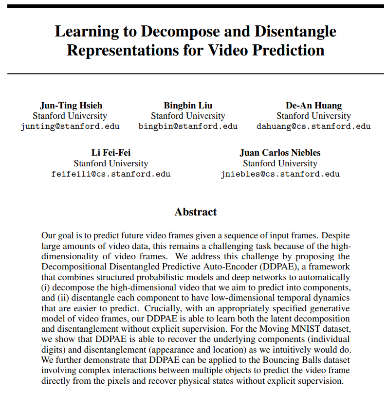
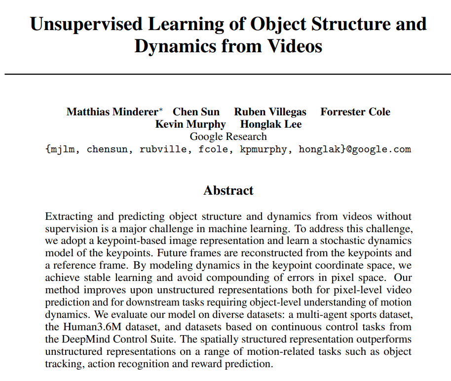

## Video Dynamics

---
### Moments in Time Dataset: one million videos for event understanding

---

[Link](https://arxiv.org/pdf/1903.07593.pdf)

---
[Link](https://arxiv.org/pdf/1706.01433.pdf)

---

---
[Link](https://arxiv.org/pdf/1806.01810.pdf)

---
[Link](https://arxiv.org/pdf/1806.04166.pdf)

---
[Link](https://papers.nips.cc/paper/8304-unsupervised-learning-of-object-structure-and-dynamics-from-videos.pdf)

### Video Understanding

https://arxiv.org/abs/1904.02912v2.pdf | Point-to-Point Video Generation
https://arxiv.org/abs/1912.05523v1.pdf | G3AN : This video does not exist. Disentangling motion and appearance for video generation
http://papers.nips.cc/paper/7333-learning-to-decompose-and-disentangle-representations-for-video-prediction.pdf | Learning to Decompose and Disentangle Representations for Video Prediction
https://paperswithcode.com/paper/non-adversarial-video-synthesis-with-learned | - Non-Adversarial Video Synthesis with Learned Priors
https://abhishekaich27.github.io/navsynth.html | Navsynth
https://github.com/abhishekaich27/Navsynth | abhishekaich27/Navsynth