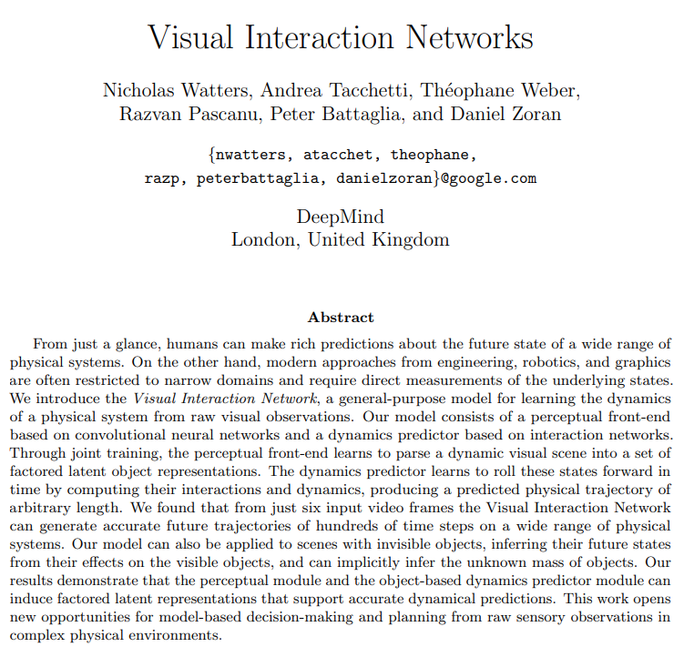
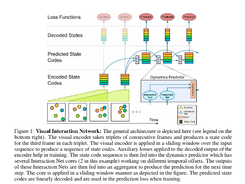

## Video Dynamics

---
### Moments in Time Dataset: one million videos for event understanding

---

[Link](https://arxiv.org/pdf/1903.07593.pdf)

---
[Link](https://arxiv.org/pdf/1706.01433.pdf)

---

---
[Link](https://arxiv.org/pdf/1806.01810.pdf)

---
[Link](https://arxiv.org/pdf/1806.04166.pdf)

---
[Link](https://papers.nips.cc/paper/8304-unsupervised-learning-of-object-structure-and-dynamics-from-videos.pdf)

