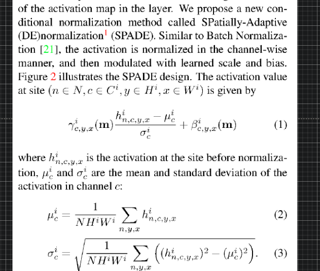
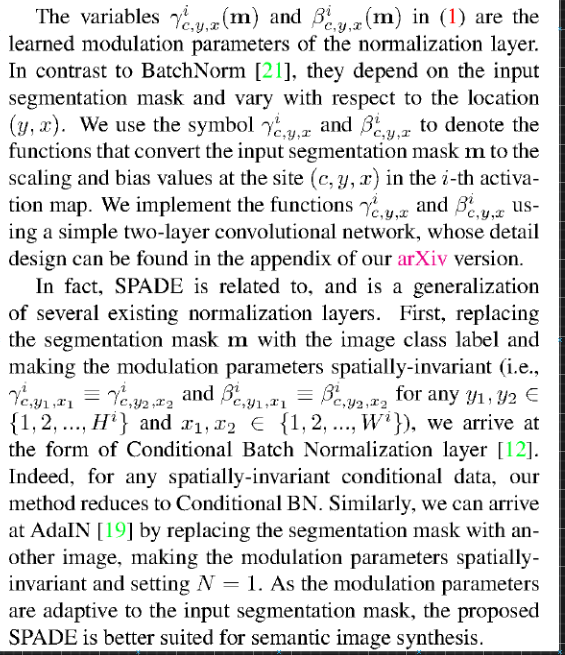
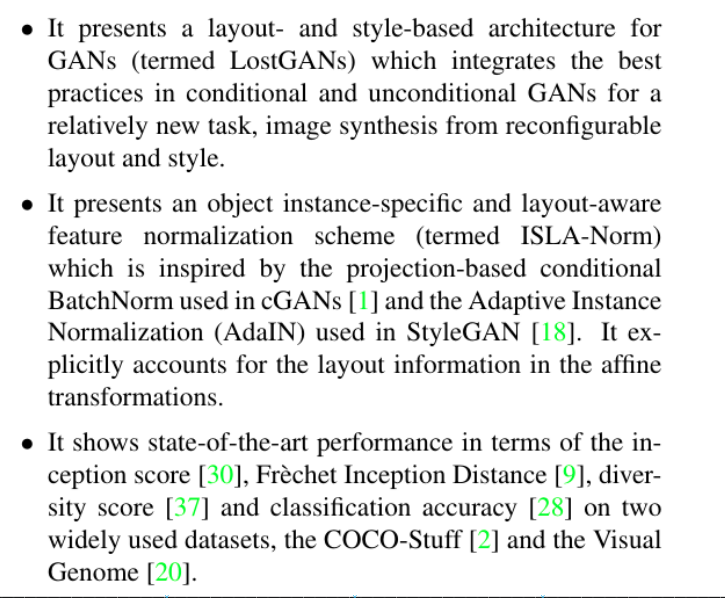
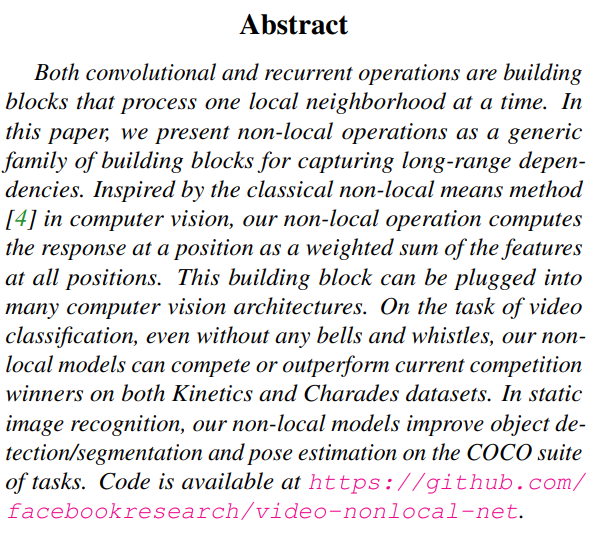

# Computer Vision

---

## AI as a Movie Maker

---

### SPADE

- [**junyanz/pytorch-CycleGAN-and-pix2pix: Image-to-Image Translation in PyTorch**](https://github.com/junyanz/pytorch-CycleGAN-and-pix2pix)
- [**NVlabs/SPADE: Semantic Image Synthesis with SPADE**](https://github.com/NVlabs/SPADE)

---

---

[**Link**](https://arxiv.org/pdf/1711.07971.pdf)

---

### End-to-End Object Detection with Transformers

https://github.com/facebookresearch/detr

---

- [**guoyongcs/DRN: Closed-loop Matters: Dual Regression Networks for Single Image Super-Resolution**](https://github.com/guoyongcs/DRN)
- [**Closed-loop Matters: Dual Regression Networks for Single Image Super-Resolution**](https://arxiv.org/abs/2003.07018.pdf)
- [**Ariel Shamir's Homepage**](http://www.faculty.idc.ac.il/arik/site/writeVideo.asp)
- [**Non-Photorealistic Computer Graphics: Modeling, Rendering, and Animation - Thomas Strothotte, Stefan Schlechtweg - Google Books**](https://books.google.co.in/books?hl=en&lr=&id=Kq_dU65kngUC&oi=fnd&pg=PP2&ots=vEmD9Rjr3i&sig=LXVandqs4l0nLWDwDaNgSwa3XjY&redir_esc=y#v=onepage&q&f=false)
- [**Lin: Video stylization: painterly rendering and optimizat... - Google Scholar**](https://scholar.google.com/scholar?um=1&ie=UTF-8&lr&cites=1538375253694513701)

http://www.eecs.umich.edu/courses/eecs498-2/papers/meier96.pdf

- [**Generalizing Convolutional Neural Networks for Equivariance to Lie Groups on Arbitrary Continuous Data**](https://github.com/mfinzi/LieConv)

---

- [**What Synthesis is Missing: Depth Adaptation Integrated with Weak Supervision for Indoor Scene Parsing**](https://arxiv.org/abs/1903.09781.pdf)
- [**Mocycle-GAN: Unpaired Video-to-Video Translation**](https://arxiv.org/abs/1908.09514.pdf)
- [**End-To-End Time-Lapse Video Synthesis From a Single Outdoor Image**](http://openaccess.thecvf.com/content_CVPR_2019/papers/Nam_End-To-End_Time-Lapse_Video_Synthesis_From_a_Single_Outdoor_Image_CVPR_2019_paper.pdf)
- [**Deep Video Frame Interpolation using Cyclic Frame Generation**](https://www.citi.sinica.edu.tw/papers/yylin/6497-F.pdf)
- [**FVD: A new Metric for Video Generation**](https://openreview.net/forum?id=rylgEULtdN)
- [**Semantic Image Synthesis with Spatially-Adaptive Normalization**](https://arxiv.org/abs/1903.07291.pdf)
- [**Modular Generative Adversarial Networks**](http://openaccess.thecvf.com/content_ECCV_2018/papers/Bo_Zhao_Modular_Generative_Adversarial_ECCV_2018_paper.pdf)

- [**Unsupervised Doodling and Painting with Improved SPIRAL**](https://learning-to-paint.github.io/)
- [**Deep Learning Monitor - Find new Arxiv papers, tweets and Reddit posts for you**](https://deeplearn.org/)
- [**Image Synthesis From Reconfigurable Layout and Style**](https://arxiv.org/abs/1908.07500.pdf)
- [**Adversarial Learning of Semantic Relevance in Text to Image Synthesis**](http://www.eecs.harvard.edu/~htk/publication/2019-aaai-cha-gwon-kung.pdf)
- [**Convolutional Sequence Generation for Skeleton-Based Action Synthesis - Google Search**](https://www.google.com/search?q=Convolutional+Sequence+Generation+for+Skeleton-Based+Action+Synthesis&rlz=1C1CHBF_enUS858US858&oq=Convolutional+Sequence+Generation+for+Skeleton-Based+Action+Synthesis&aqs=chrome..69i57&sourceid=chrome&ie=UTF-8)

---

- [**Art and Technology at Pixar**](http://graphics.pixar.com/library/sigAsia2018Course/paper.pdf)
- [**OpenVDB: An Open Source Data Structure and Toolkit for High-Resolution Volumes - YouTube**](https://www.youtube.com/watch?v=7hUH92xwODg)
- [**A Survey on Human Performance Capture and Animation**](https://users.cs.cf.ac.uk/Yukun.Lai/papers/PerformanceSurveyJCST.pdf)
- [**Text-based Editing of Talking-head Video**](https://arxiv.org/abs/1906.01524.pdf)
- [**Incremental Scene Synthesis**](https://arxiv.org/abs/1811.12297.pdf)
- [**Unsupervised Person Image Generation With Semantic Parsing Transformation**](http://openaccess.thecvf.com/content_CVPR_2019/papers/Song_Unsupervised_Person_Image_Generation_With_Semantic_Parsing_Transformation_CVPR_2019_paper.pdf)
- [**DeepView: View Synthesis With Learned Gradient Descent**](http://openaccess.thecvf.com/content_CVPR_2019/papers/Flynn_DeepView_View_Synthesis_With_Learned_Gradient_Descent_CVPR_2019_paper.pdf)
- [**Textured Neural Avatars**](http://openaccess.thecvf.com/content_CVPR_2019/papers/Shysheya_Textured_Neural_Avatars_CVPR_2019_paper.pdf)
- [**Multi-Channel Attention Selection GAN With Cascaded Semantic Guidance for Cross-View Image Translation**](http://openaccess.thecvf.com/content_CVPR_2019/papers/Tang_Multi-Channel_Attention_Selection_GAN_With_Cascaded_Semantic_Guidance_for_Cross-View_CVPR_2019_paper.pdf)
- [**STGAN: A Unified Selective Transfer Network for Arbitrary Image Attribute Editing**](http://openaccess.thecvf.com/content_CVPR_2019/papers/Liu_STGAN_A_Unified_Selective_Transfer_Network_for_Arbitrary_Image_Attribute_CVPR_2019_paper.pdf)
- [**Towards Instance-Level Image-To-Image Translation**](http://openaccess.thecvf.com/content_CVPR_2019/papers/Shen_Towards_Instance-Level_Image-To-Image_Translation_CVPR_2019_paper.pdf)
- [**Deep Flow-Guided Video Inpainting**](http://openaccess.thecvf.com/content_CVPR_2019/papers/Xu_Deep_Flow-Guided_Video_Inpainting_CVPR_2019_paper.pdf)
