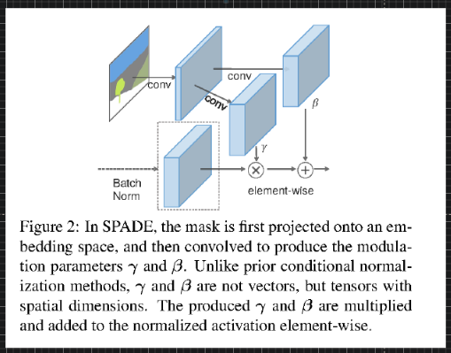

# Computer Vision

# AI Movie Project

---
## SPADE 

https://github.com/guoyongcs/DRN | guoyongcs/DRN: Closed-loop Matters: Dual Regression Networks for Single Image Super-Resolution
https://arxiv.org/abs/2003.07018.pdf | Closed-loop Matters: Dual Regression Networks for Single Image Super-Resolution
https://paperswithcode.com/task/image-generation | : Image Generation
https://paperswithcode.com/area/computer-vision | Browse state-of-the-art in ML
https://paperswithcode.com/paper/semantic-image-synthesis-with-spatially#code | : Semantic Image Synthesis with Spatially-Adaptive Normalization
https://github.com/junyanz/pytorch-CycleGAN-and-pix2pix | junyanz/pytorch-CycleGAN-and-pix2pix: Image-to-Image Translation in PyTorch
https://github.com/NVlabs/SPADE | NVlabs/SPADE: Semantic Image Synthesis with SPADE

---

---

[Link](https://arxiv.org/pdf/1711.07971.pdf)

https://books.google.co.in/books?hl=en&lr=&id=Kq_dU65kngUC&oi=fnd&pg=PP2&ots=vEmD9Rjr3i&sig=LXVandqs4l0nLWDwDaNgSwa3XjY&redir_esc=y#v=onepage&q&f=false | Non-Photorealistic Computer Graphics: Modeling, Rendering, and Animation - Thomas Strothotte, Stefan Schlechtweg - Google Books
https://scholar.google.com/scholar?um=1&ie=UTF-8&lr&cites=1538375253694513701 | Lin: Video stylization: painterly rendering and optimizat... - Google Scholar
http://www.eecs.umich.edu/courses/eecs498-2/papers/meier96.pdf

http://jiaya.me/papers/vigan_iccv19.pdf | vigan_iccv19.pdf
https://arxiv.org/abs/1903.09781.pdf | 1903.09781.pdf
https://arxiv.org/abs/1908.09514.pdf | Mocycle-GAN: Unpaired Video-to-Video Translation
http://openaccess.thecvf.com/content_CVPR_2019/papers/Nam_End-To-End_Time-Lapse_Video_Synthesis_From_a_Single_Outdoor_Image_CVPR_2019_paper.pdf | End-To-End Time-Lapse Video Synthesis From a Single Outdoor Image
https://arxiv.org/abs/1908.09514.pdf | Mocycle-GAN: Unpaired Video-to-Video Translation
https://arxiv.org/abs/1808.06601.pdf | 1808.06601.pdf
https://arxiv.org/abs/1905.08233.pdf | 1905.08233.pdf
https://arxiv.org/abs/1906.07889.pdf | 1906.07889.pdf
https://arxiv.org/abs/1906.01292.pdf | 1906.01292.pdf
https://arxiv.org/abs/1904.08379.pdf | 1904.08379.pdf
https://www.citi.sinica.edu.tw/papers/yylin/6497-F.pdf | Deep Video Frame Interpolation using Cyclic Frame Generation
https://arxiv.org/abs/1904.10247.pdf | 1904.10247.pdf
https://openreview.net/forum?id=rylgEULtdN | FVD: A new Metric for Video Generation | OpenReview
https://arxiv.org/abs/1903.07291.pdf | 1903.07291.pdf
http://openaccess.thecvf.com/content_ECCV_2018/papers/Bo_Zhao_Modular_Generative_Adversarial_ECCV_2018_paper.pdf | Modular Generative Adversarial Networks

https://learning-to-paint.github.io/ | Unsupervised Doodling and Painting with Improved SPIRAL
https://deeplearn.org/ | Deep Learning Monitor - Find new Arxiv papers, tweets and Reddit posts for you
https://arxiv.org/abs/1910.01007.pdf | 1910.01007.pdf

http://jiaya.me/papers/vigan_iccv19.pdf | vigan_iccv19.pdf
https://arxiv.org/abs/1903.09781.pdf | 1903.09781.pdf
https://arxiv.org/abs/1908.05324.pdf | 1908.05324.pdf
http://iccv2019.thecvf.com/program/main_conference#oral11 | ICCV 2019
https://arxiv.org/abs/1908.07500.pdf | https://arxiv.org/abs/1908.07500.pdf
http://www.eecs.harvard.edu/~htk/publication/2019-aaai-cha-gwon-kung.pdf | Adversarial Learning of Semantic Relevance in Text to Image Synthesis
https://arxiv.org/abs/1811.07441.pdf | 1811.07441.pdf
http://jiaya.me/papers/vigan_iccv19.pdf | vigan_iccv19.pdf
https://arxiv.org/abs/1908.05324.pdf | 1908.05324.pdf
https://arxiv.org/abs/1903.09781.pdf | 1903.09781.pdf
https://arxiv.org/abs/1909.12224.pdf | 1909.12224.pdf
https://www.google.com/search?q=Convolutional+Sequence+Generation+for+Skeleton-Based+Action+Synthesis&rlz=1C1CHBF_enUS858US858&oq=Convolutional+Sequence+Generation+for+Skeleton-Based+Action+Synthesis&aqs=chrome..69i57&sourceid=chrome&ie=UTF-8 | Convolutional Sequence Generation for Skeleton-Based Action Synthesis - Google Search
https://arxiv.org/abs/1711.08682.pdf | https://arxiv.org/abs/1711.08682.pdf
https://arxiv.org/abs/1811.12373.pdf | https://arxiv.org/abs/1811.12373.pdf
https://gilwoolee.github.io/files/lee2019handmotiondataset.pdf | lee2019handmotiondataset.pdf

https://arxiv.org/abs/1909.12224v2.pdf | 1909.12224v2.pdf
http://graphics.pixar.com/library/sigAsia2018Course/paper.pdf | paper.pdf
https://www.youtube.com/watch?v=7hUH92xwODg | OpenVDB: An Open Source Data Structure and Toolkit for High-Resolution Volumes - YouTube
https://users.cs.cf.ac.uk/Yukun.Lai/papers/PerformanceSurveyJCST.pdf | 2017-3-11-7483.dvi
https://arxiv.org/abs/1906.01524.pdf | Text-based Editing of Talking-head Video

https://arxiv.org/abs/1902.04208.pdf | 1902.04208.pdf
https://arxiv.org/abs/1811.12297.pdf | 1811.12297.pdf

https://arxiv.org/abs/1909.12224v2.pdf | 1909.12224v2.pdf
http://openaccess.thecvf.com/content_CVPR_2019/papers/Song_Unsupervised_Person_Image_Generation_With_Semantic_Parsing_Transformation_CVPR_2019_paper.pdf | Unsupervised Person Image Generation With Semantic Parsing Transformation
http://openaccess.thecvf.com/content_CVPR_2019/papers/Flynn_DeepView_View_Synthesis_With_Learned_Gradient_Descent_CVPR_2019_paper.pdf | DeepView: View Synthesis With Learned Gradient Descent
http://openaccess.thecvf.com/content_CVPR_2019/papers/Shysheya_Textured_Neural_Avatars_CVPR_2019_paper.pdf | Textured Neural Avatars
http://openaccess.thecvf.com/content_CVPR_2019/papers/Tang_Multi-Channel_Attention_Selection_GAN_With_Cascaded_Semantic_Guidance_for_Cross-View_CVPR_2019_paper.pdf | Multi-Channel Attention Selection GAN With Cascaded Semantic Guidance for Cross-View Image Translation
http://openaccess.thecvf.com/content_CVPR_2019/papers/Liu_STGAN_A_Unified_Selective_Transfer_Network_for_Arbitrary_Image_Attribute_CVPR_2019_paper.pdf | STGAN: A Unified Selective Transfer Network for Arbitrary Image Attribute Editing
http://openaccess.thecvf.com/content_CVPR_2019/papers/Shen_Towards_Instance-Level_Image-To-Image_Translation_CVPR_2019_paper.pdf | Towards Instance-Level Image-To-Image Translation
http://openaccess.thecvf.com/content_CVPR_2019/papers/Xu_Deep_Flow-Guided_Video_Inpainting_CVPR_2019_paper.pdf | Deep Flow-Guided Video Inpainting

https://arxiv.org/abs/1905.11833.pdf | https://arxiv.org/abs/1905.11833.pdf
https://arxiv.org/abs/1904.11955.pdf | 1904.11955.pdf

http://openaccess.thecvf.com/content_CVPR_2019/papers/Qiao_MirrorGAN_Learning_Text-To-Image_Generation_by_Redescription_CVPR_2019_paper.pdf | MirrorGAN: Learning Text-To-Image Generation by Redescription
http://openaccess.thecvf.com/content_CVPR_2019/papers/Lee_Inserting_Videos_Into_Videos_CVPR_2019_paper.pdf | Inserting Videos Into Videos
https://arxiv.org/abs/1606.03126.pdf | 1606.03126.pdf