## Vision-NLP Interfaces

---

### Neuro Symbolic VQA (: Using different Neural Modules for VQA)

---

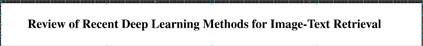

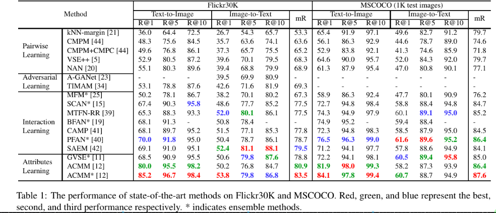

---

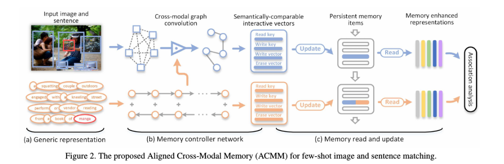

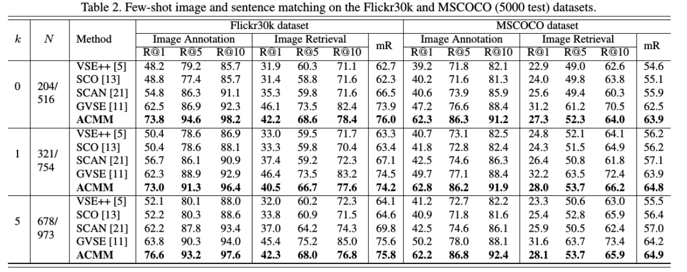

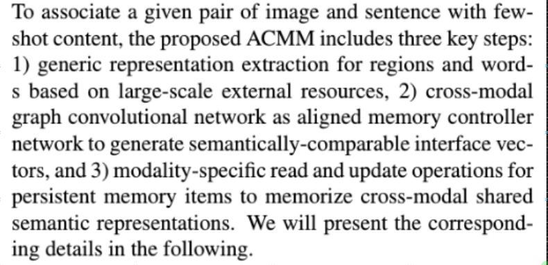

---

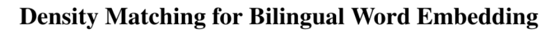

---

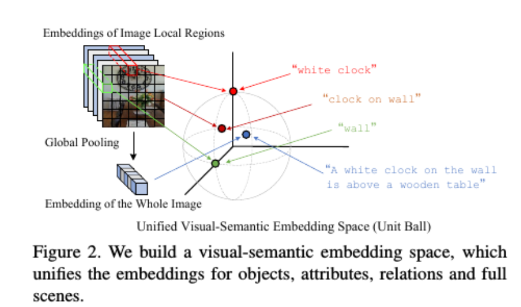

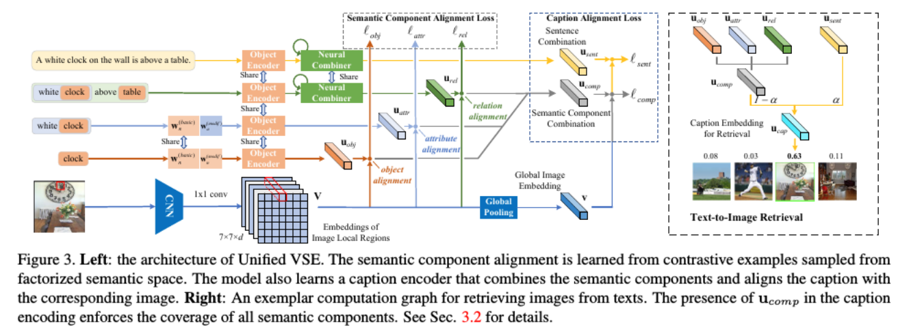

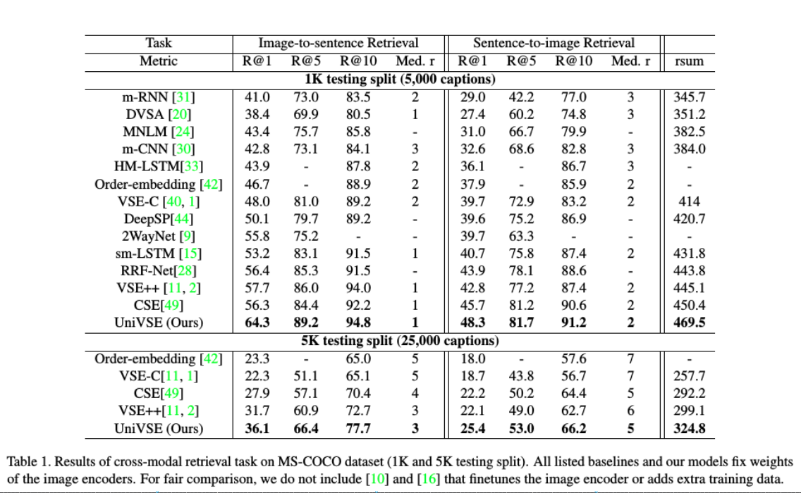

---

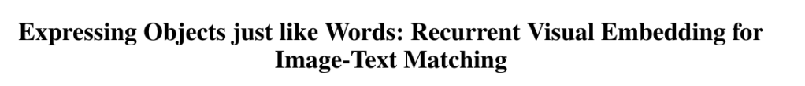

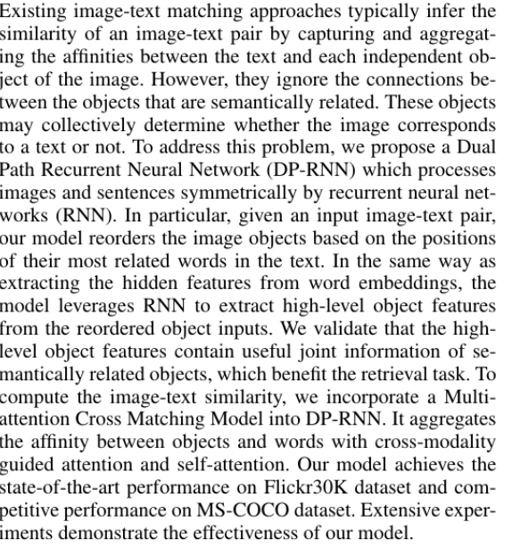

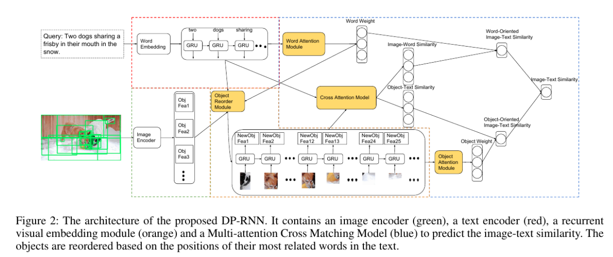

---

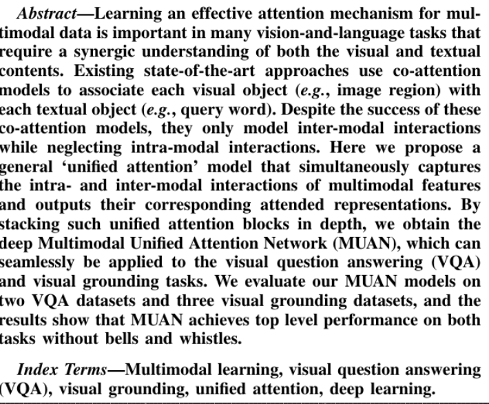

---

---

### Visual-NLP

- [**Interfacing vision and NLP - Google Docs**](https://docs.google.com/document/d/1MfQG6LdutZdOhELpfQSkMuxVMxsEUYtSQ7nS5WToyCU/edit?ts=5e7ca588)
- [**Expressing Objects just like Words: Recurrent Visual Embedding for Image-Text Matching**](https://arxiv.org/abs/2002.08510.pdf)
- [**Unifying Visual-Semantic Embeddings with Multimodal Neural Language Models**](https://arxiv.org/abs/1411.2539.pdf)
- [**ACMM: Aligned Cross-Modal Memory for Few-Shot Image and Sentence Matching**](http://openaccess.thecvf.com/content_ICCV_2019/papers/Huang_ACMM_Aligned_Cross-Modal_Memory_for_Few-Shot_Image_and_Sentence_Matching_ICCV_2019_paper.pdf)
- [**MultiGrain: a unified image embedding for classes and instances**](https://arxiv.org/abs/1902.05509.pdf)
- [**cross modal graph interface - Google Scholar**](https://scholar.google.com/scholar?start=20&q=cross+modal+graph+interface&hl=en&as_sdt=0,5&as_ylo=2020)
- [**Archive ouverte HAL - Review of Recent Deep Learning Based Methods for Image-Text Retrieval**](https://hal.archives-ouvertes.fr/hal-02480975/)
- [**Review of Recent Deep Learning Based Methods for Image-Text Retrieval**](https://hal.archives-ouvertes.fr/hal-02480975/document)
- [**Vision-Language Navigation Policy Learning and Adaptation - IEEE Journals & Magazine**](https://ieeexplore.ieee.org/abstract/document/8986691)
- [**[2003.00392] Fine-grained Video-Text Retrieval with Hierarchical Graph Reasoning**](https://arxiv.org/abs/2003.00392)
- [**Novel model to integrate word embeddings and syntactic trees for automatic caption generation from images**](https://link.springer.com/content/pdf/10.1007/s00500-019-03973-w.pdf)
- [**SimCLR Notebook.ipynb - Colaboratory**](https://colab.research.google.com/drive/1ObAYvVKQjMG5nd2wIno7j2y_X91E9IrX#scrollTo=u067AY93zh-k&forceEdit=true&sandboxMode=true)
- [**Discriminative distribution alignment: A unified framework for heterogeneous domain adaptation - ScienceDirect**](https://www.sciencedirect.com/science/article/abs/pii/S0031320319304650)
- [**One Embedding To Do Them All**](https://arxiv.org/abs/1906.12120.pdf)
- [**[1906.02390] Multi-view Knowledge Graph Embedding for Entity Alignment**](https://arxiv.org/abs/1906.02390)
- [**[1612.00222] Interaction Networks for Learning about Objects, Relations and Physics**](https://arxiv.org/abs/1612.00222)
- [**[1706.01433] Visual Interaction Networks**](https://arxiv.org/abs/1706.01433)

---

### Unified Embedding Project

- [**Knowledge Graph summarization for anomaly/error detection & completion**](https://github.com/GemsLab/KGist)
- [**Discriminative distribution alignment: A unified framework for heterogeneous domain adaptation - ScienceDirect**](https://www.sciencedirect.com/science/article/abs/pii/S0031320319304650)
- [**Differentiable Scene Graphs**](http://openaccess.thecvf.com/content_WACV_2020/papers/Raboh_Differentiable_Scene_Graphs_WACV_2020_paper.pdf)
- [**Expressing Objects just like Words: Recurrent Visual Embedding for Image-Text Matching**](https://arxiv.org/abs/2002.08510.pdf)
- [**ACMM: Aligned Cross-Modal Memory for Few-Shot Image and Sentence Matching**](http://openaccess.thecvf.com/content_ICCV_2019/papers/Huang_ACMM_Aligned_Cross-Modal_Memory_for_Few-Shot_Image_and_Sentence_Matching_ICCV_2019_paper.pdf)
- [**Unifying Visual-Semantic Embeddings with Multimodal Neural Language Models**](https://arxiv.org/abs/1411.2539.pdf)
- [**Cross-Modal Attention With Semantic Consistence for Image-Text Matching - IEEE Journals & Magazine**](https://ieeexplore.ieee.org/abstract/document/8994196)
- [**Multi-Modal Graph Neural Network for Joint Reasoning on Vision and Scene Text**](https://arxiv.org/abs/2003.13962.pdf)

- [**Visual Semantic Reasoning for Image-Text Matching**](http://openaccess.thecvf.com/content_ICCV_2019/papers/Li_Visual_Semantic_Reasoning_for_Image-Text_Matching_ICCV_2019_paper.pdf )
- [**Visual Reasoning with Natural Language**](https://arxiv.org/abs/1710.00453.pdf )
- [**Explicit Reasoning over End-to-End Neural Architectures for Visual Question Answering**](https://arxiv.org/abs/1803.08896.pdf )
- [**PubLayNet: largest dataset ever for document layout analysis - Papers With Code**](https://paperswithcode.com/paper/190807836 )
- [**HUSE: Hierarchical Universal Semantic Embeddings**](https://arxiv.org/abs/1911.05978v1.pdf )
- [**Cross-modal_Scene_Graph_Matching_for_Relationship-aware_Image-Text_Retrieval**](http://openaccess.thecvf.com/content_WACV_2020/html/Wang_Cross-modal_Scene_Graph_Matching_for_Relationship-aware_Image-Text_Retrieval_WACV_2020_paper.html )
- [**Cross-Modal Attention With Semantic Consistence for Image-Text Matching - IEEE Journals & Magazine**](https://ieeexplore.ieee.org/abstract/document/8994196 )
- [**[2002.08510] Expressing Objects just like Words: Recurrent Visual Embedding for Image-Text Matching**](https://arxiv.org/abs/2002.08510 )
- [**Novel model to integrate word embeddings and syntactic trees for automatic caption generation from images**](https://link.springer.com/article/10.1007/s00500-019-03973-w)
- [**[2003.03772] IMRAM: Iterative Matching with Recurrent Attention Memory for Cross-Modal Image-Text Retrieval**](https://arxiv.org/abs/2003.03772 )
- [**Multi-Modal Memory Enhancement Attention Network for Image-Text Matching - IEEE Journals & Magazine**](https://ieeexplore.ieee.org/abstract/document/9006782 )
- [**[1906.02890] Visually Grounded Neural Syntax Acquisition**](https://arxiv.org/abs/1906.02890 )
- [**[1911.09826] Factorized Multimodal Transformer for Multimodal Sequential Learning**](https://arxiv.org/abs/1911.09826 )
- [**MUREL: Multimodal Relational Reasoning for Visual Question Answering**](https://arxiv.org/abs/1902.09487.pdf )
- [**Relation-Aware Graph Attention Network for Visual Question Answering**](https://arxiv.org/abs/1903.12314.pdf)
